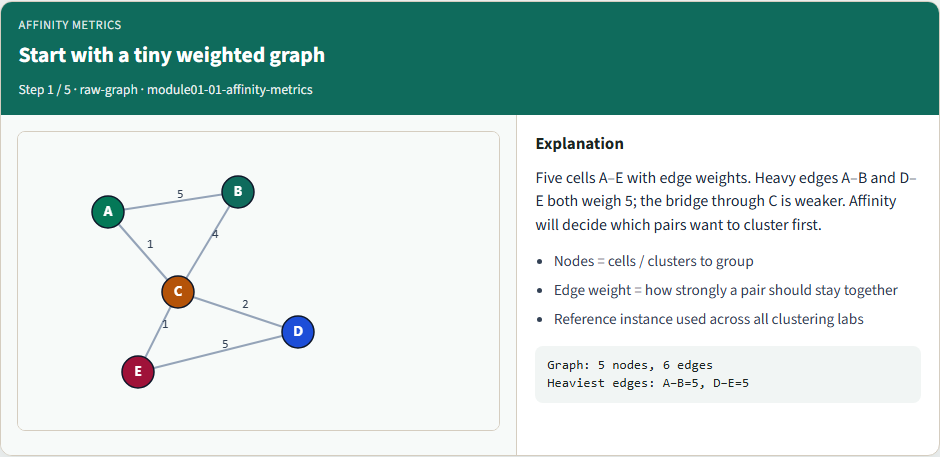
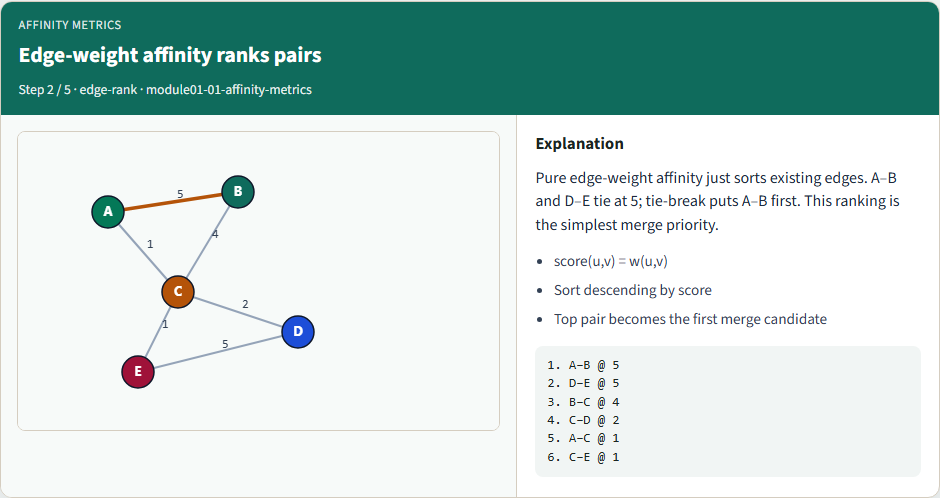
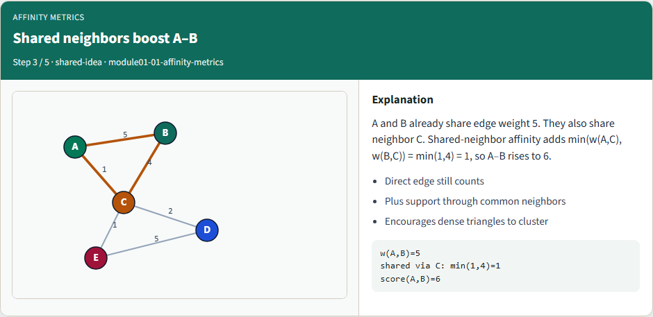
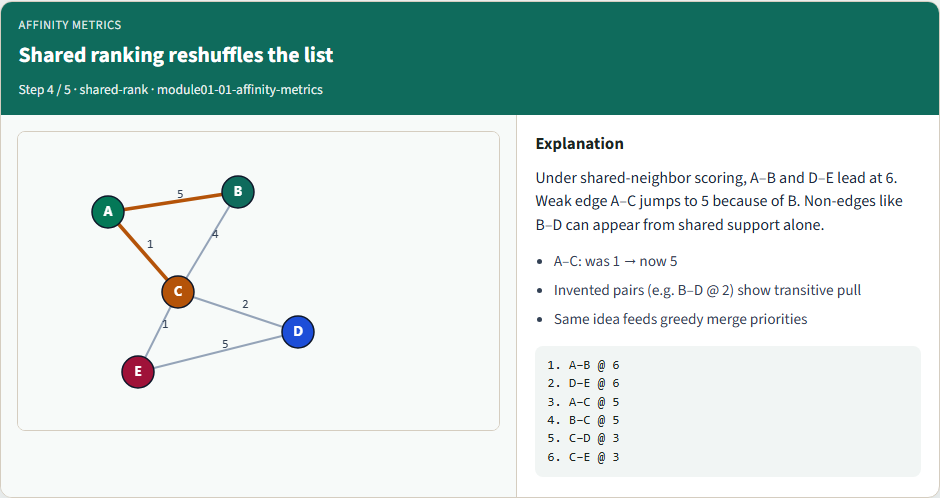
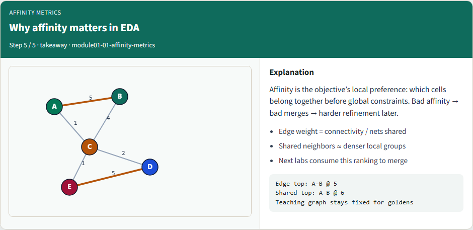

# Affinity metrics

Before you merge cells or coarsen a netlist, you need a score that says these two should stay together

---

## Start with a tiny weighted graph


---

## Edge-weight affinity ranks pairs


---

## Shared neighbors boost A–B


---

## Shared ranking reshuffles the list


---

## Why affinity matters in EDA


---

## Browser lab track
- In the browser lab track, open the affinity metrics lab, load the starter example
- Clear the ten challenges when you’re ready

---

## Implement track
- In the implement track, load the tiny weighted graph and print both rankings
- Match the goldens: edge weight tops at five for A–B; shared-neighbor lifts A–B to six
- Run the unit tests from the course common folder so your scores stay honest

---

## Implement track — try these

```
# pwd — print working directory (where am I?)
pwd

# ls examples — confirm the starter graph is here
ls examples

# print both affinity rankings
export PYTHONPATH=../common
python ../common/solvers.py examples/tiny_graph.json --mode affinity
```

---

## Pitfalls to watch
- Watch for mixing directed and undirected assumptions, or double-counting a neighbor
- Don’t invent pairs with zero connection unless your API says so
- And don’t let a later merge engine silently use a different affinity than the one you

---

## Your turn
- Finish the checklist for at least one track
- Match both golden tables, then explain why A–C climbs under shared-neighbor scoring
- Take the short quiz

