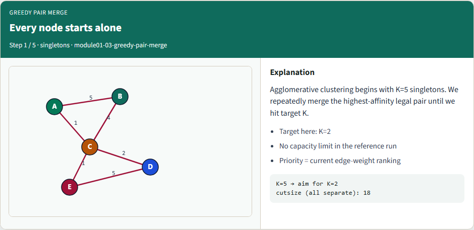
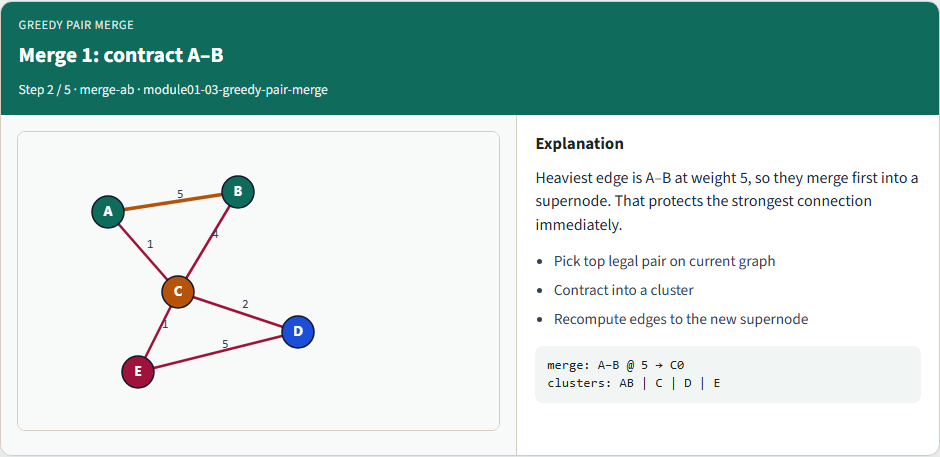
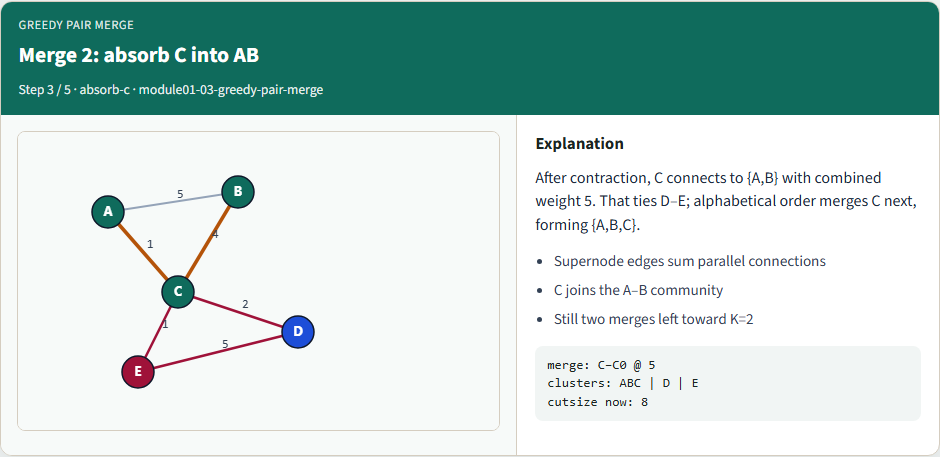
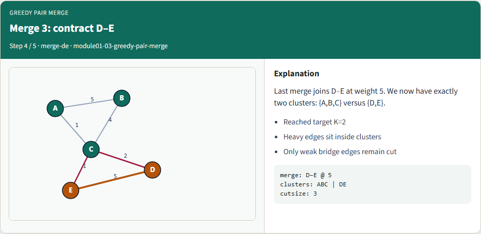
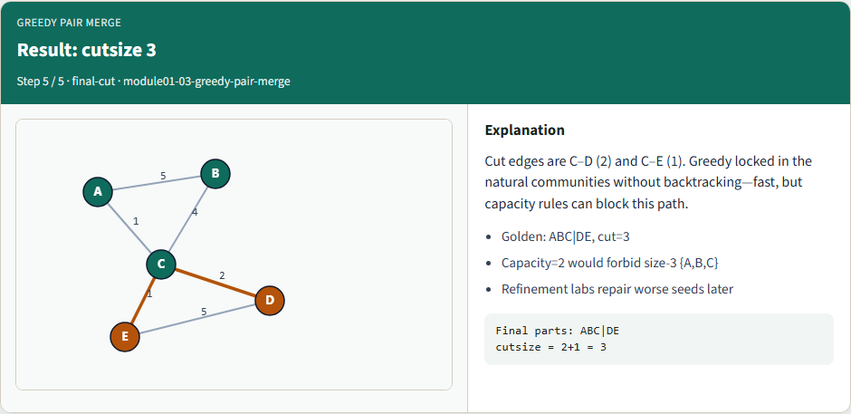

# Greedy pair merge

Greedy pair merge is the simplest coarsening engine that still feels like CAD

---

## Every node starts alone


---

## Merge 1: contract A–B


---

## Merge 2: absorb C into AB


---

## Merge 3: contract D–E


---

## Result: cutsize 3


---

## Browser lab track
- In the browser lab, load the starter, try the K and capacity presets, and run greedy merge
- Work the challenges

---

## Implement track
- Run the reference greedy merge down to two clusters
- You should land on A–B–C versus D–E with cutsize three
- Re-implement contraction yourself and keep a deterministic tie-break so golden tests stay

---

## Implement track — try these

```
# pwd — print working directory
pwd

# ls examples — confirm tiny_graph.json is present
ls examples

# greedy merge to K=2 via reference solver
export PYTHONPATH=../common
python ../common/solvers.py examples/tiny_graph.json --k 2

```

---

## Pitfalls to watch
- Greedy is myopic, a great first merge can strand you with a bad global cut
- Watch illegal merges that violate a size cap
- And updating affinities incorrectly after contraction creates silent wrong clusters until

---

## Your turn
- Implement greedy pair merge end to end, hit a chosen K, and record cutsize
- Complete the checklist and quiz

