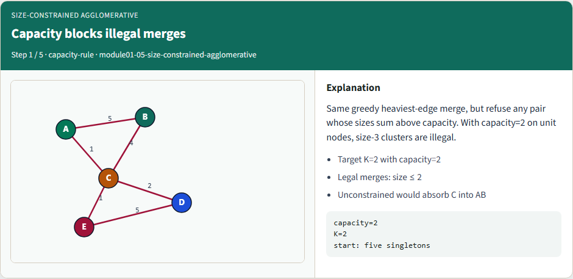
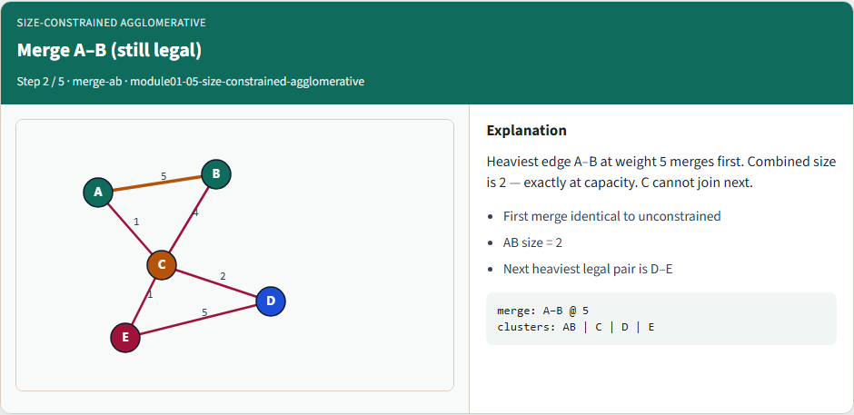
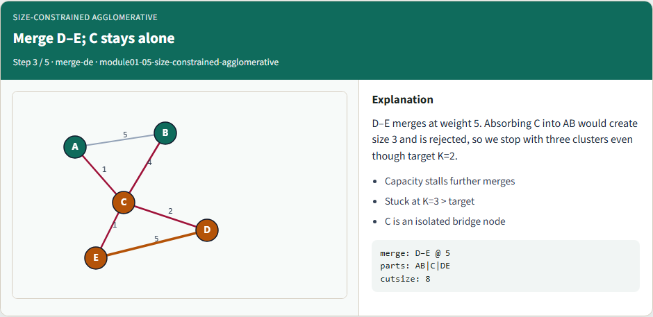
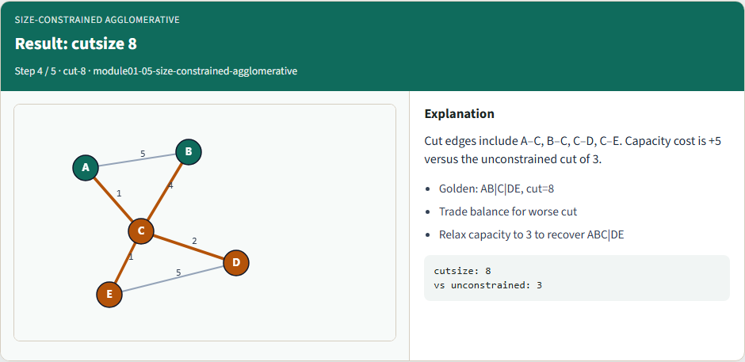
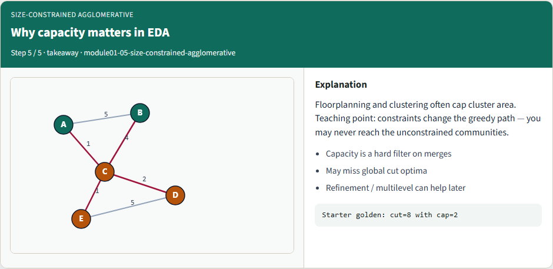

# Size-constrained agglomerative clustering

Size caps change which merges are legal

---

## Capacity blocks illegal merges


---

## Merge A–B (still legal)


---

## Merge D–E; C stays alone


---

## Result: cutsize 8


---

## Why capacity matters in EDA


---

## Browser lab track
- In the browser lab
- Clear the challenges for blocked size-three clusters and the AB|C|DE parts

---

## Implement track
- Run greedy merge with capacity two and confirm cutsize eight with parts AB|C|DE
- Then lift capacity to three and recover the unconstrained ABC|DE cutsize three

---

## Implement track — try these

```
export PYTHONPATH=../common
python ../common/solvers.py examples/tiny_graph.json --k 2 --capacity 2

```

---

## Pitfalls to watch
- Forgetting to check capacity before contracting is the classic bug
- Also watch stale affinities after a blocked merge candidate is skipped

---

## Your turn
- Match the capacity-two golden

