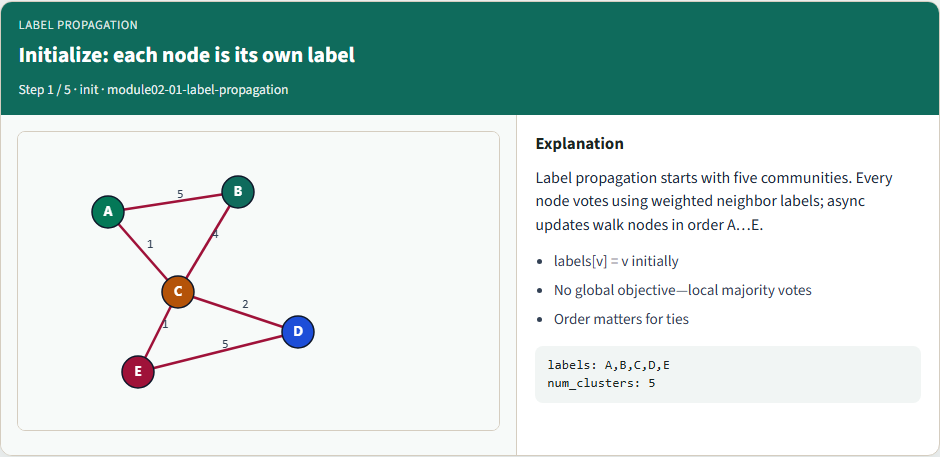
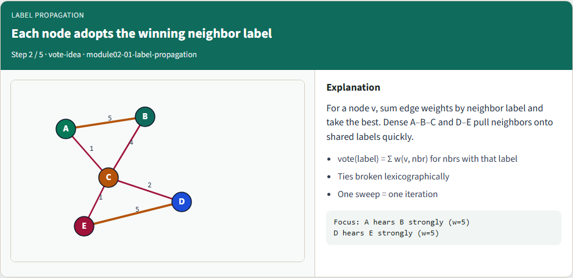
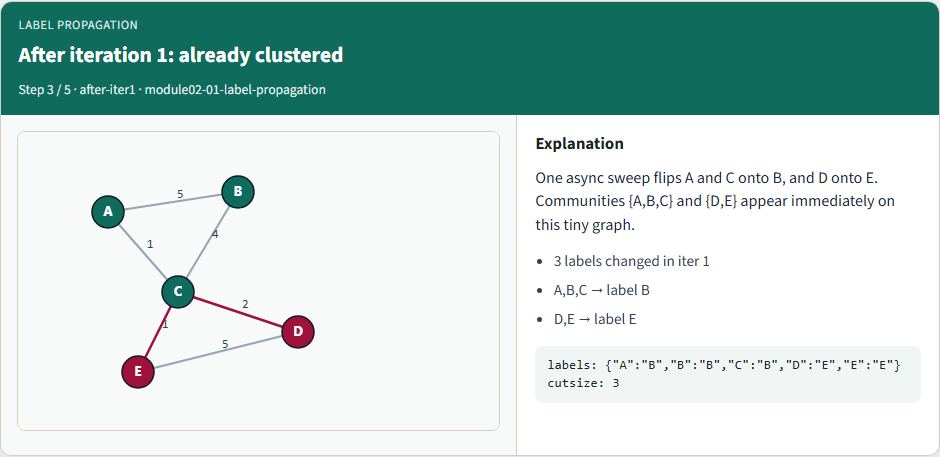
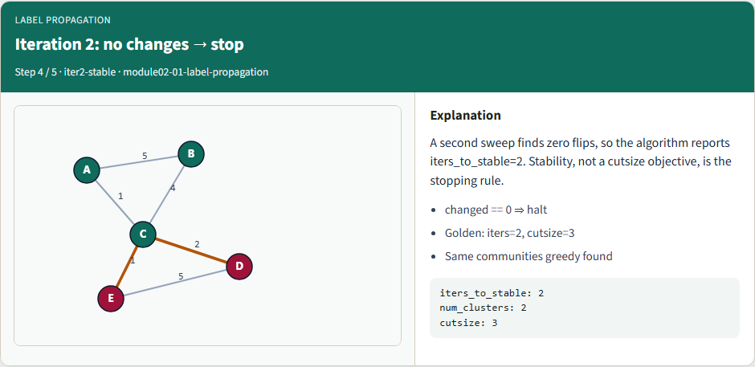
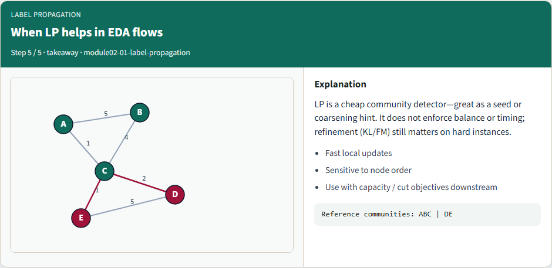

# Label propagation clustering

Label propagation grows communities by letting each node adopt the strongest neighbor label

---

## Initialize: each node is its own label


---

## Each node adopts the winning neighbor label


---

## After iteration 1: already clustered


---

## Iteration 2: no changes — stop


---

## When LP helps in EDA flows


---

## Browser lab track
- In the browser lab, show the initial labels, then run label propagation
- Clear the challenges for two iterations, two communities, and the full golden label map

---

## Implement track
- Load the tiny graph and run the reference label-propagation mode
- Confirm two iterations, labels grouping A–B–C versus D–E, and cutsize three
- Re-implement the vote and tie-break until the unit test passes

---

## Implement track — try these

```
# run async label propagation on the tiny graph
export PYTHONPATH=../common
python ../common/solvers.py examples/tiny_graph.json --mode lp

```

---

## Pitfalls to watch
- Order dependence is real, document your sweep order
- Without a tie-break, goldens flake
- And stopping only on max iterations without checking that nothing changed hides

---

## Your turn
- Match the golden table, finish the checklist and quiz, then continue to spectral bisection

