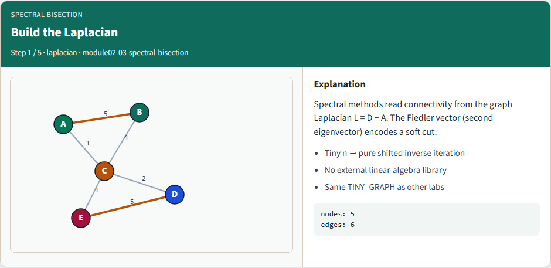
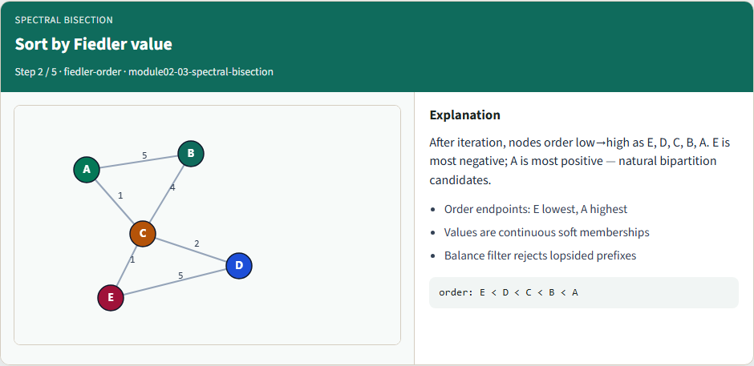
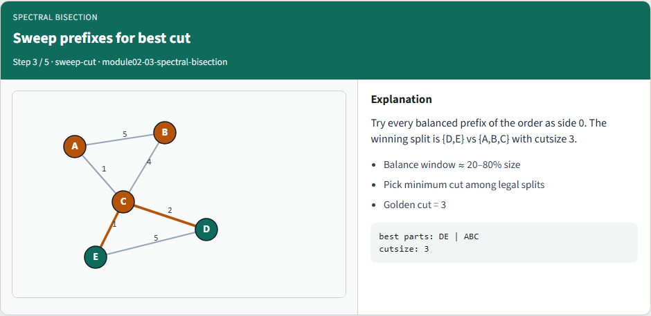
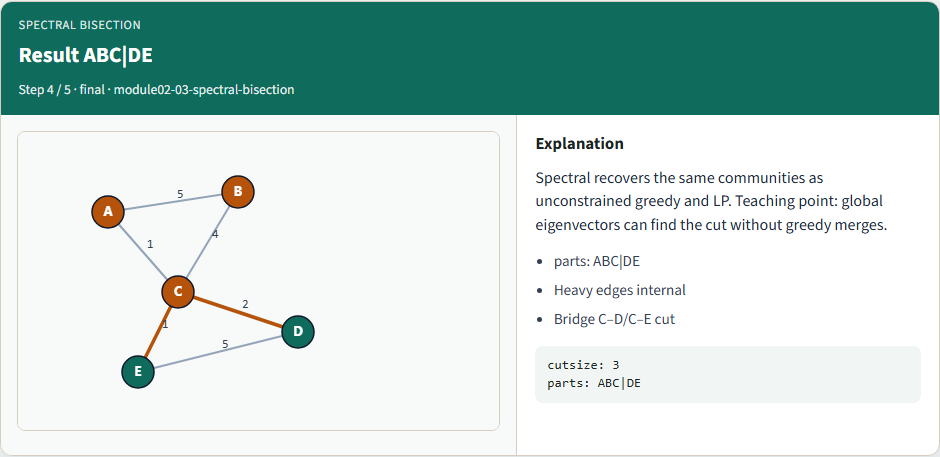
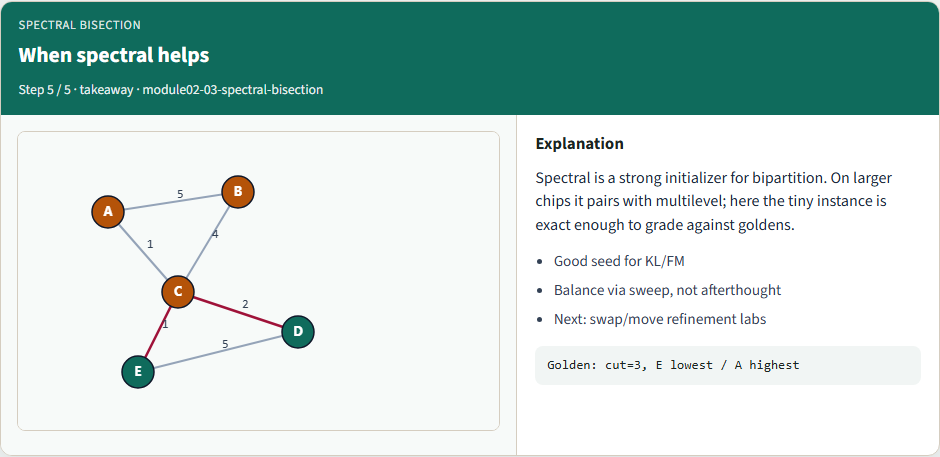

# Spectral bisection

Spectral bisection uses the graph Laplacian and its Fiedler vector to propose a balanced cut

---

## Build the Laplacian


---

## Sort by Fiedler value


---

## Sweep prefixes for best cut


---

## Result ABC|DE


---

## When spectral helps


---

## Browser lab track
- In the browser lab, run spectral bisection and inspect the Fiedler order
- Clear challenges for cutsize three and the ABC versus DE parts

---

## Implement track
- Run the spectral mode on the tiny graph
- Confirm cutsize three and the natural clusters
- Re-implement the sweep yourself; a dense tiny eigensolve is fine at course scale

---

## Implement track — try these

```
export PYTHONPATH=../common
python ../common/solvers.py examples/tiny_graph.json --mode spectral

```

---

## Pitfalls to watch
- Ignoring balance can isolate one node
- Numerical noise can scramble near-ties, use a stable sort
- Disconnected graphs need explicit component handling

---

## Your turn
- Match cutsize three, finish the checklist and quiz, then continue to Kernighan–Lin

