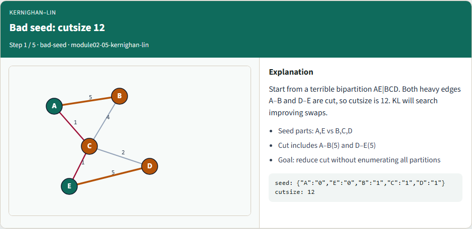
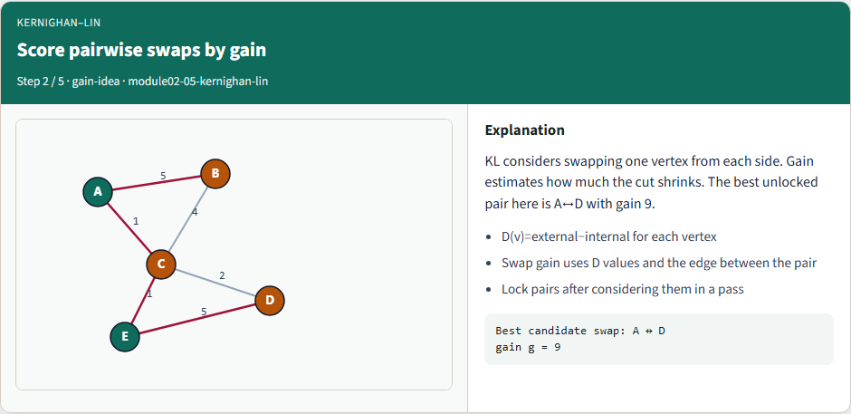
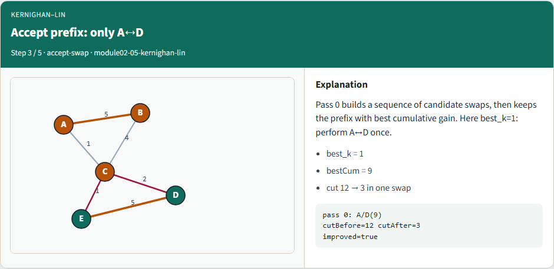
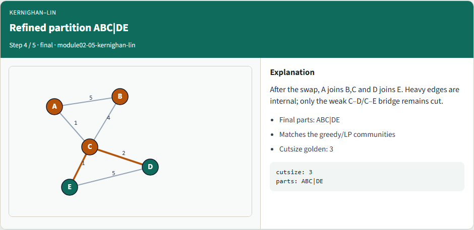
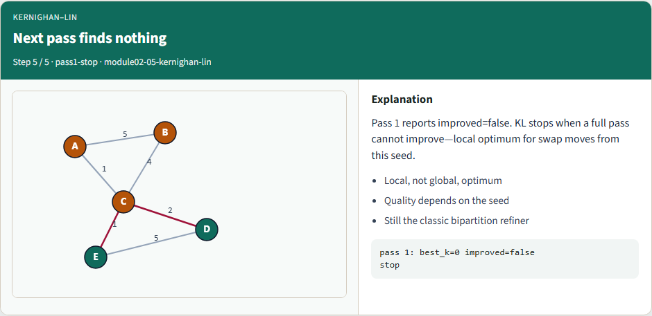

# Kernighan–Lin refinement

**Module id:** module02-05-kernighan-lin
**Lab:** kernighan-lin
**Tracks:** A (implement) · B (browser lab)

## Slide 1 — Kernighan–Lin refinement

Kernighan–Lin improves an existing bipartition by swapping pairs across the cut. You’ll watch a full pass—gains, locking, a swap sequence, and rollback to the best prefix. On the starter seed that cuts both heavy edges, KL drives the cut from twelve down to three.

<!-- algorithm-walkthrough -->

## Slide 2 — Bad seed: cutsize 12



Start from a terrible bipartition: A and E versus B, C, and D. Both heavy edges A–B and D–E are cut, so cutsize is twelve. KL will search improving swaps.

## Slide 3 — Score pairwise swaps by gain



KL considers swapping one vertex from each side. Gain estimates how much the cut shrinks. The best unlocked pair here is A with D, gain nine.

## Slide 4 — Accept prefix: only A↔D



Pass zero builds a sequence of candidate swaps, then keeps the prefix with best cumulative gain. Here best k equals one: perform A↔D once, and the cut falls from twelve to three.

## Slide 5 — Refined partition ABC|DE



After the swap, A joins B and C, and D joins E. Heavy edges are internal; only the weak bridge through C remains cut. Cutsize golden: three.

## Slide 6 — Next pass finds nothing



Pass one reports no improvement. KL stops at a local optimum for swap moves from this seed. Quality still depends on where you started.

<!-- /algorithm-walkthrough -->

## Slide 7 — Browser lab track

In the browser lab, show the seed only, then run KL. Check the challenges for cutsize twelve, the A–D swap, and the final cutsize three.

## Slide 8 — Implement track

Load the tiny graph and the bad seed. Print cutsize twelve before you start. Run the reference KL solver and confirm it accepts A–D, lands on cutsize three, then stops on the next pass.

```bash
# pwd — print working directory
pwd

# ls examples — graph + seed partition
ls examples

# run full KL refinement on the bad seed
export PYTHONPATH=../common
python ../common/solvers.py examples/tiny_graph.json --mode kl --seed examples/seed_partition.json
```

## Slide 9 — Pitfalls to watch

Forgetting rollback is the classic bug—you keep the final locked state even when an earlier prefix was better. Stale D-values after a swap pick the wrong pair next. And if your seed isn’t labeled zero and one, the gain math won’t match.

## Slide 10 — Your turn

Reproduce cut twelve to three with the accepted A–D swap. Finish the checklist and quiz, then continue to Fiduccia–Mattheyses—single-vertex moves instead of pairwise swaps.
