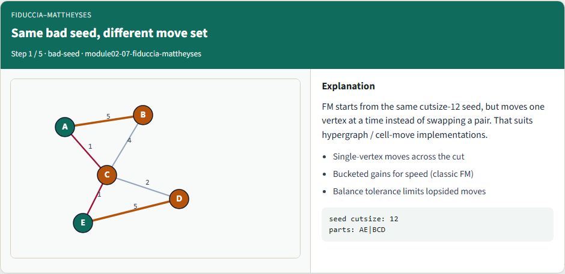
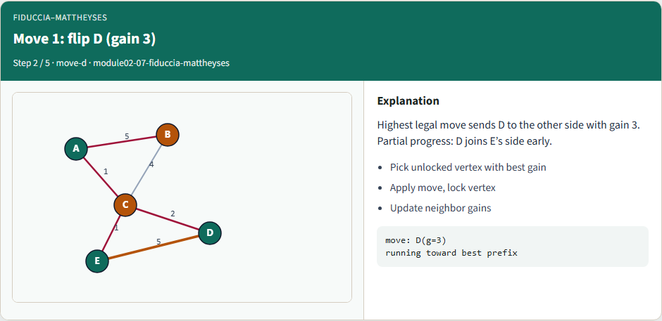
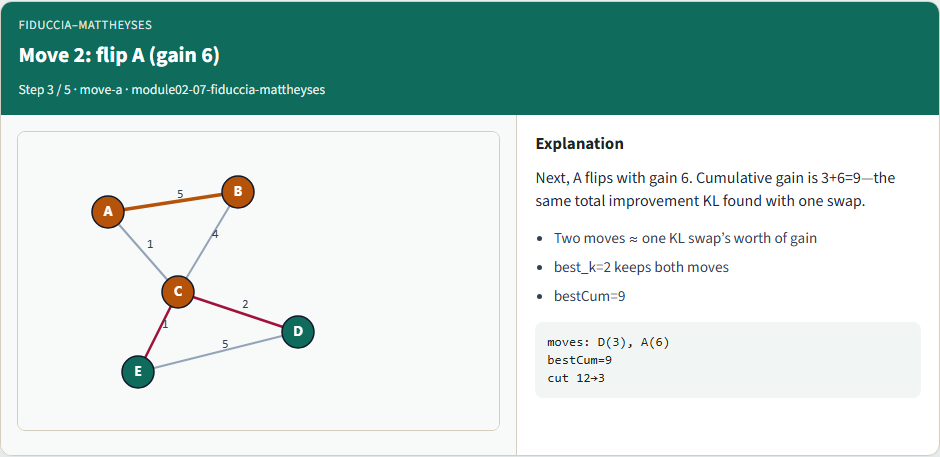
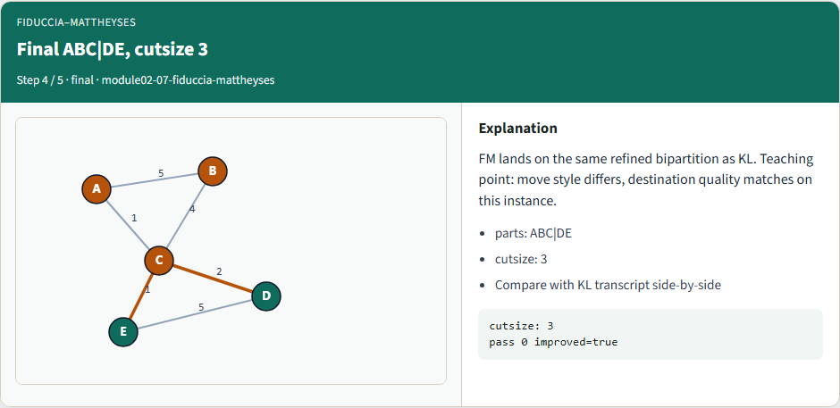
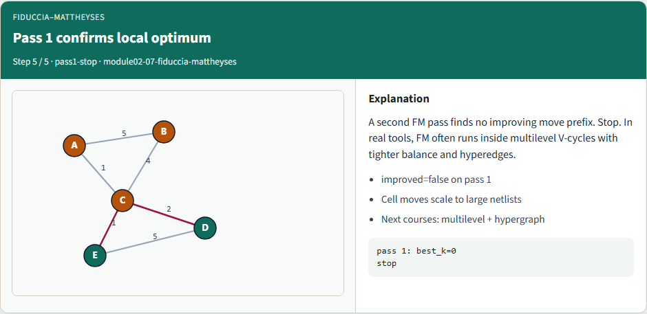

# Fiduccia–Mattheyses refinement

FM refines a bipartition with single-vertex moves, locking

---

## Same bad seed, different move set


---

## Move 1: flip D (gain 3)


---

## Move 2: flip A (gain 6)


---

## Final ABC|DE, cutsize 3


---

## Pass 1 confirms local optimum


---

## Browser lab track
- In the browser lab, show the seed, run FM, and compare the move list with KL’s single swap
- Clear the challenges for twelve-to-three and the D-then-A prefix

---

## Implement track
- Run FM on the shared bad seed
- Confirm moves D then A in the accepted prefix, and cut twelve to three
- Re-implement selection and rollback until tests pass

---

## Implement track — try these

```
# FM refinement on the shared bad seed
export PYTHONPATH=../common
python ../common/solvers.py examples/tiny_graph.json --mode fm --seed ../module02-05-kernighan-lin/examples/seed_partition.json

```

---

## Pitfalls to watch
- Skipping rollback keeps a worse locked state
- Ignoring balance lets one side empty
- Stale gains after a move pick the wrong cell next

---

## Your turn
- Reproduce twelve to three

