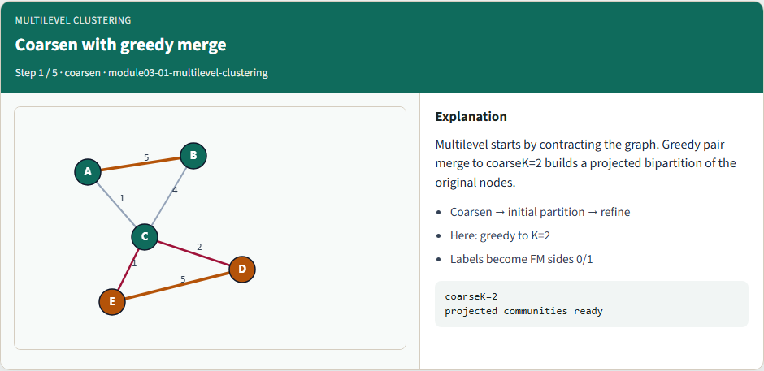
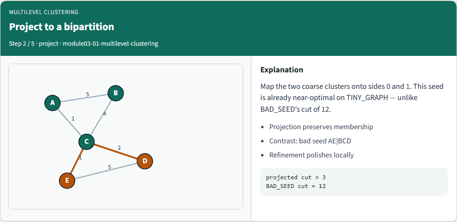
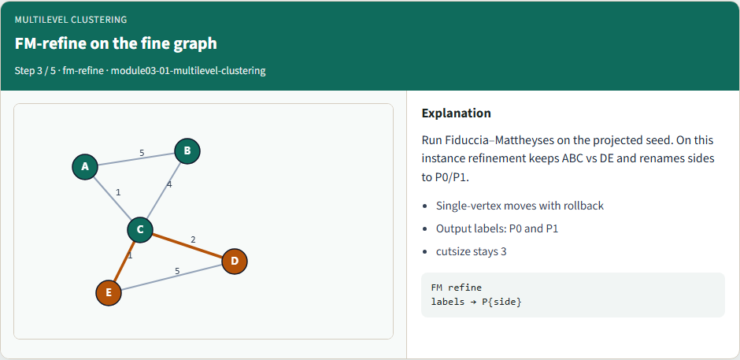
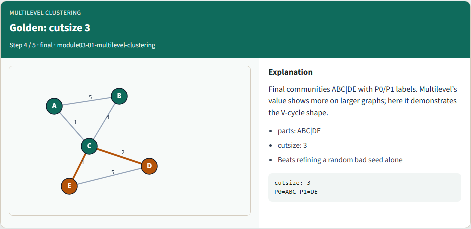
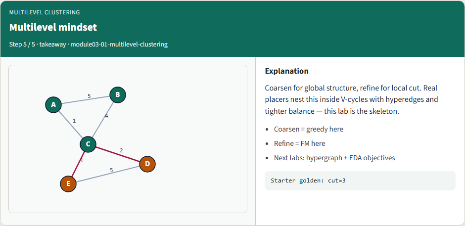

# Multilevel clustering — step-by-step (for slides / transcript)

**Module:** `module03-01-multilevel-clustering`  
**Lab / algo:** `multilevel-clustering`  
**Viewer:** `/tools/algorithm-walkthrough/?algo=multilevel-clustering&step=1`

Use each **Caption** as spoken prose (or a shortened slide note).
Use **Bullets** on the PPT; pair with the PNG in `assets/steps/`.

## Step 1 — Coarsen with greedy merge



**Caption (transcript):** Multilevel starts by contracting the graph. Greedy pair merge to coarseK=2 builds a projected bipartition of the original nodes.

**Slide bullets:**

- Coarsen → initial partition → refine
- Here: greedy to K=2
- Labels become FM sides 0/1

**On-screen metrics:**

```
coarseK=2
projected communities ready
```

## Step 2 — Project to a bipartition



**Caption (transcript):** Map the two coarse clusters onto sides 0 and 1. This seed is already near-optimal on TINY_GRAPH — unlike BAD_SEED’s cut of 12.

**Slide bullets:**

- Projection preserves membership
- Contrast: bad seed AE|BCD
- Refinement polishes locally

**On-screen metrics:**

```
projected cut ≈ 3
BAD_SEED cut = 12
```

## Step 3 — FM-refine on the fine graph



**Caption (transcript):** Run Fiduccia–Mattheyses on the projected seed. On this instance refinement keeps ABC vs DE and renames sides to P0/P1.

**Slide bullets:**

- Single-vertex moves with rollback
- Output labels: P0 and P1
- cutsize stays 3

**On-screen metrics:**

```
FM refine
labels → P{side}
```

## Step 4 — Golden: cutsize 3



**Caption (transcript):** Final communities ABC|DE with P0/P1 labels. Multilevel’s value shows more on larger graphs; here it demonstrates the V-cycle shape.

**Slide bullets:**

- parts: ABC|DE
- cutsize: 3
- Beats refining a random bad seed alone

**On-screen metrics:**

```
cutsize: 3
P0=ABC P1=DE
```

## Step 5 — Multilevel mindset



**Caption (transcript):** Coarsen for global structure, refine for local cut. Real placers nest this inside V-cycles with hyperedges and tighter balance — this lab is the skeleton.

**Slide bullets:**

- Coarsen = greedy here
- Refine = FM here
- Next labs: hypergraph + EDA objectives

**On-screen metrics:**

```
Starter golden: cut=3
```

