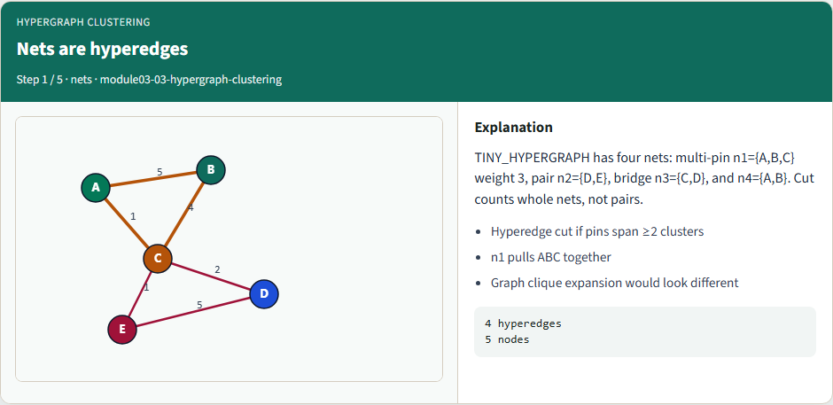
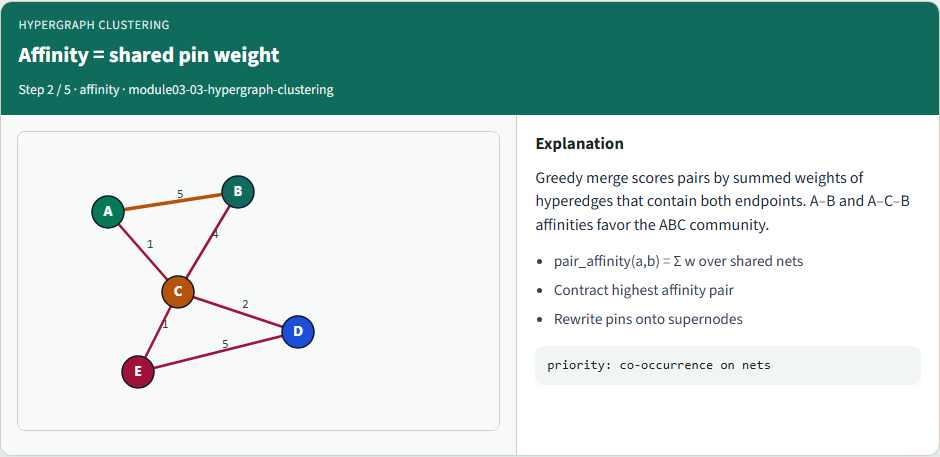
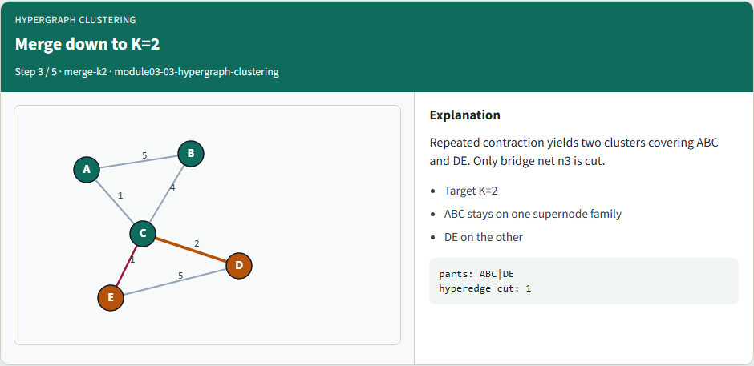
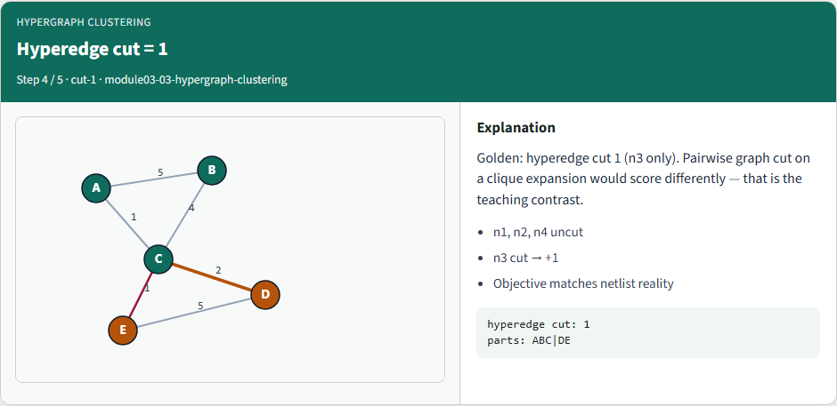
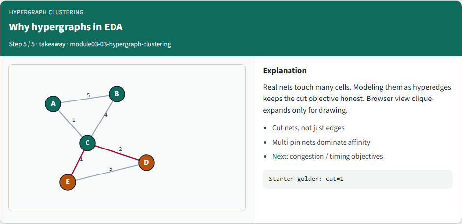

# Hypergraph clustering

**Module id:** module03-03-hypergraph-clustering
**Lab:** hypergraph-clustering
**Tracks:** A (implement) · B (browser lab)

## Slide 1 — Hypergraph clustering

Netlists are hypergraphs—one net can touch many pins. You’ll watch greedy clustering on a tiny hypergraph where multi-pin net n1 pulls A–B–C together.

<!-- algorithm-walkthrough -->

## Slide 2 — Nets are hyperedges



TINY_HYPERGRAPH has four nets: multi-pin n1={A,B,C} weight 3, pair n2={D,E}, bridge n3={C,D}, and n4={A,B}. Cut counts whole nets, not pairs.

## Slide 3 — Affinity = shared pin weight



Greedy merge scores pairs by summed weights of hyperedges that contain both endpoints. A–B and A–C–B affinities favor the ABC community.

## Slide 4 — Merge down to K=2



Repeated contraction yields two clusters covering ABC and DE. Only bridge net n3 is cut.

## Slide 5 — Hyperedge cut = 1



Golden: hyperedge cut 1 (n3 only). Pairwise graph cut on a clique expansion would score differently — that is the teaching contrast.

## Slide 6 — Why hypergraphs in EDA



Real nets touch many cells. Modeling them as hyperedges keeps the cut objective honest. Browser view clique-expands only for drawing.

<!-- /algorithm-walkthrough -->

## Slide 7 — Browser lab track

In the browser lab, load the starter hypergraph and run greedy clustering to K equals two. Confirm hyperedge cut one for ABC versus DE.

## Slide 8 — Implement track

Run hypergraph greedy to K equals two. Confirm hyperedge cut one and the natural clusters.

```bash
export PYTHONPATH=../common
python ../common/solvers.py examples/tiny_hypergraph.json --mode hypergraph --k 2
```

## Slide 9 — Pitfalls to watch

Clique-expanding hyperedges changes the objective. Counting a cut once per hyperedge—not per pair—is required. Empty or singleton nets must be filtered.

## Slide 10 — Your turn

Match hyperedge cut one, finish the checklist and quiz, then continue to congestion-aware clustering.
