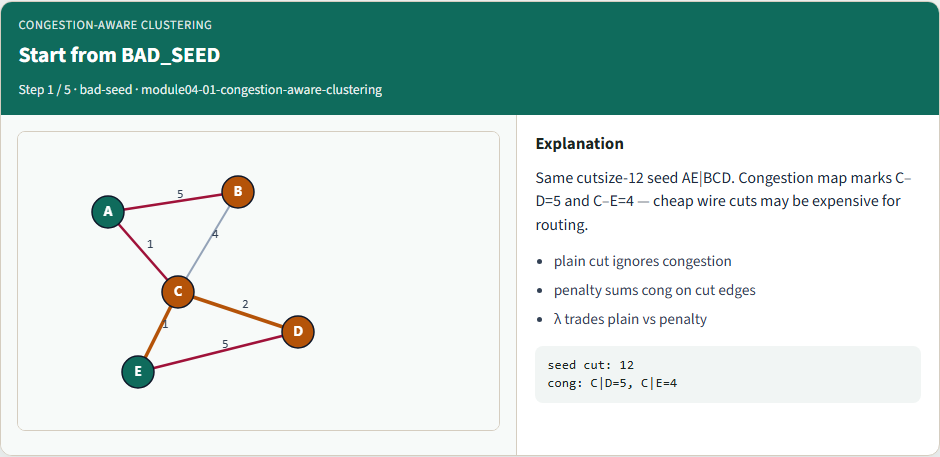
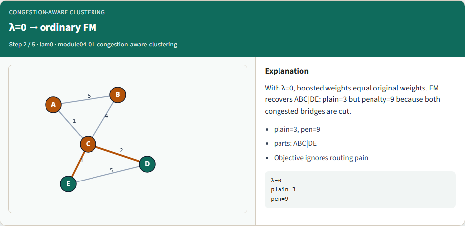
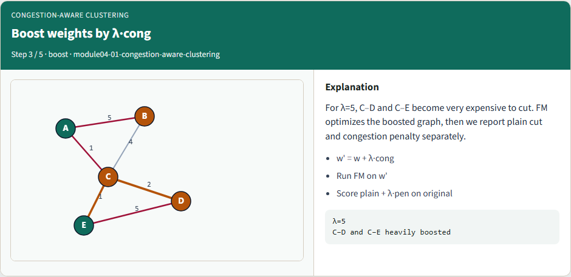
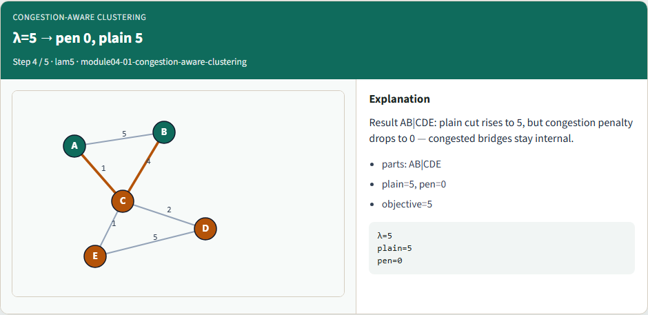
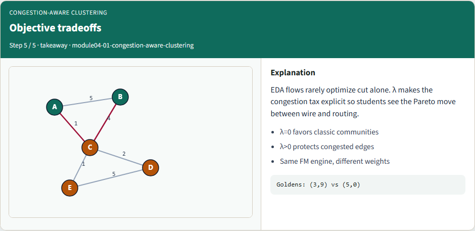

# Congestion-aware clustering

When bridge edges are congested, cutting them becomes expensive

---

## Start from BAD_SEED


---

## λ=0 → ordinary FM


---

## Boost weights by λ·cong


---

## λ=5 → pen 0, plain 5


---

## Objective tradeoffs


---

## Browser lab track
- In the browser lab, compare lambda zero with lambda five from the same bad seed
- Watch the penalty drop to zero when the congested bridge is avoided

---

## Implement track
- Run congestion-aware partition at lambda zero and five
- Confirm plain cut three with penalty nine at lambda zero

---

## Implement track — try these

```
export PYTHONPATH=../common
python ../common/solvers.py examples/tiny_graph.json --mode congestion --seed ../module02-05-kernighan-lin/examples/seed_partition.json --congestion examples/congestion.json --lambda 5
```

---

## Pitfalls to watch
- Applying congestion only after FM misses the point, weights must change before moves
- Huge lambda can ignore connectivity entirely

---

## Your turn
- Match both lambda goldens

