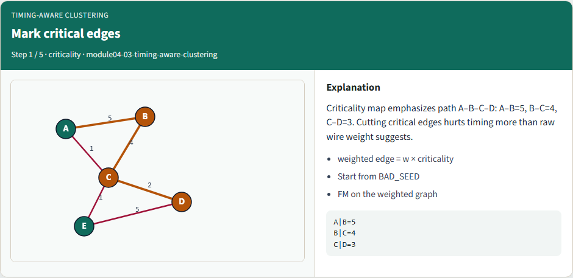
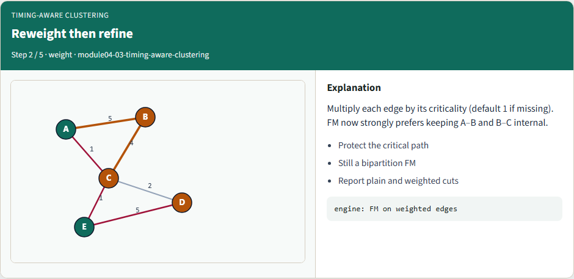
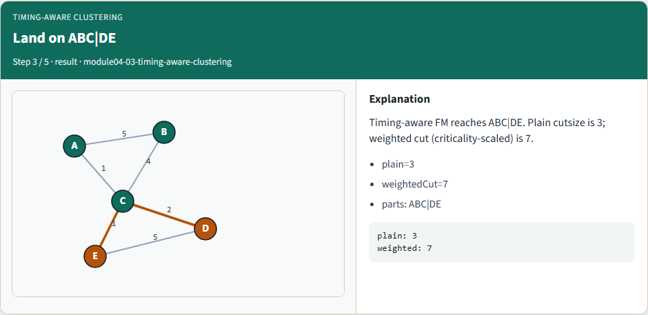
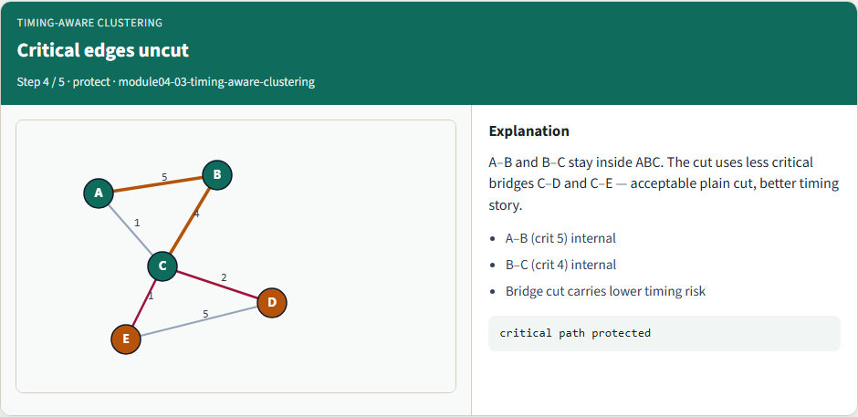
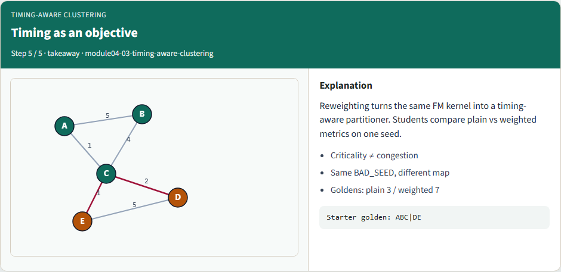

# Timing-aware clustering

Critical nets should stay uncut

---

## Mark critical edges


---

## Reweight then refine


---

## Land on ABC|DE


---

## Critical edges uncut


---

## Timing as an objective


---

## Browser lab track
- In the browser lab, run timing-aware refinement from the bad seed
- Confirm plain cut three and weighted cut seven

---

## Implement track
- Run timing-aware mode and confirm ABC versus DE, plain three, weighted seven

---

## Implement track — try these

```
export PYTHONPATH=../common
python ../common/solvers.py examples/tiny_graph.json --mode timing --seed ../module02-05-kernighan-lin/examples/seed_partition.json --criticality examples/criticality.json

```

---

## Pitfalls to watch
- Criticality of one means no boost, document defaults
- Mixing plain and weighted metrics in the same table confuses compares

---

## Your turn
- Match the golden

