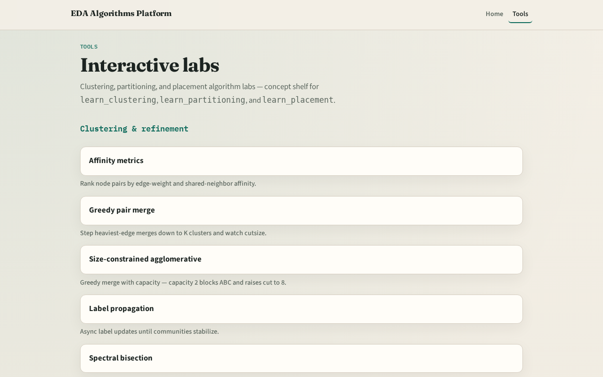

# Welcome to congestion for EDA

**Module id:** module00-00-intro
**Lab:** none
**Tracks:** intro (dual-track welcome)

## Slide 1 — Congestion in the stack

You placed and legalized cells. Routers still need room in each GCell. This course teaches how to estimate demand, read overflow, and feed congestion back into placement—before you open a full global router.

## Slide 2 — Two tracks

Track B is the browser lab: drag cells, watch heat maps, clear challenges. Track A is implement: Python solvers on a tiny JSON instance. Use either or both. Browser first for intuition is fine.

## Slide 3 — Course map

Foundations cover GCells and capacity. Estimation covers RUDY, probabilistic demand, heat maps, and overflow metrics. Feedback covers inflators, net weights, and one placement loop. Offline compare and wrap close the path.

## Slide 4 — Prerequisites

Finish learn_placement or learn_legalization first so float versus legal coordinates already make sense. Density bins from placement are cousins—not the same as routing GCells.

## Slide 5 — How to move

Read each module README, pick a track, check the checklist, then skim the clip when media is available. Odd module slots leave room to insert algorithms later without renumbering.

## Slide 6 — Next

Open the GCell grid model and learn the four-by-two tiling by heart.
