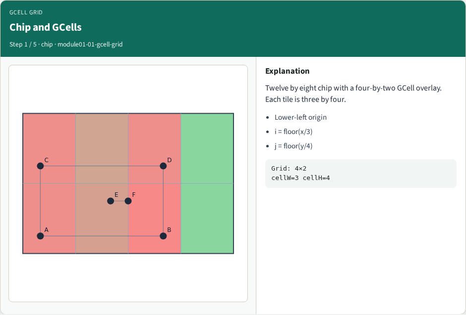
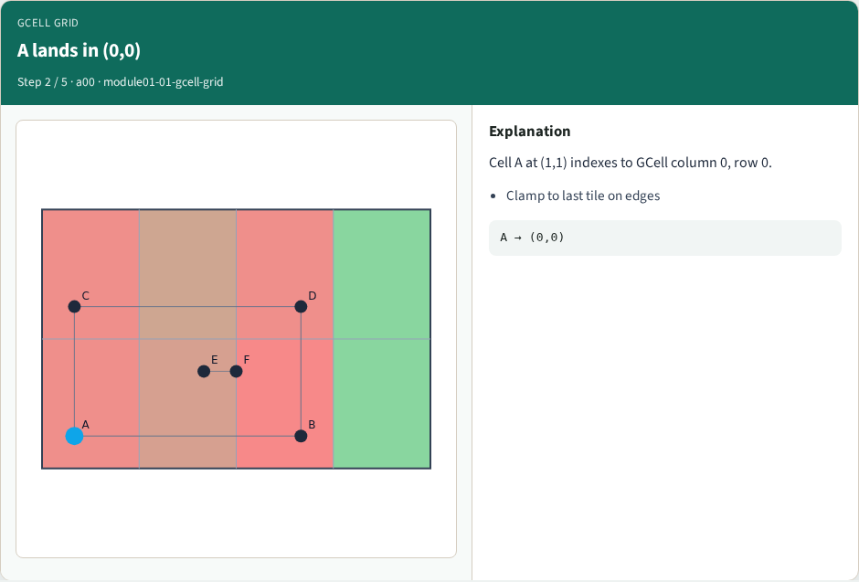
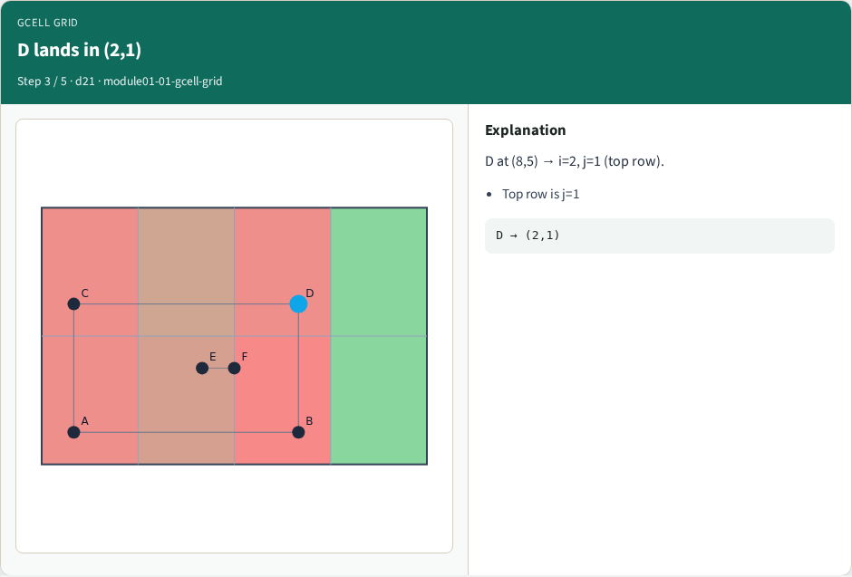
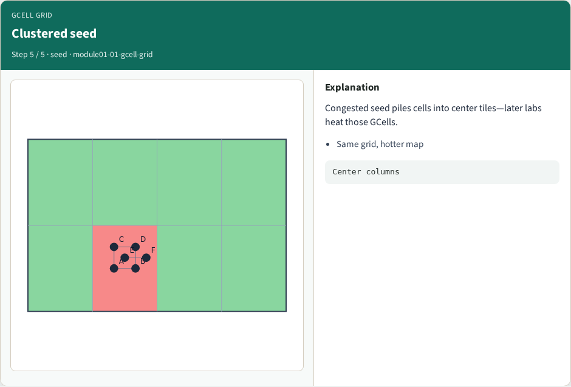
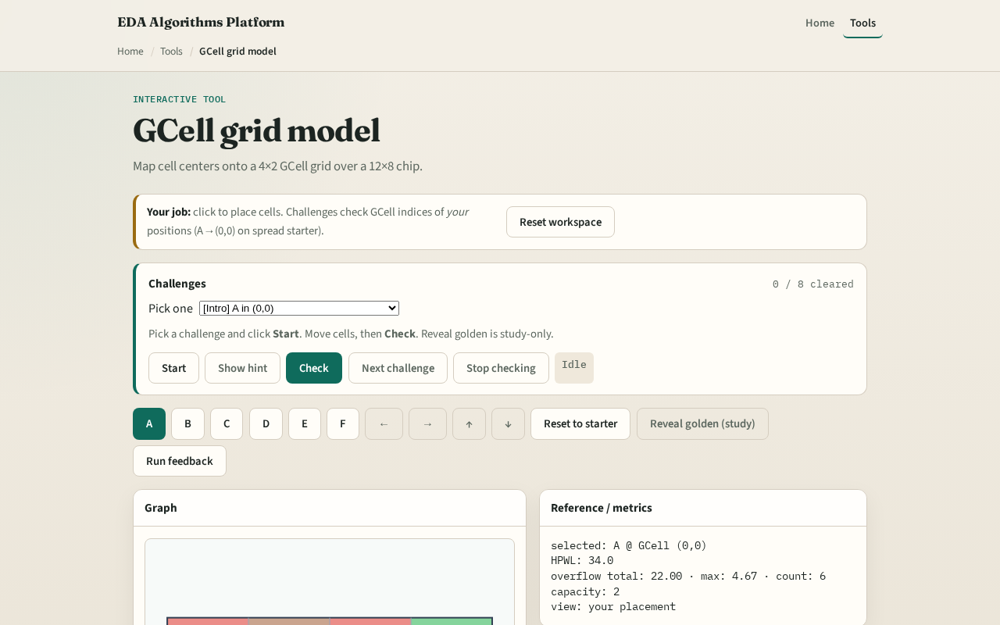

# GCell grid model

**Module id:** module01-01-gcell-grid
**Lab:** gcell-grid
**Tracks:** A (implement) · B (browser lab)

## Slide 1 — Why GCells

After legalization you have legal cell sites, but routers still think in coarser tiles called GCells. Our toy chip is twelve by eight. We overlay a four by two grid: each GCell is three wide and four tall. Congestion literacy starts by naming which tile owns a point.

## Slide 2 — The idea

Index with lower-left origin. Column i is floor of x over cell width, clamped to zero through three. Row j is floor of y over cell height, clamped to zero or one. Cell A at one comma one lands in GCell zero comma zero. Cell D at eight comma five lands in two comma one. Memorize that mapping—every estimator reuses it.

<!-- algorithm-walkthrough -->

## Slide 3 — Chip and GCells

Twelve by eight chip with a four-by-two GCell overlay. Each tile is three by four.

## Slide 4 — A lands in (0,0)

Cell A at (1,1) indexes to GCell column 0, row 0.

## Slide 5 — D lands in (2,1)

D at (8,5) → i=2, j=1 (top row).

## Slide 6 — Paint all centers

Every cell maps to exactly one GCell; the grid is the router’s coarse map.

## Slide 7 — Clustered seed

Congested seed piles cells into center tiles—later labs heat those GCells.

<!-- /algorithm-walkthrough -->

## Slide 8 — Browser lab track

Open the **gcell-grid** lab. Move a cell and read the GCell index in the metrics panel. Paint the grid lines so the four-by-two tiling is obvious. Then encode the same clamp-and-floor rule in Track A.

## Slide 9 — Implement track

Parse `tiny_cong.json`. Print nx, ny, cellW, cellH. Write `cell_gcell(x, y)` returning (i, j). Assert A→(0,0) and D→(2,1) on the spread placement. No demand yet—this module is pure geometry.

## Slide 10 — Pitfalls

Using upper-left image coordinates instead of chip lower-left. Forgetting to clamp points on the right or top edge into the last tile. Mixing site columns from legalization with GCell columns—different grids.

## Slide 11 — Your turn

Finish the checklist. Be able to sketch the eight GCells from memory. Next: capacity versus demand—the supply side of the map.
