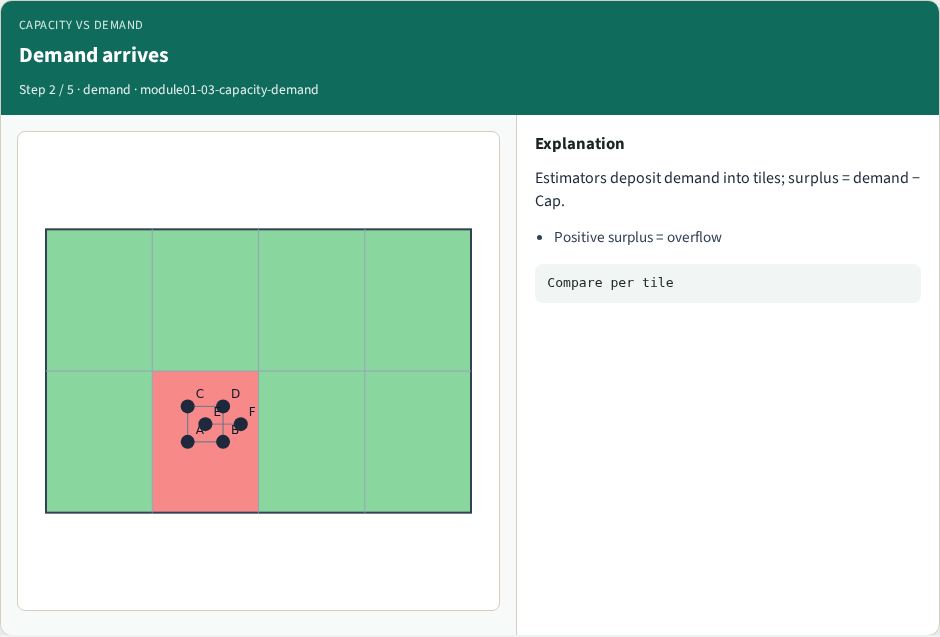
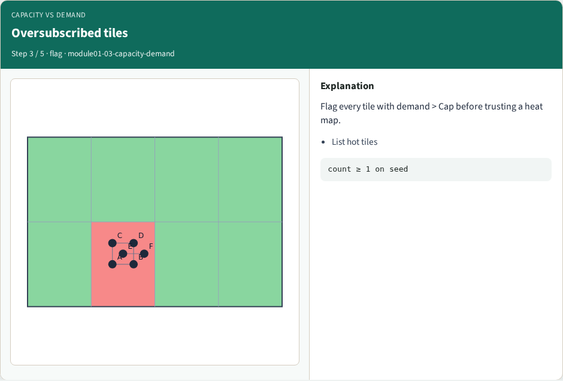
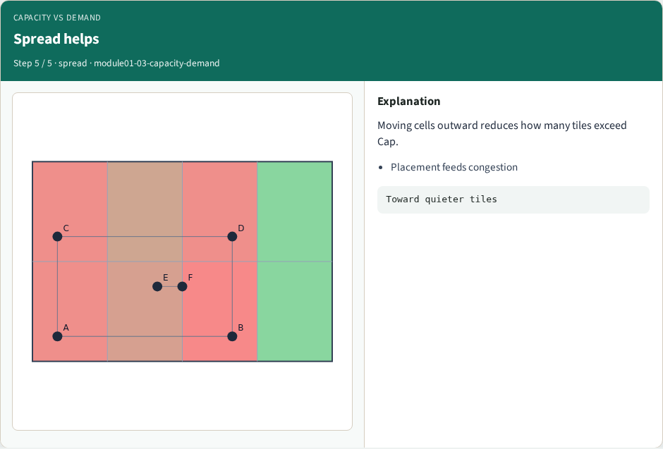

# Capacity vs demand — step-by-step (for slides / transcript)

**Module:** `module01-03-capacity-demand`  
**Lab / algo:** `capacity-demand`  
**Viewer:** `/tools/algorithm-walkthrough/?algo=capacity-demand&step=1`

Use each **Caption** as spoken prose (or a shortened slide note).
Use **Bullets** on the PPT; pair with the PNG in `assets/steps/`.

## Step 1 — Capacity budget


**Caption (transcript):** Each GCell has capacity 2.0 on the toy instance.

**Slide bullets:**

- Scalar Cap for goldens

**On-screen metrics:**

```
Cap=2
```

## Step 2 — Demand arrives



**Caption (transcript):** Estimators deposit demand into tiles; surplus = demand − Cap.

**Slide bullets:**

- Positive surplus = overflow

**On-screen metrics:**

```
Compare per tile
```

## Step 3 — Oversubscribed tiles



**Caption (transcript):** Flag every tile with demand > Cap before trusting a heat map.

**Slide bullets:**

- List hot tiles

**On-screen metrics:**

```
count ≥ 1 on seed
```

## Step 4 — Lower Cap


**Caption (transcript):** At Cap=1 more tiles fail—capacity is part of the contract.

**Slide bullets:**

- Document units

**On-screen metrics:**

```
Cap is a knob
```

## Step 5 — Spread helps



**Caption (transcript):** Moving cells outward reduces how many tiles exceed Cap.

**Slide bullets:**

- Placement feeds congestion

**On-screen metrics:**

```
Toward quieter tiles
```

