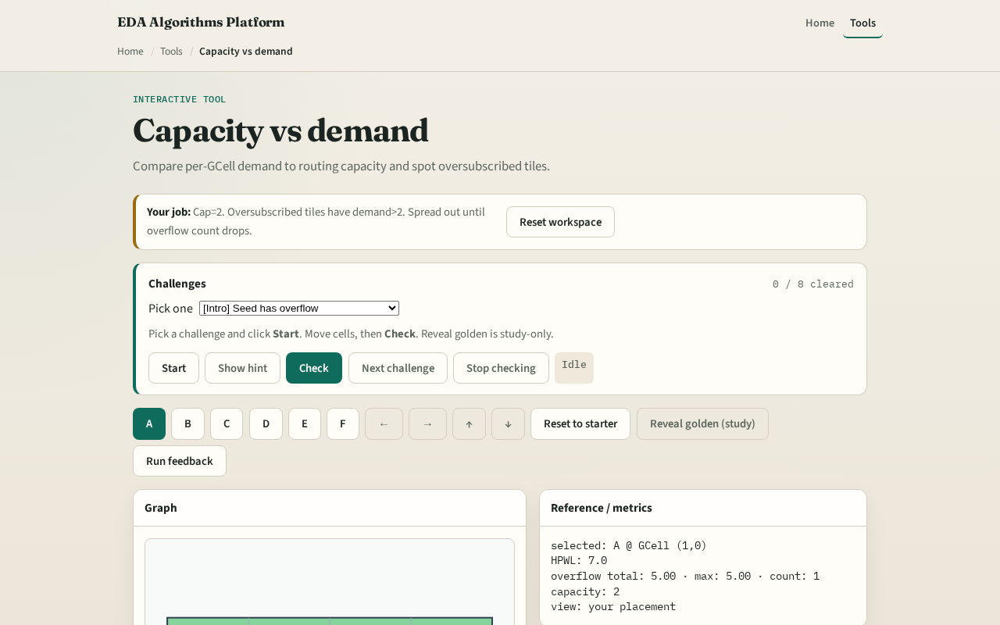

# Supply and load

A GCell has a routing budget, capacity

---

## The idea
- Surplus equals demand minus capacity
- Positive surplus means overflow
- List oversubscribed tiles before you trust a heat map
- Capacity can later become anisotropic edge capacities

---

## Capacity budget

---

## Demand arrives

---

## Oversubscribed tiles

---

## Lower Cap

---

## Spread helps

---

## Browser lab track

---

## Implement track
- Given a demand matrix from RUDY (or a hand-filled stub)
- Print both for capacity equals two and capacity equals one
- Keep the API ready for the overflow-metrics lab

---

## Pitfalls
- Comparing demand to capacity without documenting units
- Treating zero demand as “healthy” while ignoring that neighboring tiles may be hot
- Changing capacity mid-challenge without resetting the starter placement

---

## Your turn
- Complete Track A or B
- Next: RUDY, the classic demand estimator that fills those tiles from net bounding boxes

