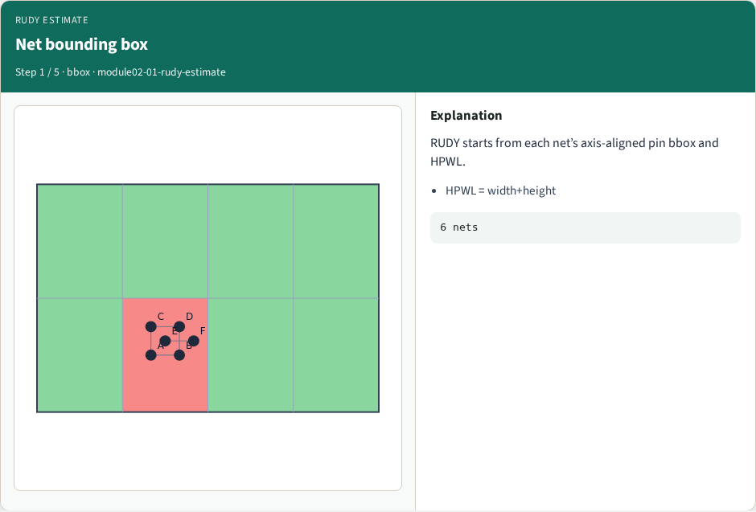
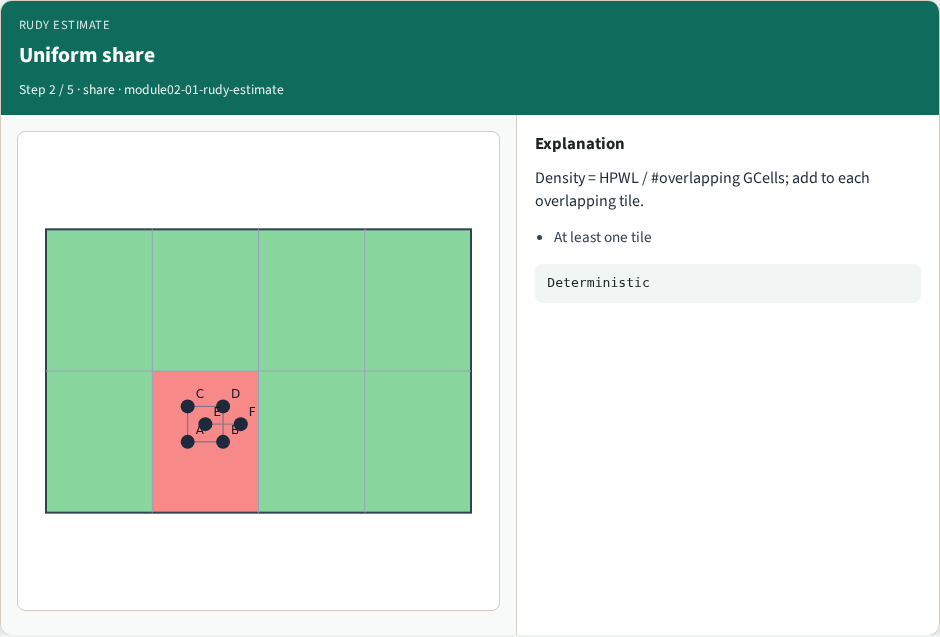
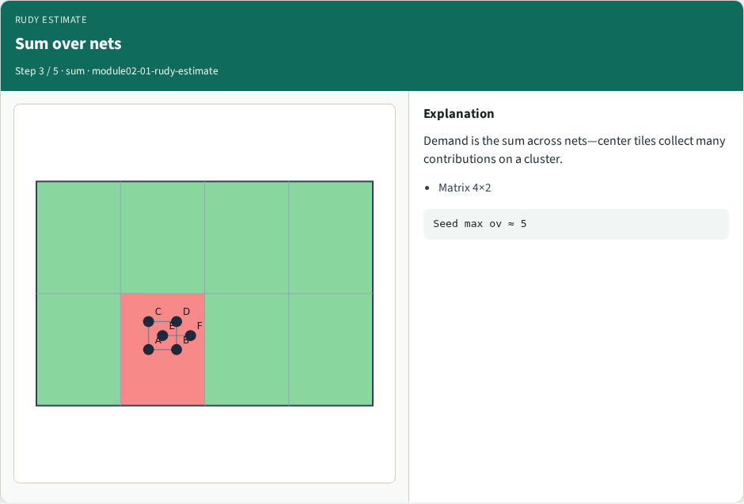
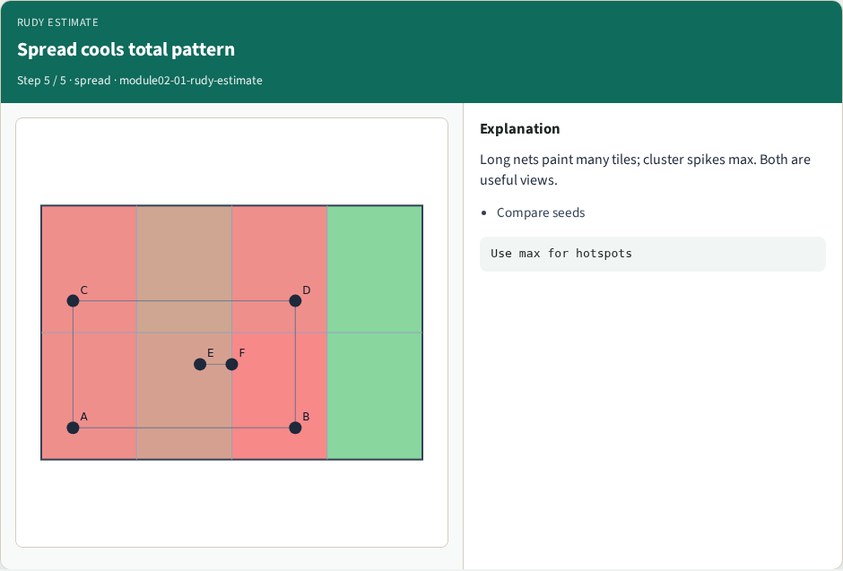
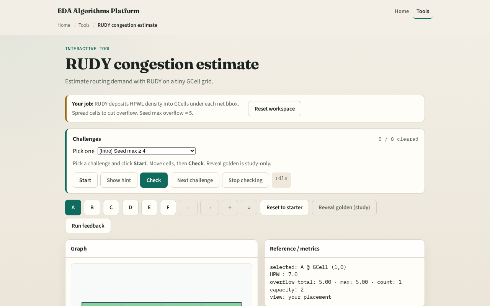

# RUDY congestion estimate

**Module id:** module02-01-rudy-estimate
**Lab:** rudy-estimate
**Tracks:** A (implement) · B (browser lab)

## Slide 1 — Uniform wire density

RUDY—Rectangular Uniform wire DensitY—spreads each net’s wirelength evenly across GCells under its bounding box. It is fast, deterministic, and good enough to teach overflow before you build a full global router.

## Slide 2 — The idea

For each net, take the axis-aligned bbox of pin positions. Half-perimeter wirelength is width plus height. Collect overlapping GCells—at least one. Density equals HPWL divided by the tile count. Add that density into every overlapping tile. Sum across nets for the demand map.

<!-- algorithm-walkthrough -->

## Slide 3 — Net bounding box

RUDY starts from each net’s axis-aligned pin bbox and HPWL.

## Slide 4 — Uniform share

Density = HPWL / #overlapping GCells; add to each overlapping tile.

## Slide 5 — Sum over nets

Demand is the sum across nets—center tiles collect many contributions on a cluster.

## Slide 6 — Overflow appears

ov = max(0, demand−Cap). Seed shows a clear hotspot.

## Slide 7 — Spread cools total pattern

Long nets paint many tiles; cluster spikes max. Both are useful views.

<!-- /algorithm-walkthrough -->

## Slide 8 — Browser lab track

Open **rudy-estimate**. Start from the spread placement, then load the congested seed and watch center tiles heat up. Check challenges against your demand totals. Reveal golden is study-only.

## Slide 9 — Implement track

Implement `rudy_demand(positions)` in `common/solvers.py`. On `congested_seed`, print the four-by-two demand matrix and total overflow at capacity two. Match the browser golden within a small rounding tolerance.

## Slide 10 — Pitfalls

Dividing by bbox area in continuous units while depositing into discrete tiles inconsistently. Skipping nets with coincident pins—still touch one GCell. Mutating the demand matrix in place across calls without zeroing.

## Slide 11 — Your turn

Ship Track A RUDY and clear the browser challenges. Next: probabilistic L-shapes for a different demand signature.
