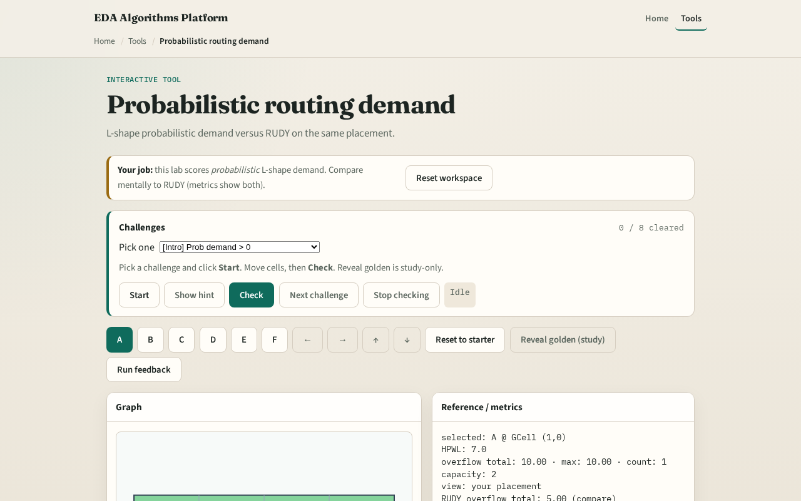

# L-shape routes

RUDY paints the whole bbox

---

## The idea
- For a two-pin net
- Multi-pin nets: star from the bbox center to each pin and deposit like two-pin edges
- Compare the resulting matrix to RUDY on the same placement

---

## L-shape idea

---

## Deposit along legs

---

## Multi-pin star

---

## Versus RUDY

---

## Spread again

---

## Browser lab track

---

## Implement track
- Implement `probabilistic_demand`
- On spread placement, print both RUDY and probabilistic totals
- Explain one tile where they disagree and why

---

## Pitfalls
- Double-counting the corner GCell on both L legs
- Forgetting multi-pin nets
- Document your unit choice

---

## Your turn
- Clear the checklist
- Next: turn demand into a congestion heat map

