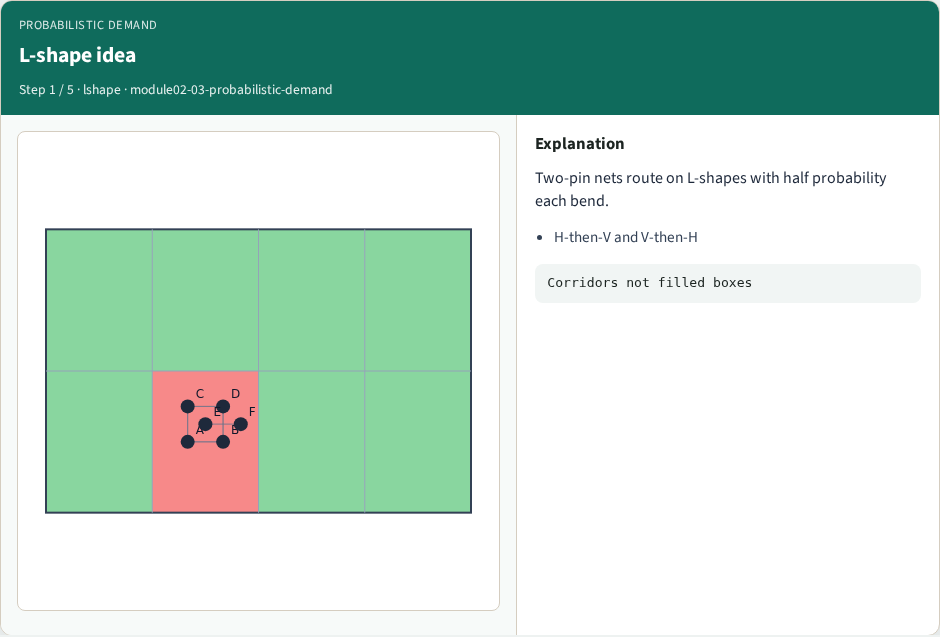
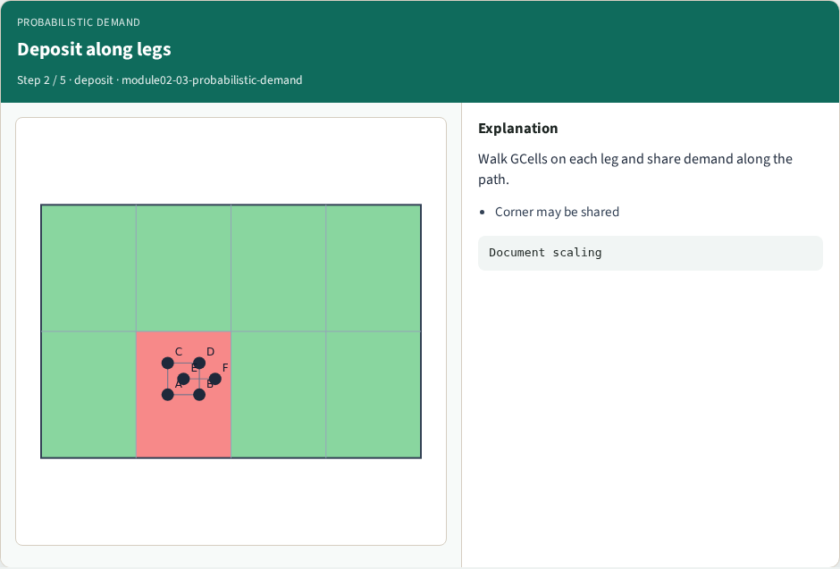
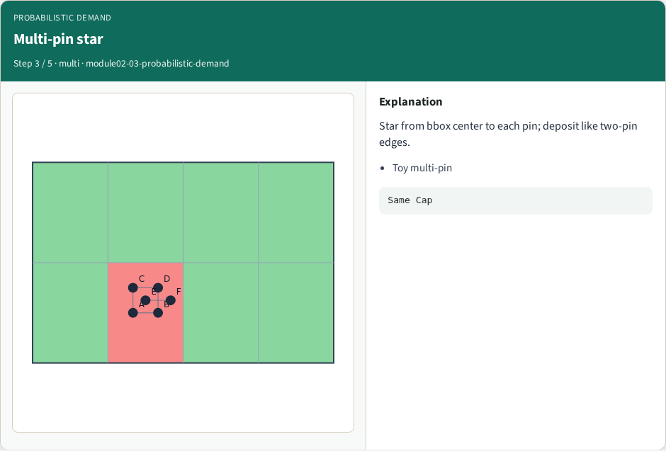
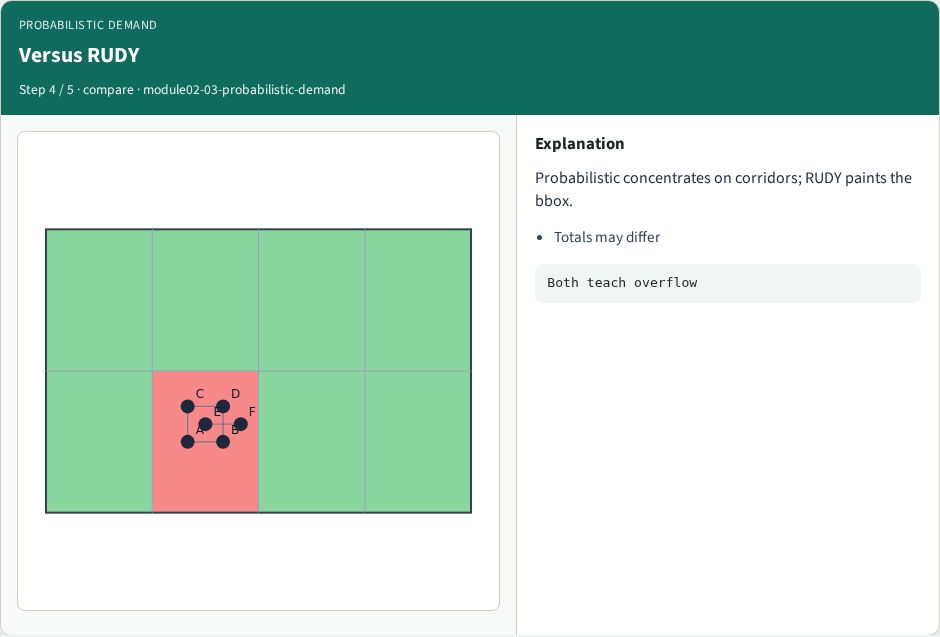
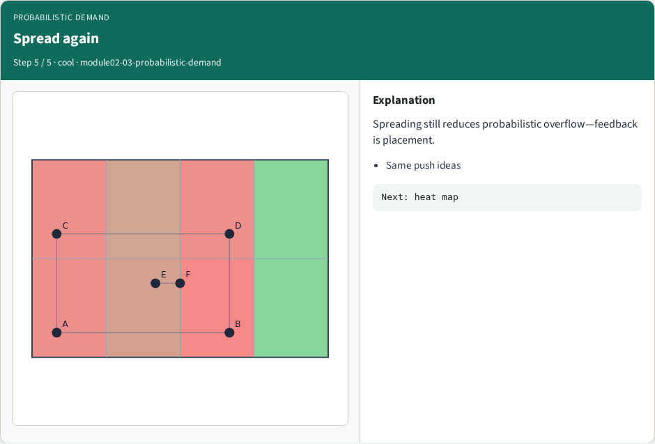

# Probabilistic routing demand

**Module id:** module02-03-probabilistic-demand
**Lab:** probabilistic-demand
**Tracks:** A (implement) · B (browser lab)

## Slide 1 — L-shape routes

RUDY paints the whole bbox. Probabilistic demand instead assumes two-pin nets route on L-shapes: half the probability goes horizontal-then-vertical, half the other bend. That concentrates demand on corridors instead of the filled rectangle.

## Slide 2 — The idea

For a two-pin net, walk GCells along each L and add one half unit of demand per walk (toy scaling). Multi-pin nets: star from the bbox center to each pin and deposit like two-pin edges. Compare the resulting matrix to RUDY on the same placement.

## Slide 3 — Browser lab track

<!-- algorithm-walkthrough -->

## Slide 4 — L-shape idea

Two-pin nets route on L-shapes with half probability each bend.

## Slide 5 — Deposit along legs

Walk GCells on each leg and share demand along the path.

## Slide 6 — Multi-pin star

Star from bbox center to each pin; deposit like two-pin edges.

## Slide 7 — Versus RUDY

Probabilistic concentrates on corridors; RUDY paints the bbox.

## Slide 8 — Spread again

Spreading still reduces probabilistic overflow—feedback is placement.

<!-- /algorithm-walkthrough -->

Open **probabilistic-demand**. Toggle RUDY versus probabilistic overlays. Note which center tiles differ. Challenges score your placement’s probabilistic overflow, not which button you clicked.

## Slide 9 — Implement track

Implement `probabilistic_demand`. On spread placement, print both RUDY and probabilistic totals. Explain one tile where they disagree and why.

## Slide 10 — Pitfalls

Double-counting the corner GCell on both L legs. Forgetting multi-pin nets. Scaling probabilistic deposits so differently from RUDY that overflow comparisons become meaningless—document your unit choice.

## Slide 11 — Your turn

Clear the checklist. Next: turn demand into a congestion heat map.
