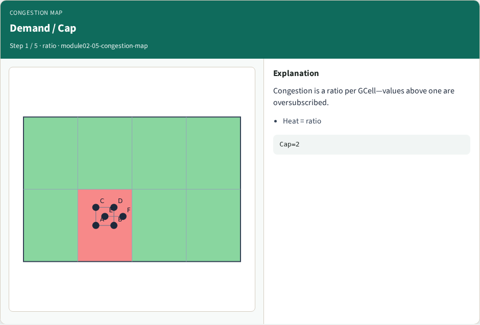
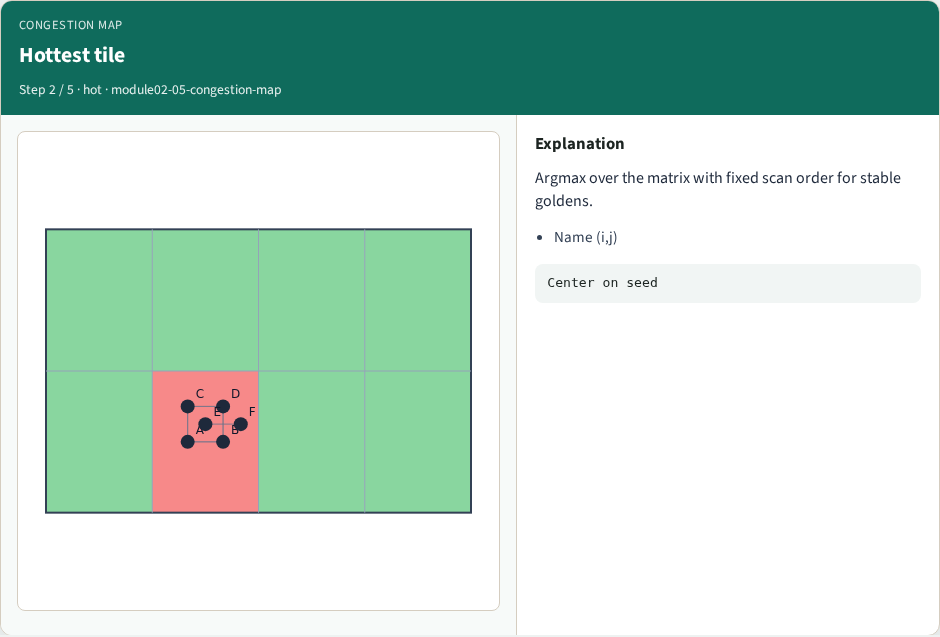
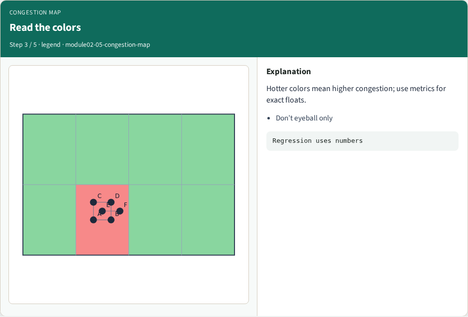
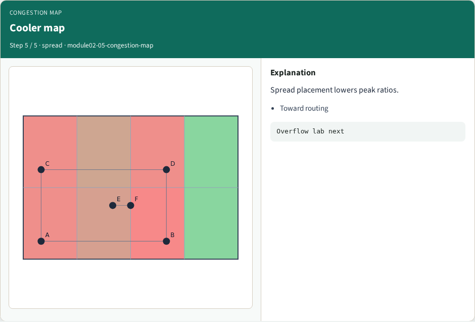

# Congestion heat map — step-by-step (for slides / transcript)

**Module:** `module02-05-congestion-map`  
**Lab / algo:** `congestion-map`  
**Viewer:** `/tools/algorithm-walkthrough/?algo=congestion-map&step=1`

Use each **Caption** as spoken prose (or a shortened slide note).
Use **Bullets** on the PPT; pair with the PNG in `assets/steps/`.

## Step 1 — Demand / Cap



**Caption (transcript):** Congestion is a ratio per GCell—values above one are oversubscribed.

**Slide bullets:**

- Heat = ratio

**On-screen metrics:**

```
Cap=2
```

## Step 2 — Hottest tile



**Caption (transcript):** Argmax over the matrix with fixed scan order for stable goldens.

**Slide bullets:**

- Name (i,j)

**On-screen metrics:**

```
Center on seed
```

## Step 3 — Read the colors



**Caption (transcript):** Hotter colors mean higher congestion; use metrics for exact floats.

**Slide bullets:**

- Don’t eyeball only

**On-screen metrics:**

```
Regression uses numbers
```

## Step 4 — Move the hotspot


**Caption (transcript):** Dragging cells can move which tile is hottest.

**Slide bullets:**

- Learner state

**On-screen metrics:**

```
Challenges score positions
```

## Step 5 — Cooler map



**Caption (transcript):** Spread placement lowers peak ratios.

**Slide bullets:**

- Toward routing

**On-screen metrics:**

```
Overflow lab next
```

