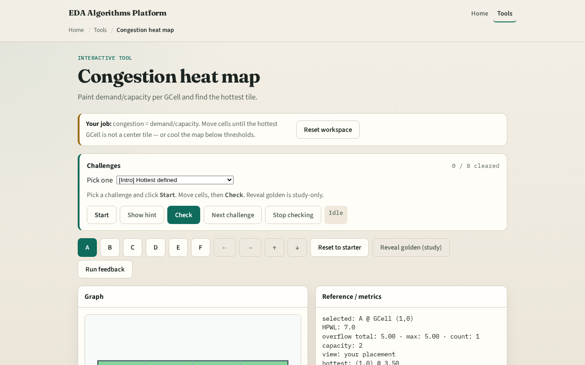

# Congestion heat map

**Module id:** module02-05-congestion-map
**Lab:** congestion-map
**Tracks:** A (implement) · B (browser lab)

## Slide 1 — Demand over capacity

Congestion is a ratio: demand divided by capacity. A heat map paints that ratio per GCell so you can point at the hottest tile without reading a matrix of floats aloud.

## Slide 2 — The idea

cong[i][j] equals demand[i][j] over Cap. Values above one are oversubscribed. The hottest GCell is the argmax. On the congested seed, expect the center columns to light up first.

<!-- algorithm-walkthrough -->

## Slide 3 — Demand / Cap

Congestion is a ratio per GCell—values above one are oversubscribed.

## Slide 4 — Hottest tile

Argmax over the matrix with fixed scan order for stable goldens.

## Slide 5 — Read the colors

Hotter colors mean higher congestion; use metrics for exact floats.

## Slide 6 — Move the hotspot

Dragging cells can move which tile is hottest.

## Slide 7 — Cooler map

Spread placement lowers peak ratios.

<!-- /algorithm-walkthrough -->

## Slide 8 — Browser lab track

Open **congestion-map**. Read the heat legend. Move cells until a different GCell becomes hottest, then Check. Study reveal shows a reference map—do not rely on it to pass.

## Slide 9 — Implement track

Build `congestion_map(demand, capacity)` returning the ratio matrix and hottest index. Print hottest for both placement seeds.

## Slide 10 — Pitfalls

Dividing by zero capacity. Coloring by raw demand while labeling the plot “congestion.” Breaking ties in argmax nondeterministically—pick a fixed scan order.

## Slide 11 — Your turn

Finish the lab. Next: overflow metrics compress the map into totals you can regress.
