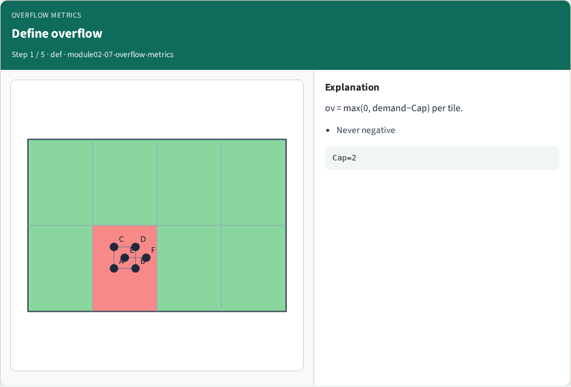
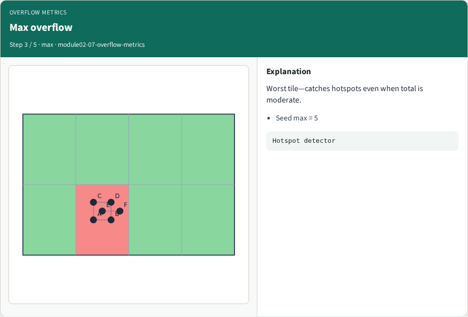
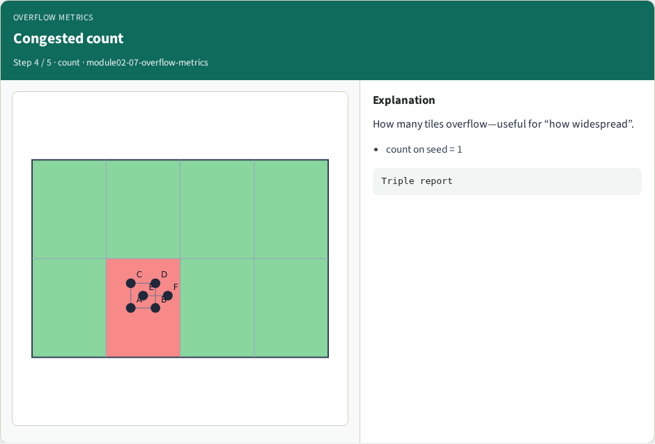
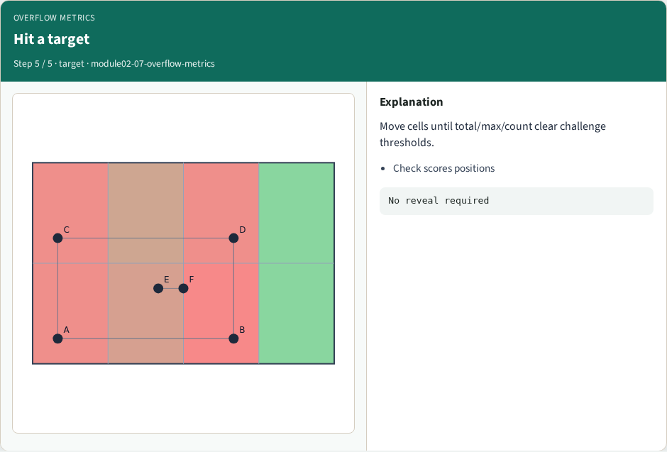
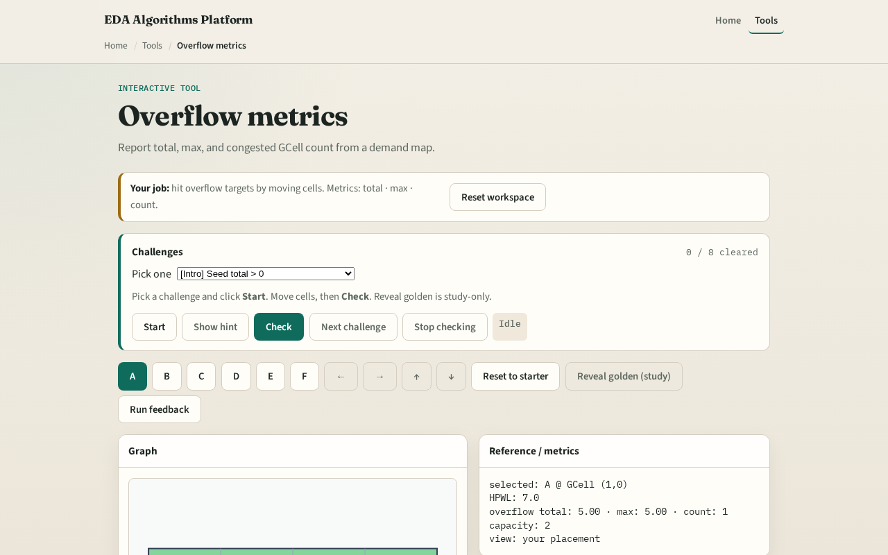

# Numbers that regress

Overflow is demand above capacity

---

## The idea
- Ov equals max of zero and demand minus Cap, per tile
- Total is the sum
- Max is the worst tile
- Count is how many tiles have positive overflow
- Report all three every time you change placement

---

## Define overflow

---

## Total overflow

---

## Max overflow

---

## Congested count

---

## Hit a target

---

## Browser lab track

---

## Implement track
- Implement `overflow_metrics`
- Assert congested_seed has higher total overflow than spread placement at Cap equals two
- Print the triple (total, max, count)

---

## Pitfalls
- Reporting negative “overflow.” Counting tiles with congestion greater than one while
- Comparing totals across estimators with incompatible demand units

---

## Your turn
- Hit the overflow targets
- Next: cell inflation, the first feedback knob

