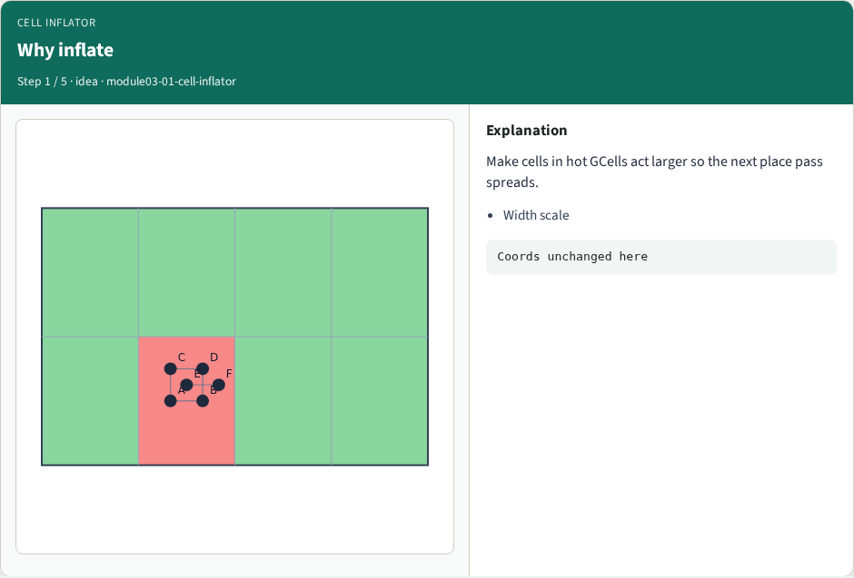
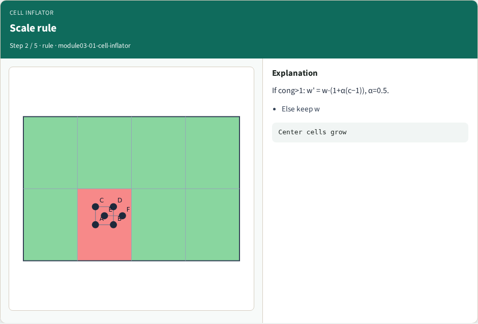
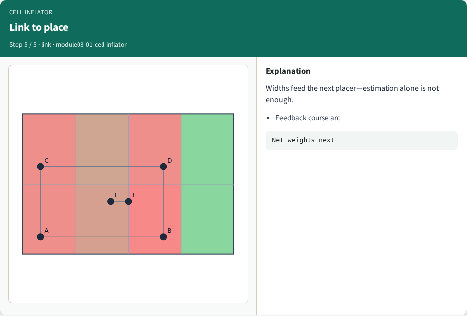
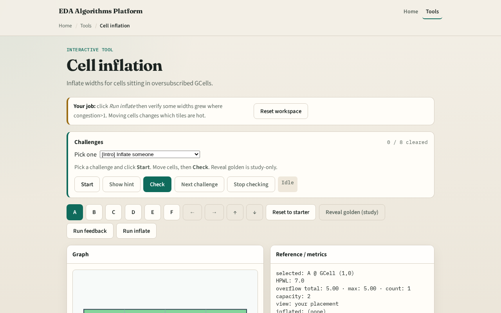

# Cell inflation

**Module id:** module03-01-cell-inflator
**Lab:** cell-inflator
**Tracks:** A (implement) · B (browser lab)

## Slide 1 — Make hot cells larger

Inflators tell the placer that cells in congested GCells should act bigger, encouraging spreading on the next pass. On the toy grid we scale width: width prime equals width times one plus alpha times congestion minus one, when congestion is above one.

## Slide 2 — The idea

Map each cell center to a GCell. If that tile’s congestion exceeds one, inflate; otherwise leave width alone. Alpha around zero point five keeps the demo visible without exploding geometry. Coordinates stay put—this lab changes widths, not x y.

<!-- algorithm-walkthrough -->

## Slide 3 — Why inflate

Make cells in hot GCells act larger so the next place pass spreads.

## Slide 4 — Scale rule

If cong>1: w' = w·(1+α(c−1)), α=0.5.

## Slide 5 — Apply once

Compute congestion from RUDY, then inflate widths once.

## Slide 6 — Quiet tiles

Cells in tiles with cong≤1 stay at base width.

## Slide 7 — Link to place

Widths feed the next placer—estimation alone is not enough.

<!-- /algorithm-walkthrough -->

## Slide 8 — Browser lab track

Open **cell-inflator**. Run inflate on congested_seed and read which cells grew. Challenges verify inflated widths from your congestion state.

## Slide 9 — Implement track

Implement `inflate_cells` with alpha equals zero point five. Print before/after widths for cells sitting in oversubscribed tiles.

## Slide 10 — Pitfalls

Inflating every cell when only some GCells are hot. Inflating height when the placer model only tracks width. Applying inflation twice without resetting to base widths.

## Slide 11 — Your turn

Clear the inflator challenges. Next: net weighting—the wirelength-side knob.
