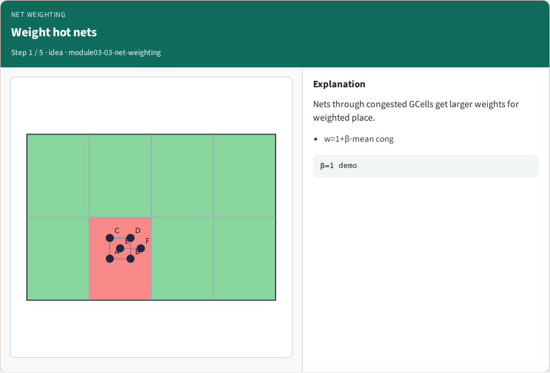
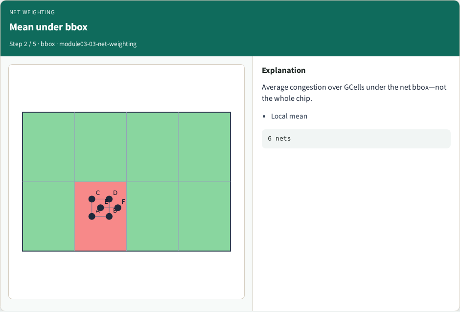
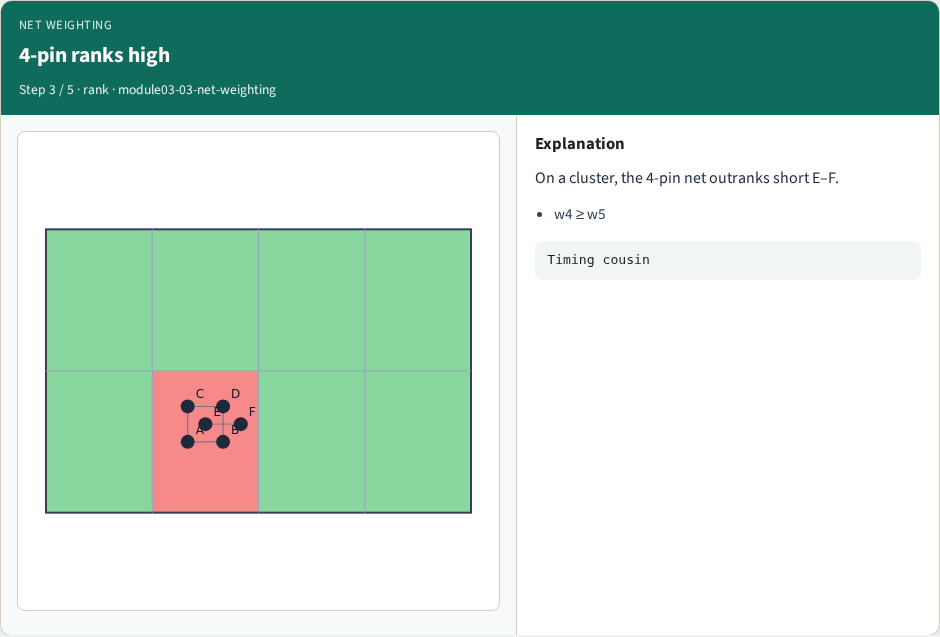
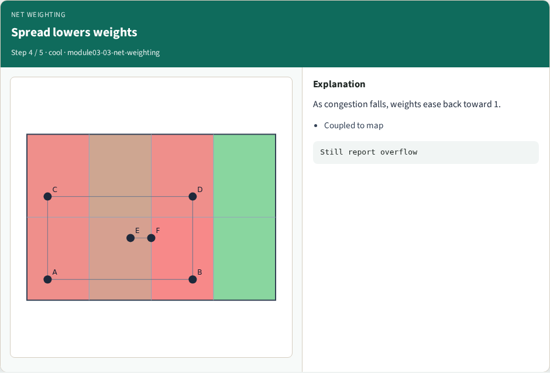
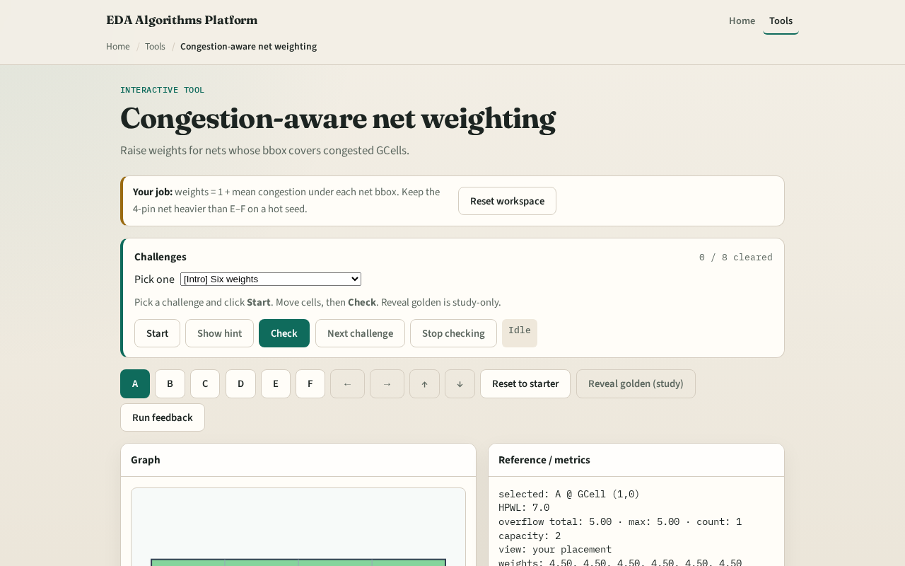

# Pull soft from hotspots

Net weighting raises the cost of nets that cross congested GCells so a weighted placer pulls those pins apart

---

## The idea
- For each net, average congestion over GCells under its bbox
- Scale with beta, one point zero is a clear demo
- The four-pin net on a clustered seed should outrank the short E–F net

---

## Weight hot nets

---

## Mean under bbox

---

## 4-pin ranks high

---

## Spread lowers weights

---

## Use in placer

---

## Browser lab track

---

## Implement track
- Implement `net_weights_from_congestion`
- Print the six weights for congested_seed
- Confirm net index four is among the highest

---

## Pitfalls
- Averaging over the whole chip instead of the net bbox
- Using demand instead of congestion ratios
- Updating weights but forgetting the placer still optimizes unweighted HPWL in the toy lab

---

## Your turn
- Finish weighting
- Next: one full placement feedback pass

