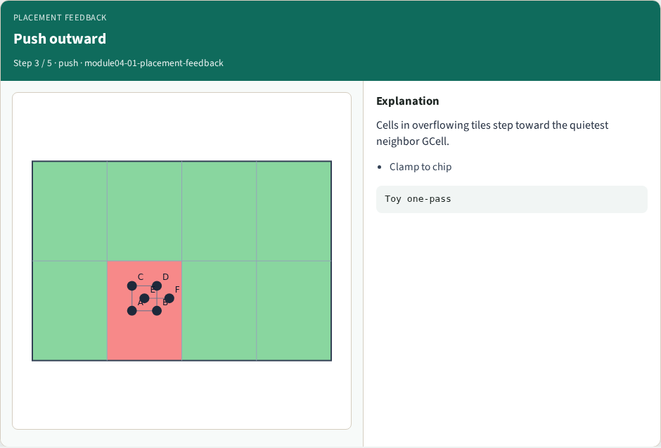
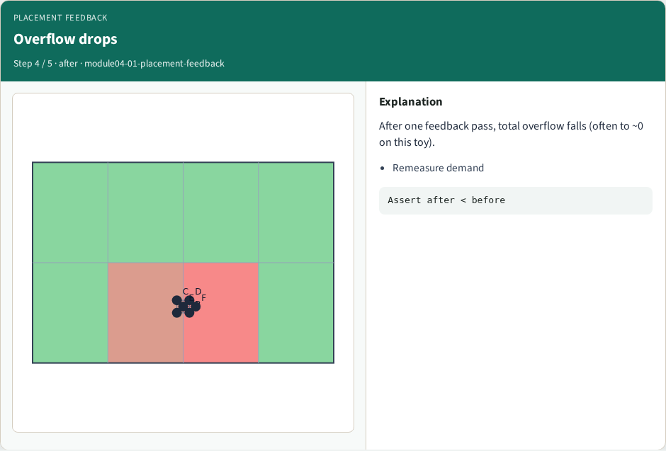
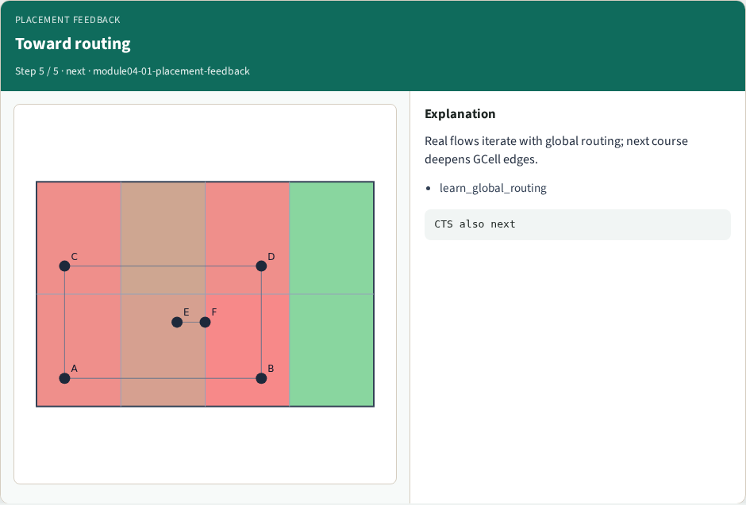
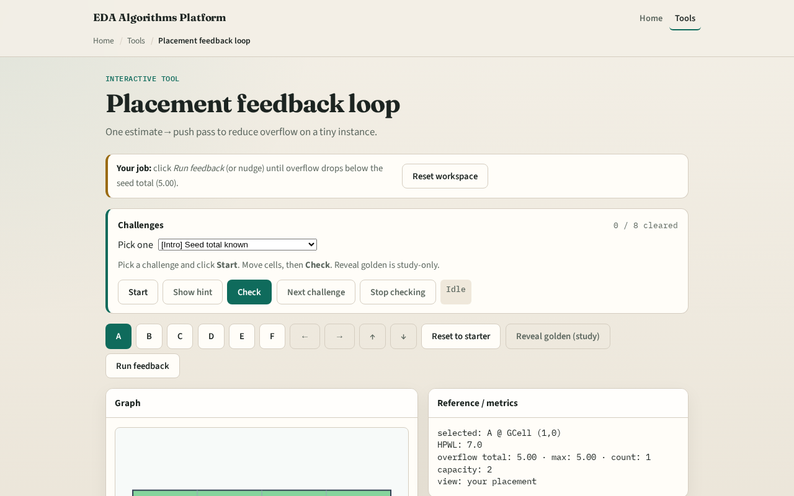

# Close the loop

Congestion estimation matters when it changes placement

---

## The idea
- After inflation
- Clamp to the chip
- Recompute RUDY
- On congested_seed you should see total overflow drop after one pass

---

## Hot starter

---

## Estimate

---

## Push outward

---

## Overflow drops

---

## Toward routing

---

## Browser lab track

---

## Implement track
- Implement `placement_feedback_lite`
- Print overflow before and after on congested_seed
- Assert after is strictly less than before at Cap equals two

---

## Pitfalls
- Pushing macros that should stay fixed
- Infinite oscillation from oversized steps, use a fraction of GCell size
- Declaring victory without recomputing demand after the move

---

## Your turn
- Complete the feedback lab and offline compare next
- Then the wrap points you to global routing

