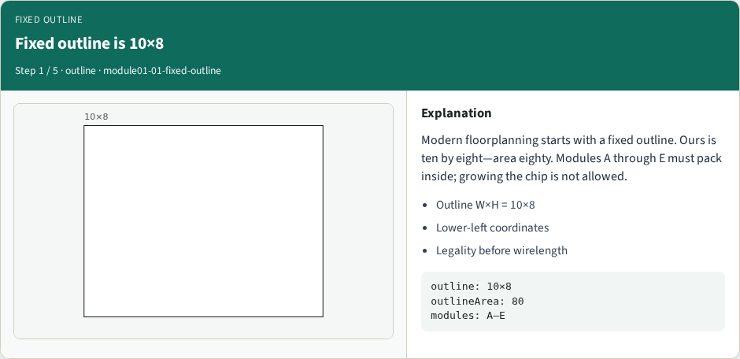
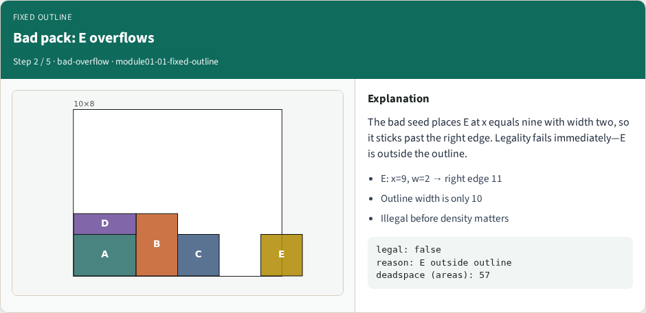
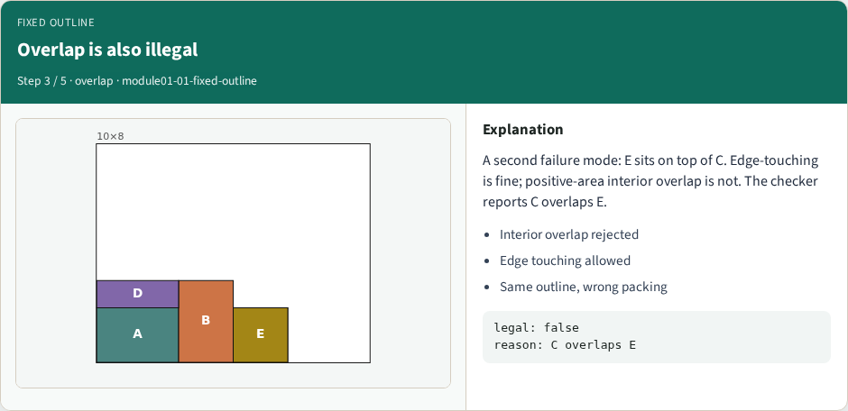
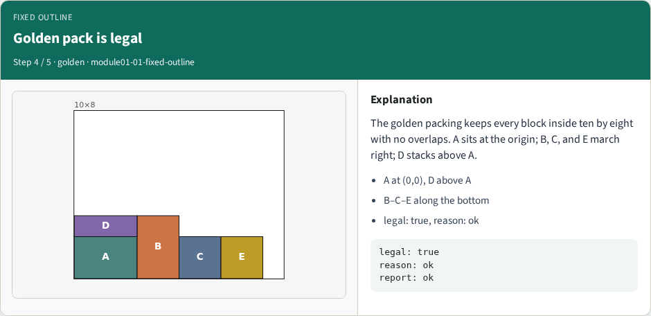
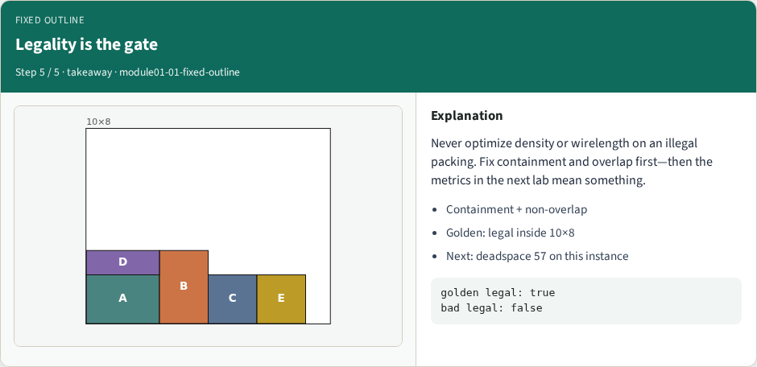

# Fixed-outline constraints — step-by-step (for slides / transcript)

**Module:** `module01-01-fixed-outline`  
**Lab / algo:** `fixed-outline`  
**Viewer:** `/tools/algorithm-walkthrough/?algo=fixed-outline&step=1`

Use each **Caption** as spoken prose (or a shortened slide note).
Use **Bullets** on the PPT; pair with the PNG in `assets/steps/`.

## Step 1 — Fixed outline is 10×8



**Caption (transcript):** Modern floorplanning starts with a fixed outline. Ours is ten by eight—area eighty. Modules A through E must pack inside; growing the chip is not allowed.

**Slide bullets:**

- Outline W×H = 10×8
- Lower-left coordinates
- Legality before wirelength

**On-screen metrics:**

```
outline: 10×8
outlineArea: 80
modules: A–E
```

## Step 2 — Bad pack: E overflows



**Caption (transcript):** The bad seed places E at x equals nine with width two, so it sticks past the right edge. Legality fails immediately—E is outside the outline.

**Slide bullets:**

- E: x=9, w=2 → right edge 11
- Outline width is only 10
- Illegal before density matters

**On-screen metrics:**

```
legal: false
reason: E outside outline
deadspace (areas): 57
```

## Step 3 — Overlap is also illegal



**Caption (transcript):** A second failure mode: E sits on top of C. Edge-touching is fine; positive-area interior overlap is not. The checker reports C overlaps E.

**Slide bullets:**

- Interior overlap rejected
- Edge touching allowed
- Same outline, wrong packing

**On-screen metrics:**

```
legal: false
reason: C overlaps E
```

## Step 4 — Golden pack is legal



**Caption (transcript):** The golden packing keeps every block inside ten by eight with no overlaps. A sits at the origin; B, C, and E march right; D stacks above A.

**Slide bullets:**

- A at (0,0), D above A
- B–C–E along the bottom
- legal: true, reason: ok

**On-screen metrics:**

```
legal: true
reason: ok
report: ok
```

## Step 5 — Legality is the gate



**Caption (transcript):** Never optimize density or wirelength on an illegal packing. Fix containment and overlap first—then the metrics in the next lab mean something.

**Slide bullets:**

- Containment + non-overlap
- Golden: legal inside 10×8
- Next: deadspace 57 on this instance

**On-screen metrics:**

```
golden legal: true
bad legal: false
```

