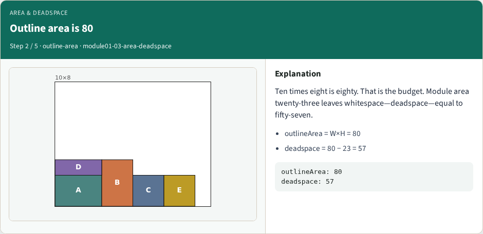
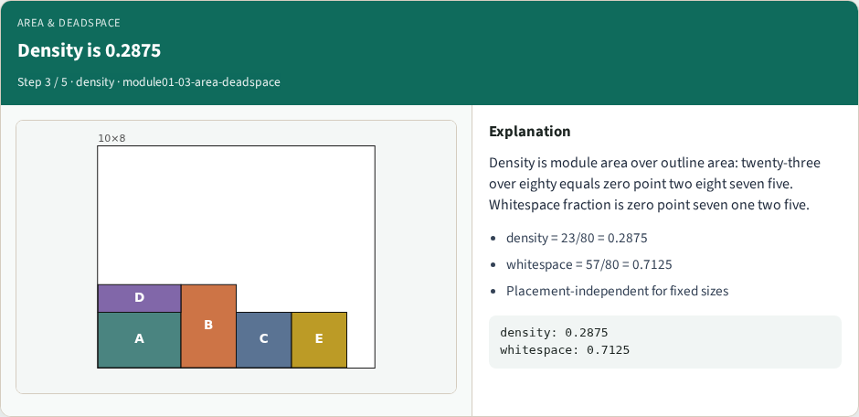
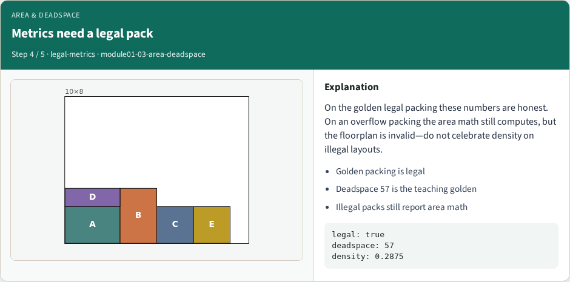
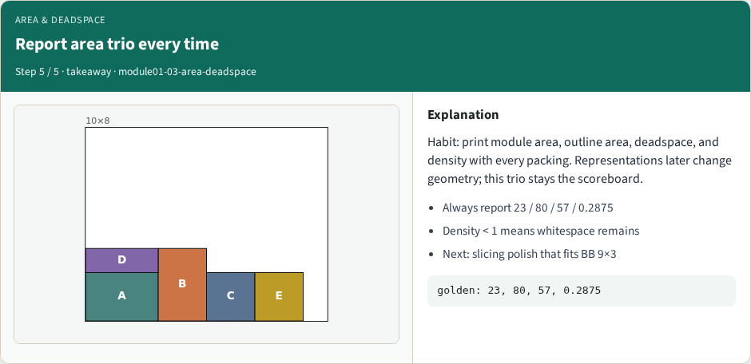

# Area, packing density, whitespace/deadspace

With a legal packing in hand, score the whitespace

---

## Module areas sum to 23

---

## Outline area is 80

---

## Density is 0.2875

---

## Metrics need a legal pack

---

## Report area trio every time

---

## Browser lab track
- Open area-deadspace, load the golden packing, and read the metrics panel

---

## Implement track
- Implement moduleAreaSum, outlineArea, deadspace, and density
- Assert deadspace equals eighty minus twenty-three on the starter modules

---

## Pitfalls
- Reporting density on an illegal pack

---

## Your turn
- Print the area trio on every run
- Next lab builds a slicing polish whose bounding box is nine by three inside this outline

