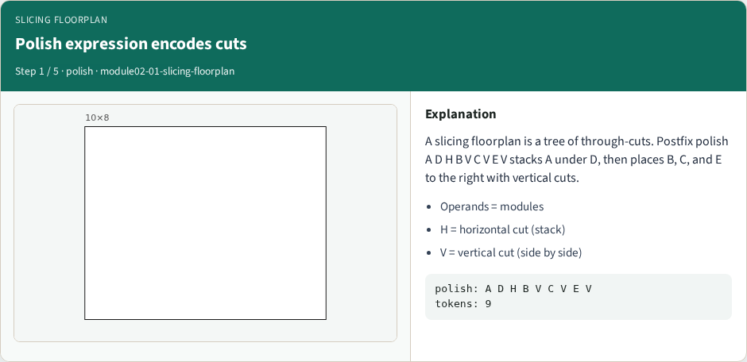
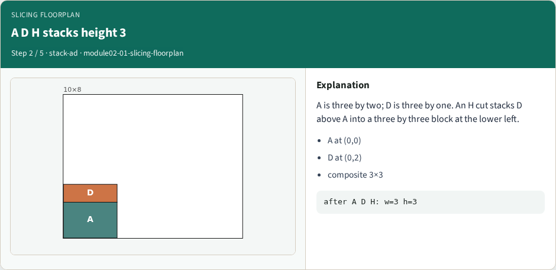
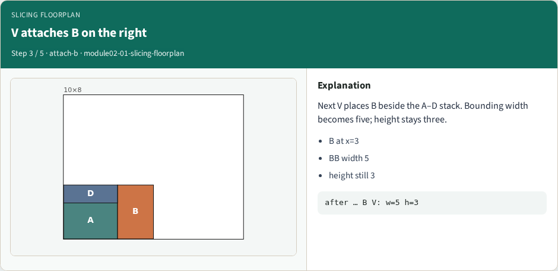
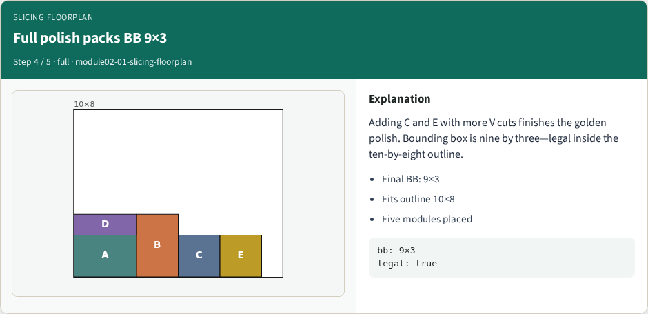
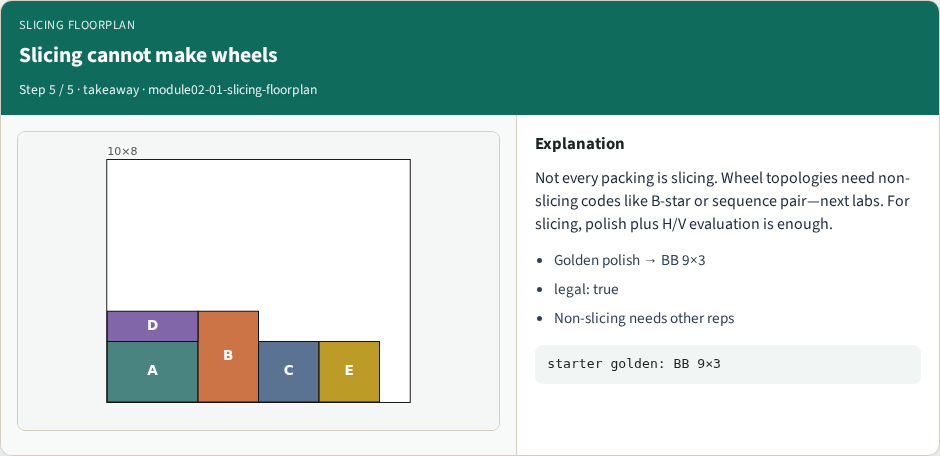

# Slicing tree / polish expression packing

Slicing floorplans use through-cuts

---

## Pseudocode
- Slicing polish is a postfix stack
- Modules push rectangles; H stacks vertically; V places side by side
- The sketch names the operators so evaluation stays deterministic
- Open this module's examples file and find the Pseudocode section
- That written sketch is what you implement on the implement track and what the browser

---

## Algorithm sketch
- Golden tokens A D H B V C V E V pack to a nine by three bbox inside the ten by eight

---

## Algorithm sketch — try these

```
INPUT: polish tokens (modules + H/V)
OUTPUT: packing (x,y,w,h) per module
stack-eval postfix:
  module → push rect
  H: pop a,b; stack vertically
  V: pop a,b; place side by side
GOLDEN: A D H B V C V E V
bbox 9×3; legal in 10×8
```

---

## Polish expression encodes cuts


---

## A D H stacks height 3


---

## V attaches B on the right


---

## Full polish packs BB 9×3


---

## Slicing cannot make wheels


---

## Browser lab track
- Open slicing-floorplan and Evaluate polish
- Confirm bounding width nine, height three, and a legal packing inside ten by eight

---

## Implement track
- Implement postfix evaluation for H and V
- On the golden token list, assert width nine, height three, and is_legal_packing true

---

## Pitfalls
- Swapping H/V meanings

---

## Your turn
- Ship a legal polish pack with BB nine by three
- Next: B-star trees for non-slicing adjacency

