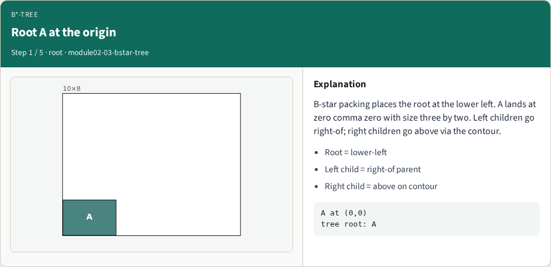
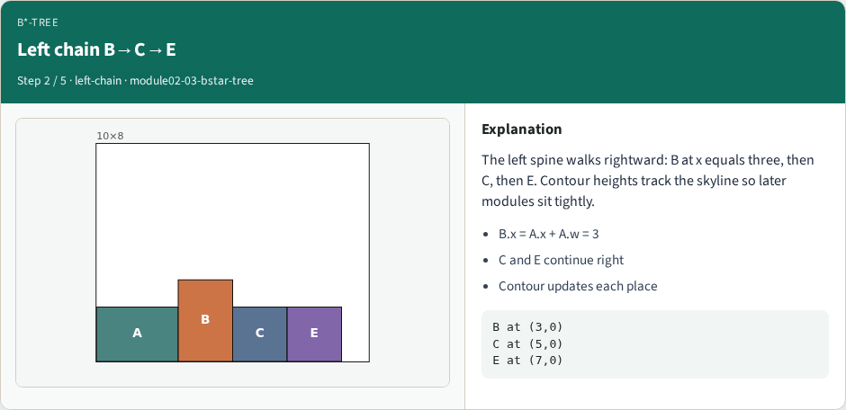
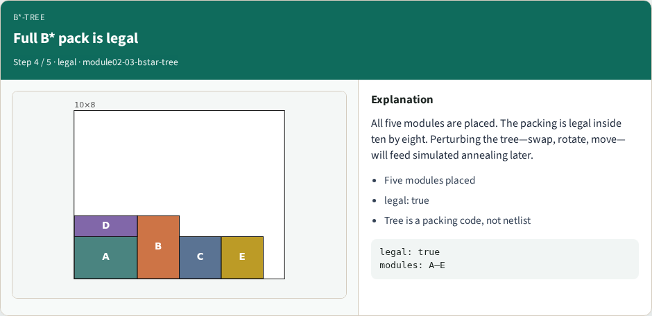
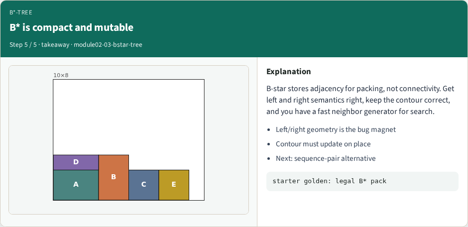

# B*-tree floorplan representation

B-star stores packing adjacency: left child sits right-of the parent; right child sits above on a contour

---

## Pseudocode
- B-star packing walks the tree with a contour
- Left child sits to the right of the parent
- Open this module's examples file and find the Pseudocode section
- That written sketch is what you implement on the implement track and what the browser

---

## Algorithm sketch
- Golden tree roots A at the origin
- B’s x equals A’s right edge; D’s y is at least A’s height
- The packing must stay legal in the outline

---

## Algorithm sketch — try these

```
INPUT: binary tree (left=right-of, right=above)
OUTPUT: packed (x,y) via contour
root at (0,0)
left child: x ← parent.x + parent.w
right child: y ← above parent (contour)
update horizontal contour after each place
GOLDEN: A@0,0; B.x=A.x+A.w; D.y≥A.h; legal
```

---

## Root A at the origin


---

## Left chain B→C→E


---

## Right child D above A


---

## Full B* pack is legal


---

## B* is compact and mutable


---

## Browser lab track
- Open bstar-tree and Pack B*-tree
- Confirm A at zero comma zero, B at x equals three, D above A

---

## Implement track
- Build the golden tree and contour-pack it
- Assert A at (0,0), B.x equals A.x plus A.w, D.y at least A.h, and legality true

---

## Pitfalls
- Reversing left/right geometry; stale contour segments; treating the tree as a netlist

---

## Your turn
- Produce the legal B-star packing
- Next: sequence-pair permutations as another encoding

