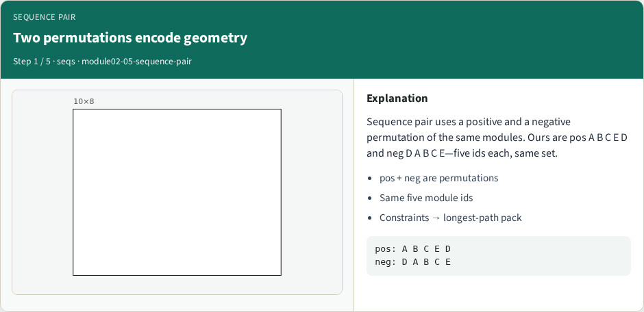
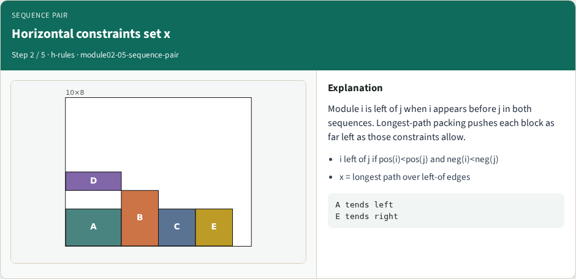
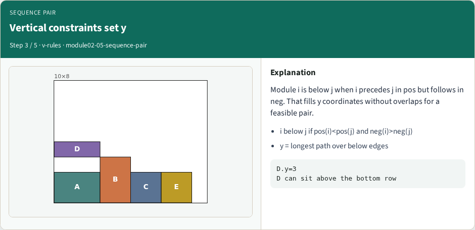
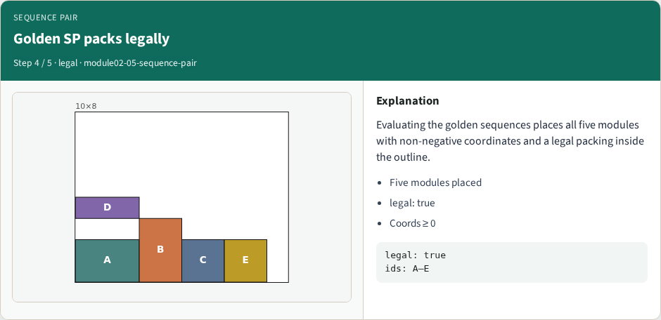

# Sequence-pair representation

Sequence pair uses positive permutation A B C E D and negative D A B C E

---

## Two permutations encode geometry

---

## Horizontal constraints set x

---

## Vertical constraints set y

---

## Golden SP packs legally

---

## SP neighbors are permutation moves

---

## Browser lab track
- Open sequence-pair and Pack sequence pair
- Confirm five modules, non-negative coordinates

---

## Implement track
- Implement longest-path SP packing
- Assert pos and neg are the same five ids, and the golden pair packs legally

---

## Pitfalls
- Mismatched id sets between pos and neg

---

## Your turn
- Pack the golden sequences legally
- Next: simulated annealing that prefers legal low-cost neighbors

