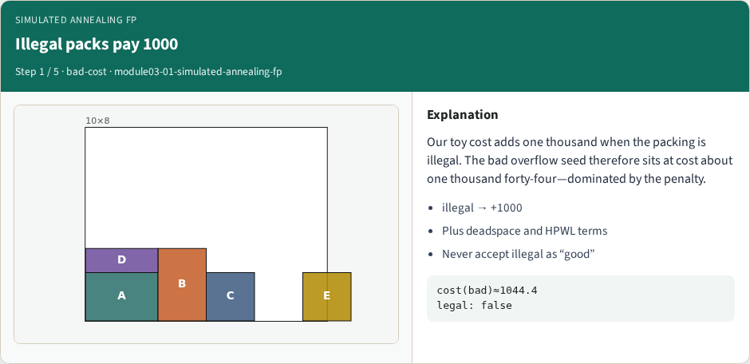
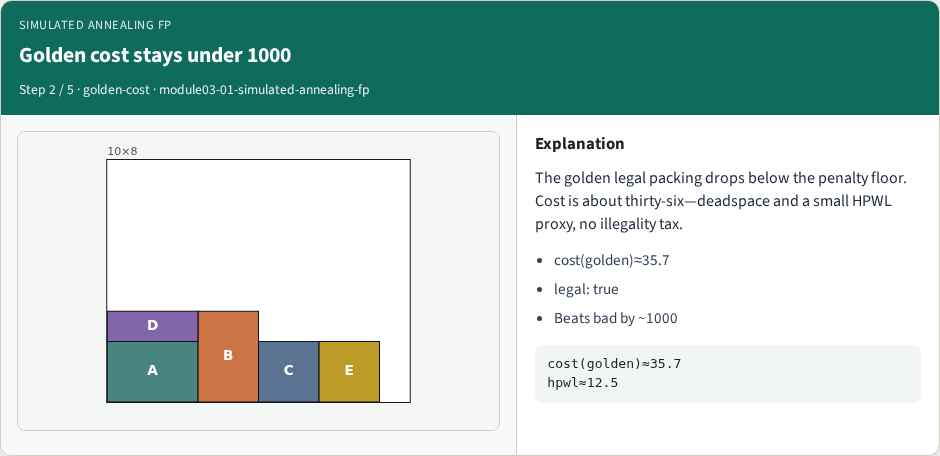
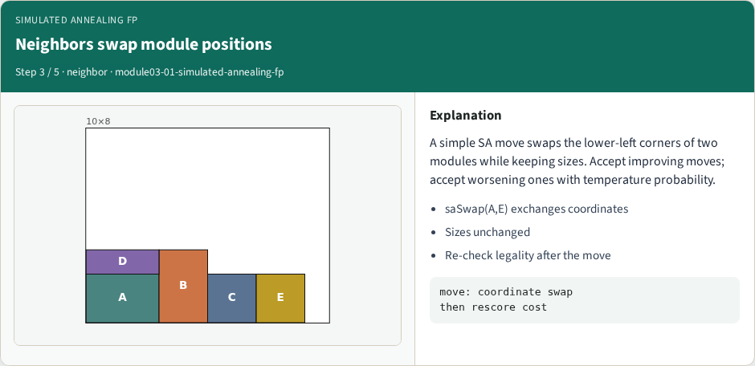
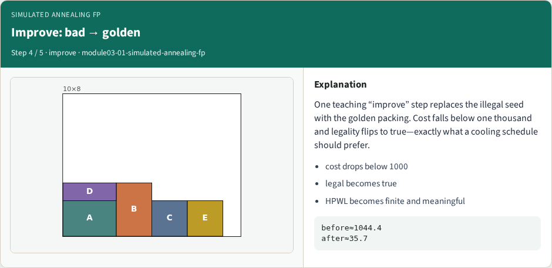
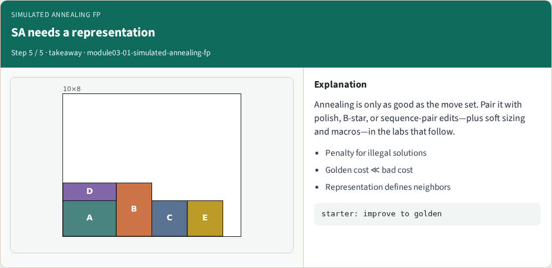

# Simulated annealing floorplan search

Toy cost adds one thousand when a packing is illegal

---

## Illegal packs pay 1000

---

## Golden cost stays under 1000

---

## Neighbors swap module positions

---

## Improve: bad → golden

---

## SA needs a representation

---

## Browser lab track
- Open simulated-annealing-fp
- Show bad, note cost at least one thousand
- Show golden or Improve, cost drops below one thousand and legality becomes true

---

## Implement track
- Implement cost with an illegality penalty, plus deadspace and HPWL terms
- Assert cost(golden) is less than cost(bad), and saSwap only exchanges coordinates

---

## Pitfalls
- Accepting illegal states without penalty

---

## Your turn
- Demonstrate one improve step from bad to golden
- Next: soft module A reshaped from three by two to two by three

