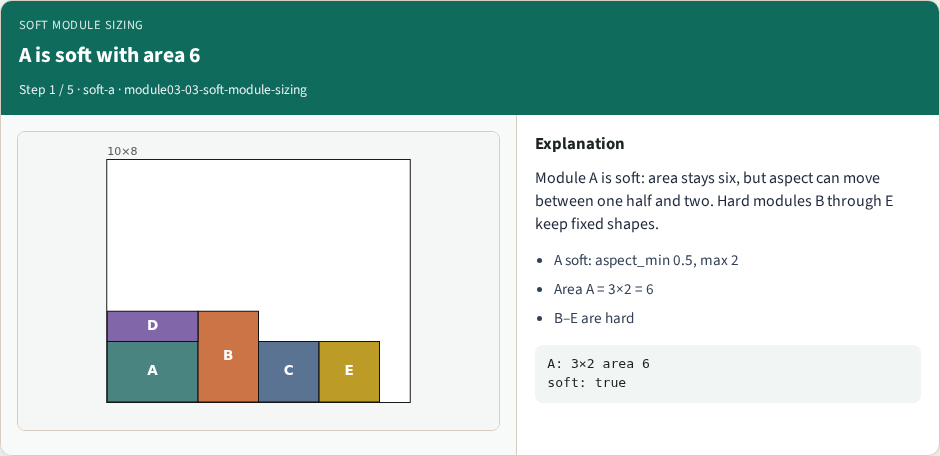
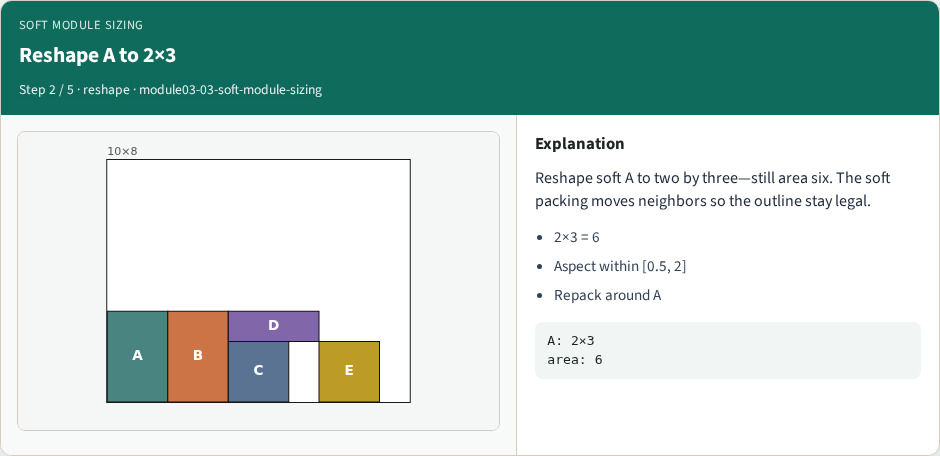
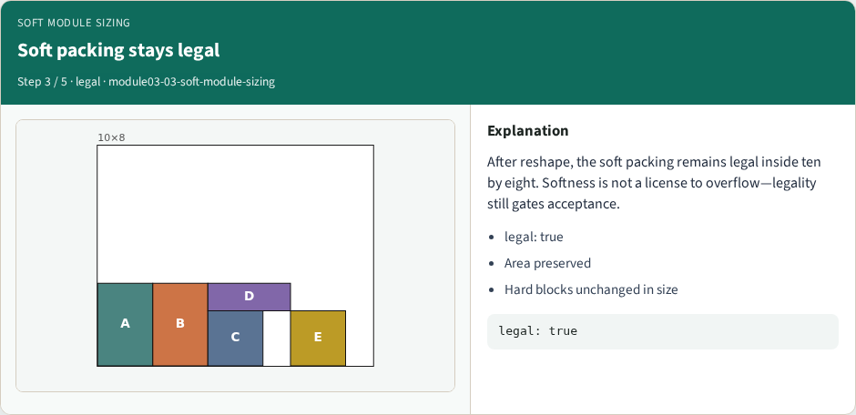
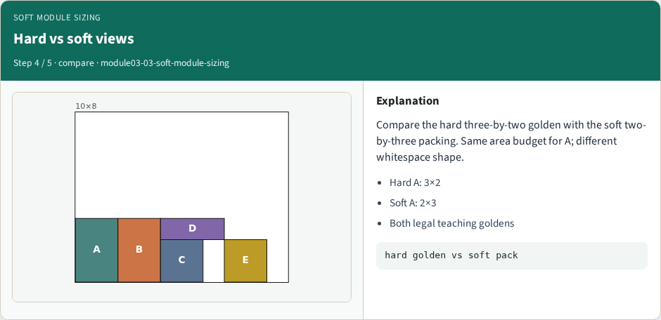
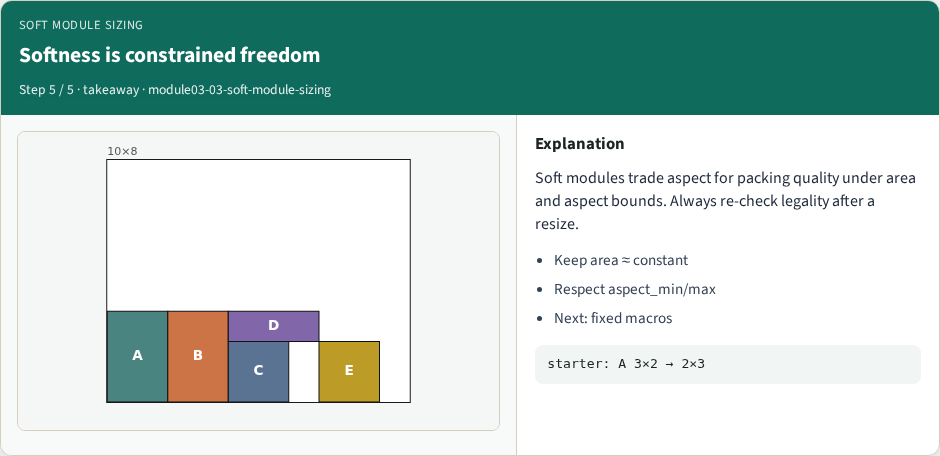

# Soft module aspect sizing — step-by-step (for slides / transcript)

**Module:** `module03-03-soft-module-sizing`  
**Lab / algo:** `soft-module-sizing`  
**Viewer:** `/tools/algorithm-walkthrough/?algo=soft-module-sizing&step=1`

Use each **Caption** as spoken prose (or a shortened slide note).
Use **Bullets** on the PPT; pair with the PNG in `assets/steps/`.

## Step 1 — A is soft with area 6



**Caption (transcript):** Module A is soft: area stays six, but aspect can move between one half and two. Hard modules B through E keep fixed shapes.

**Slide bullets:**

- A soft: aspect_min 0.5, max 2
- Area A = 3×2 = 6
- B–E are hard

**On-screen metrics:**

```
A: 3×2 area 6
soft: true
```

## Step 2 — Reshape A to 2×3



**Caption (transcript):** Reshape soft A to two by three—still area six. The soft packing moves neighbors so the outline stay legal.

**Slide bullets:**

- 2×3 = 6
- Aspect within [0.5, 2]
- Repack around A

**On-screen metrics:**

```
A: 2×3
area: 6
```

## Step 3 — Soft packing stays legal



**Caption (transcript):** After reshape, the soft packing remains legal inside ten by eight. Softness is not a license to overflow—legality still gates acceptance.

**Slide bullets:**

- legal: true
- Area preserved
- Hard blocks unchanged in size

**On-screen metrics:**

```
legal: true
```

## Step 4 — Hard vs soft views



**Caption (transcript):** Compare the hard three-by-two golden with the soft two-by-three packing. Same area budget for A; different whitespace shape.

**Slide bullets:**

- Hard A: 3×2
- Soft A: 2×3
- Both legal teaching goldens

**On-screen metrics:**

```
hard golden vs soft pack
```

## Step 5 — Softness is constrained freedom



**Caption (transcript):** Soft modules trade aspect for packing quality under area and aspect bounds. Always re-check legality after a resize.

**Slide bullets:**

- Keep area ≈ constant
- Respect aspect_min/max
- Next: fixed macros

**On-screen metrics:**

```
starter: A 3×2 → 2×3
```

