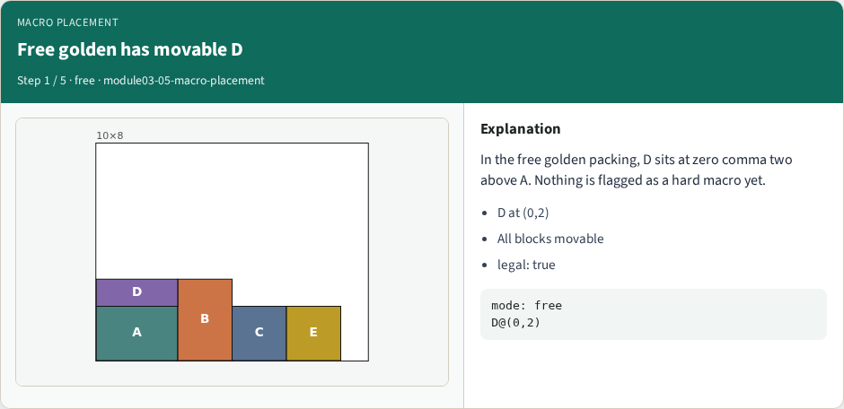
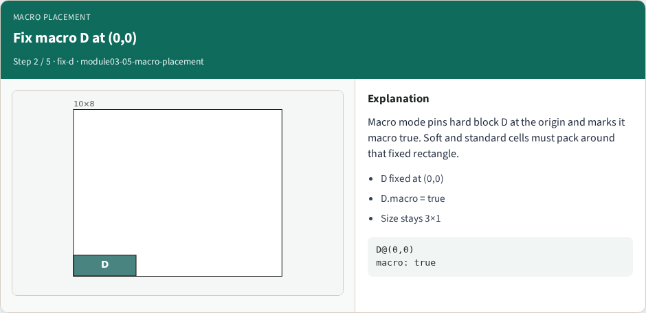
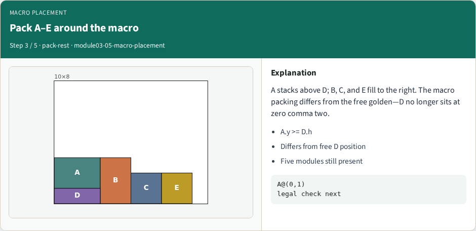
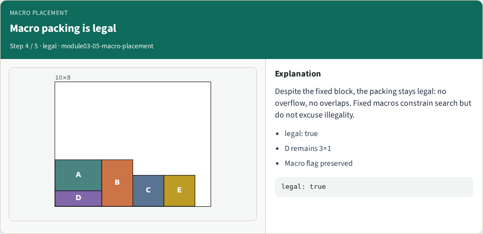

# Hard macro / fixed-block placement

**Module id:** module03-05-macro-placement
**Lab:** macro-placement
**Tracks:** A (implement) · B (browser lab)

## Slide 1 — Hard macro / fixed-block placement

Macros are hard fixed rectangles. In macro mode, D is pinned at zero comma zero with macro true, size three by one. A stacks above; B, C, and E pack to the right—still legal.


## Slide 2 — Pseudocode

Macro placement locks hard blocks first. Free modules pack around those obstacles; legality fails if a macro drifts.

Open this module's examples file and find the Pseudocode section. That written sketch is what you implement on the implement track and what the browser challenges measure.

## Slide 3 — Algorithm sketch

Free golden has movable D at zero comma two. Macro teaching pack pins D at zero comma zero with macro true and the rest legal.

```text
INPUT: macros F locked (x,y), free modules
OUTPUT: legal pack; macros never move
place each f∈F at locked pose (macro flag)
pack free modules around F obstacles
fail if any macro drifts
GOLDEN free: D@(0,2); macro: D@(0,0)
```


<!-- algorithm-walkthrough -->

## Slide 4 — Free golden has movable D



In the free golden packing, D sits at zero comma two above A. Nothing is flagged as a hard macro yet.

## Slide 5 — Fix macro D at (0,0)



Macro mode pins hard block D at the origin and marks it macro true. Soft and standard cells must pack around that fixed rectangle.

## Slide 6 — Pack A–E around the macro



A stacks above D; B, C, and E fill to the right. The macro packing differs from the free golden—D no longer sits at zero comma two.

## Slide 7 — Macro packing is legal



Despite the fixed block, the packing stays legal: no overflow, no overlaps. Fixed macros constrain search but do not excuse illegality.

## Slide 8 — Macros first, then cells


Industrial flows often place large macros before standard cells. Treat fixed rectangles as hard constraints, then optimize the rest.

<!-- /algorithm-walkthrough -->


## Slide 9 — Browser lab track

Open macro-placement. Compare free golden D at zero comma two with Place macros: D at zero comma zero. Confirm legality and the macro flag.

## Slide 10 — Implement track

Fix D, pack the rest, assert D at (0,0), D.macro true, and is_legal_packing true. Note the free golden differs.

## Slide 11 — Pitfalls

Moving macros after fixing them; shrinking macro size; allowing overlaps against the fixed block.

## Slide 12 — Your turn

Ship the legal macro packing. Next: hierarchical AB left and CDE right at offset five.
