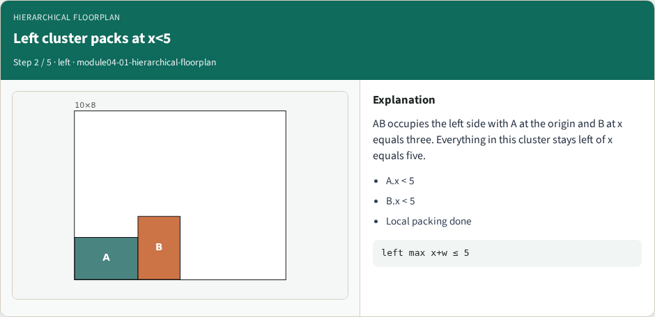
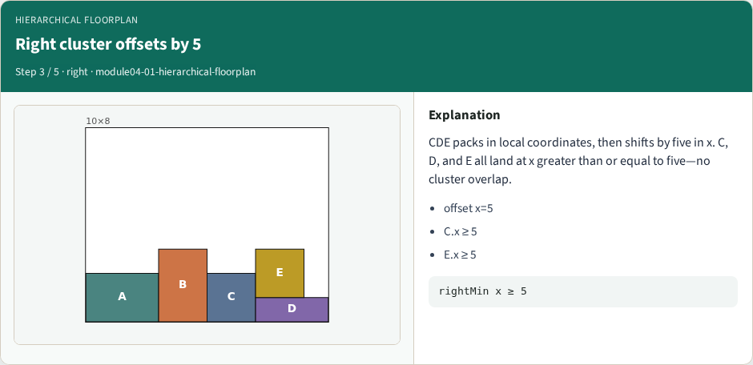
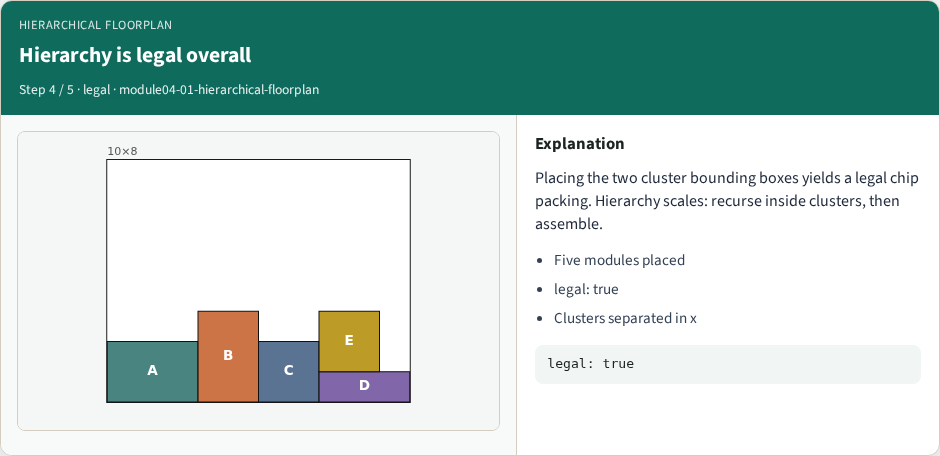
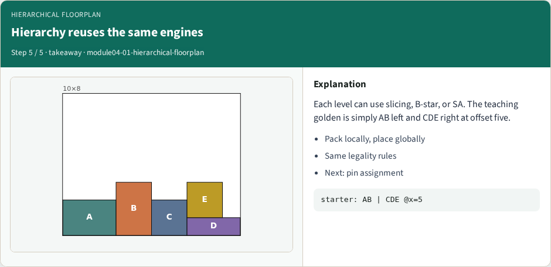

# Hierarchical floorplanning — step-by-step (for slides / transcript)

**Module:** `module04-01-hierarchical-floorplan`  
**Lab / algo:** `hierarchical-floorplan`  
**Viewer:** `/tools/algorithm-walkthrough/?algo=hierarchical-floorplan&step=1`

Use each **Caption** as spoken prose (or a shortened slide note).
Use **Bullets** on the PPT; pair with the PNG in `assets/steps/`.

## Step 1 — Two clusters: AB and CDE


**Caption (transcript):** Hierarchy packs locally first. Left cluster holds A and B; right cluster holds C, D, and E. Each cluster is a mini-floorplan.

**Slide bullets:**

- Left: AB
- Right: CDE
- Pack then place clusters

**On-screen metrics:**

```
clusters: 2
```

## Step 2 — Left cluster packs at x<5



**Caption (transcript):** AB occupies the left side with A at the origin and B at x equals three. Everything in this cluster stays left of x equals five.

**Slide bullets:**

- A.x < 5
- B.x < 5
- Local packing done

**On-screen metrics:**

```
left max x+w ≤ 5
```

## Step 3 — Right cluster offsets by 5



**Caption (transcript):** CDE packs in local coordinates, then shifts by five in x. C, D, and E all land at x greater than or equal to five—no cluster overlap.

**Slide bullets:**

- offset x=5
- C.x ≥ 5
- E.x ≥ 5

**On-screen metrics:**

```
rightMin x ≥ 5
```

## Step 4 — Hierarchy is legal overall



**Caption (transcript):** Placing the two cluster bounding boxes yields a legal chip packing. Hierarchy scales: recurse inside clusters, then assemble.

**Slide bullets:**

- Five modules placed
- legal: true
- Clusters separated in x

**On-screen metrics:**

```
legal: true
```

## Step 5 — Hierarchy reuses the same engines



**Caption (transcript):** Each level can use slicing, B-star, or SA. The teaching golden is simply AB left and CDE right at offset five.

**Slide bullets:**

- Pack locally, place globally
- Same legality rules
- Next: pin assignment

**On-screen metrics:**

```
starter: AB | CDE @x=5
```

