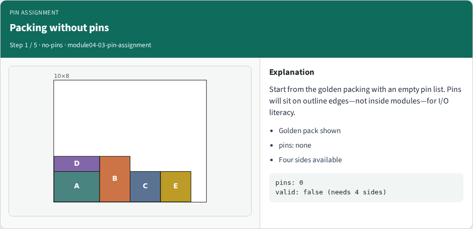
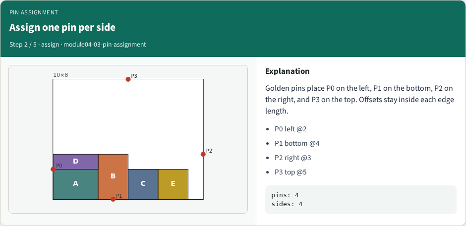
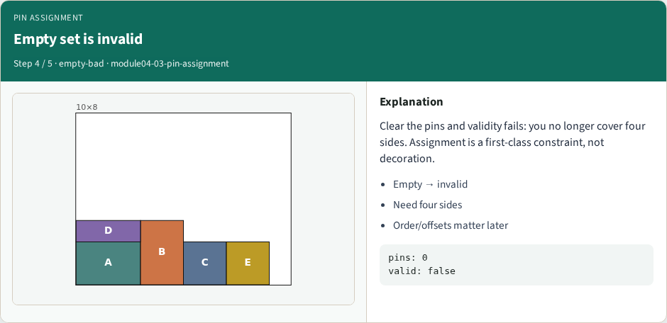
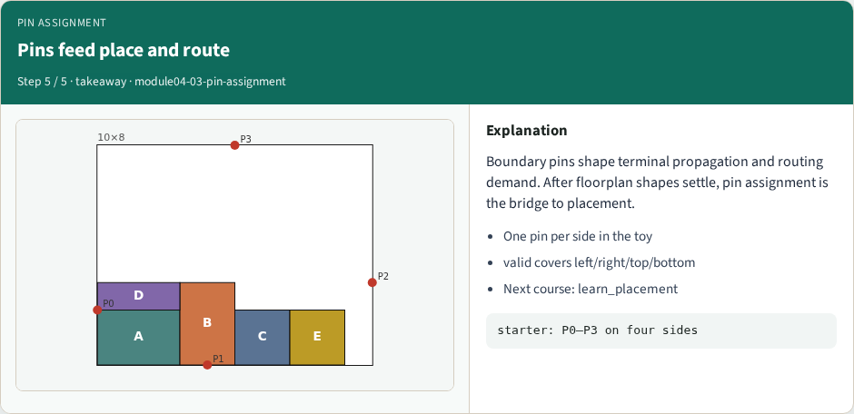

# Boundary pin / I/O assignment

**Module id:** module04-03-pin-assignment
**Lab:** pin-assignment
**Tracks:** A (implement) · B (browser lab)

## Slide 1 — Boundary pin / I/O assignment

Pins sit on outline edges. Golden assignment places P0 left, P1 bottom, P2 right, P3 top—four sides covered so pinsValid is true. An empty list is invalid.

<!-- algorithm-walkthrough -->

## Slide 2 — Packing without pins

Start from the golden packing with an empty pin list. Pins will sit on outline edges—not inside modules—for I/O literacy.

## Slide 3 — Assign one pin per side

Golden pins place P0 on the left, P1 on the bottom, P2 on the right, and P3 on the top. Offsets stay inside each edge length.

## Slide 4 — Coverage makes pinsValid true

pinsValid requires every side to appear and offsets to lie on the edge. The golden set covers all four sides—valid returns true.

## Slide 5 — Empty set is invalid

Clear the pins and validity fails: you no longer cover four sides. Assignment is a first-class constraint, not decoration.

## Slide 6 — Pins feed place and route

Boundary pins shape terminal propagation and routing demand. After floorplan shapes settle, pin assignment is the bridge to placement.

<!-- /algorithm-walkthrough -->

## Slide 7 — Browser lab track

Open pin-assignment. Assign golden pins, confirm four sides and valid true. Clear pins and watch validity fail.

## Slide 8 — Implement track

Implement pinsValid requiring all four sides and in-range offsets. Assert golden pins pass and the empty list fails.

## Slide 9 — Pitfalls

Putting pins inside modules; offsets past edge length; claiming validity with only two sides covered.

## Slide 10 — Your turn

Ship a valid four-side assignment. Offline compare is next; then the wrap points to learn_placement.
