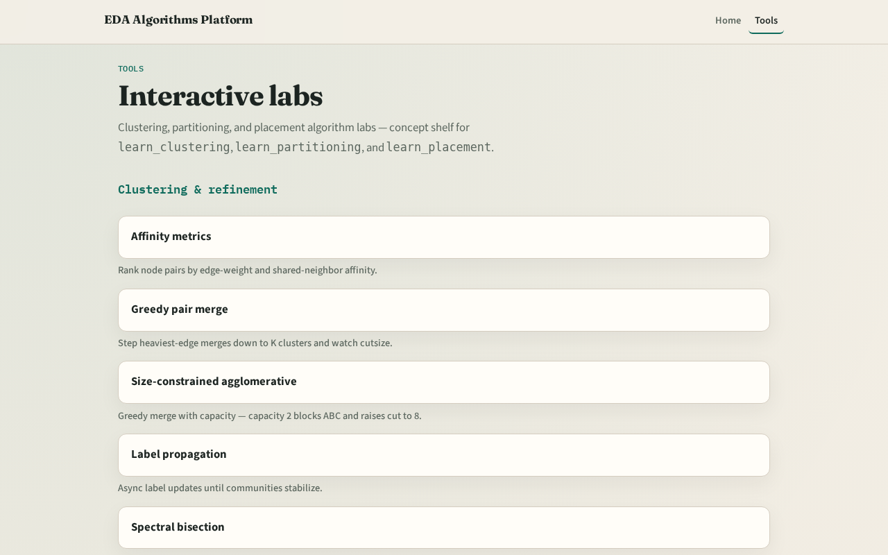

# Global routing in the stack

You estimated congestion on GCells

---

## Two tracks
- Track B is the browser lab: route nets, watch edge heat, clear challenges
- Track A is implement: Python solvers on tiny_gr.json
- Use either or both
- Browser first for intuition is fine

---

## Course map
- Foundations cover the routing graph and terminals
- Patterns cover L, Z, maze, and multipin star
- Congestion response covers edge overflow and rip-up
- Sequential global ties the flow together
- Offline compare and wrap close the path

---

## Prerequisites
- Finish learn_congestion or learn_legalization so GCell indexing and placed netlists
- Congestion demand maps are cousins, not the same as edge usage deposits

---

## How to move
- Read each module README
- Odd module slots leave room to insert algorithms later without renumbering

---

## Next
- Complete the quiz for this part
- Open the GCell routing graph and enumerate eleven edges on the four-by-two grid

