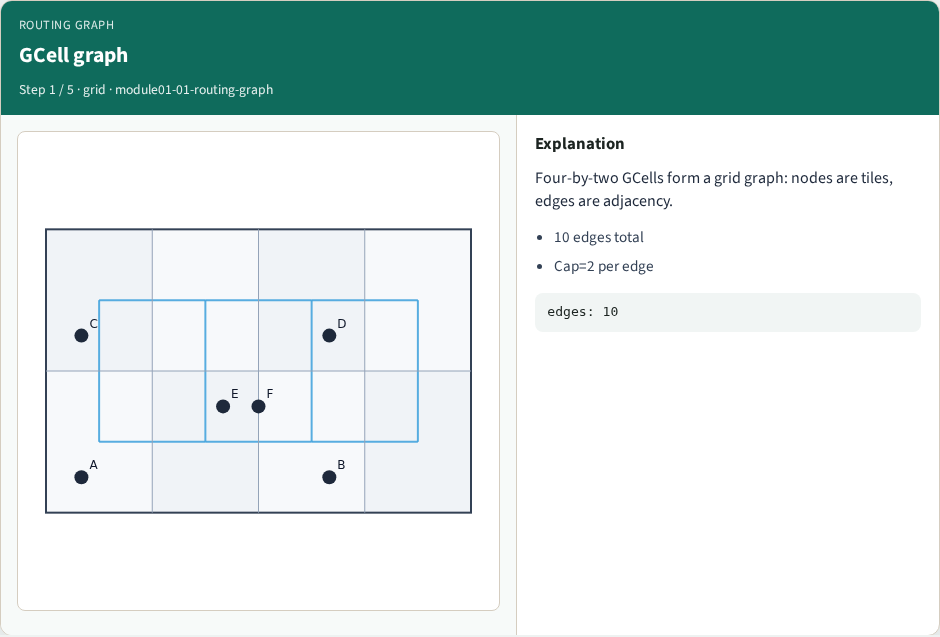
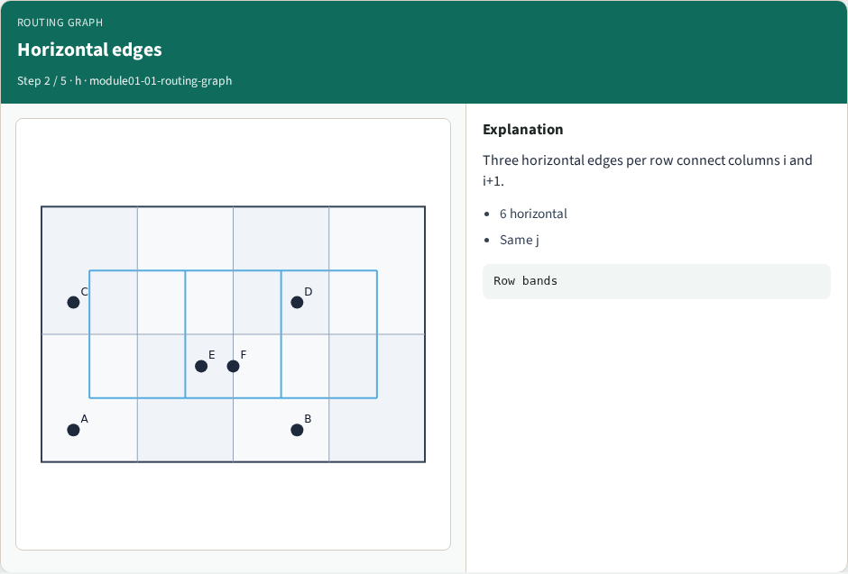
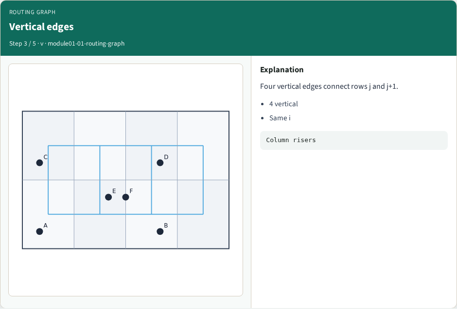
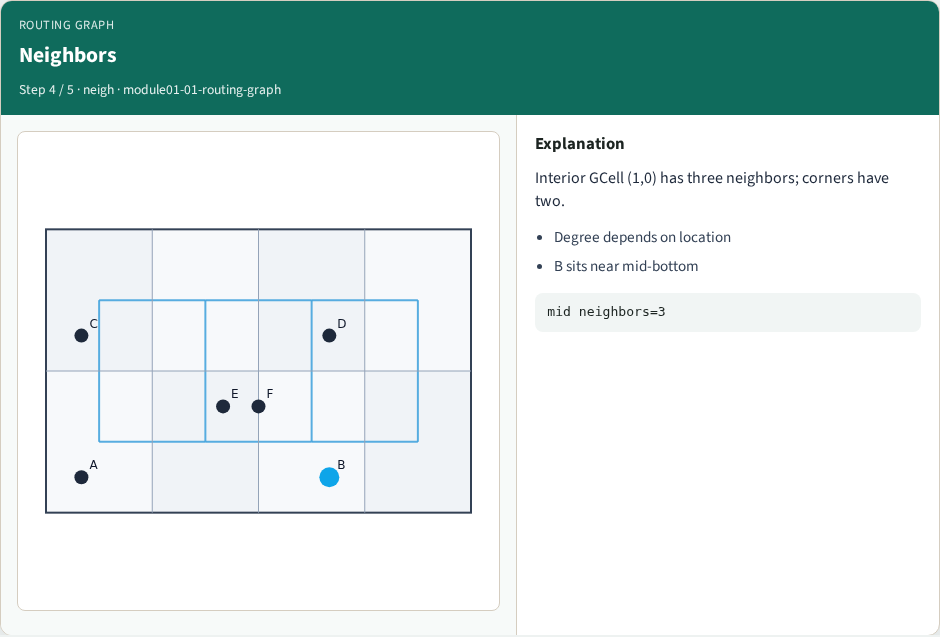
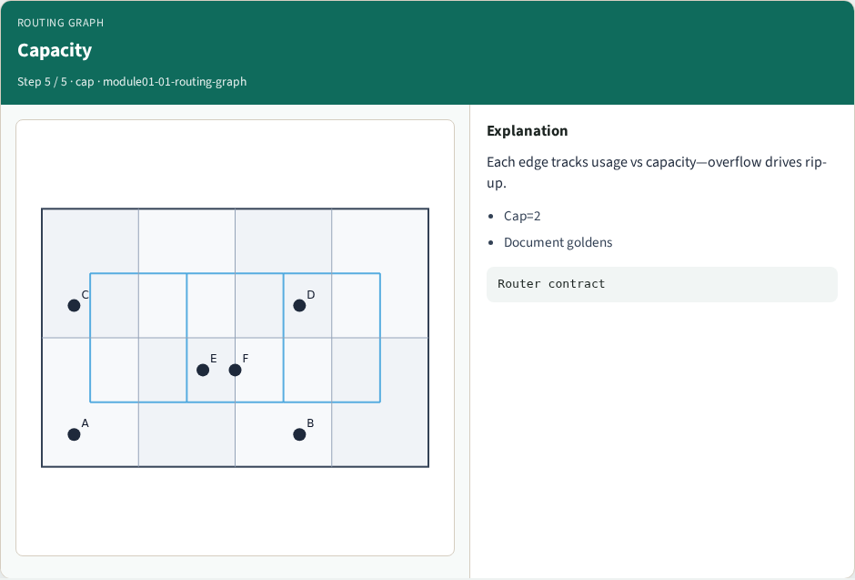

# GCell routing graph — step-by-step (for slides / transcript)

**Module:** `module01-01-routing-graph`  
**Lab / algo:** `routing-graph`  
**Viewer:** `/tools/algorithm-walkthrough/?algo=routing-graph&step=1`

Use each **Caption** as spoken prose (or a shortened slide note).
Use **Bullets** on the PPT; pair with the PNG in `assets/steps/`.

## Step 1 — GCell graph



**Caption (transcript):** Four-by-two GCells form a grid graph: nodes are tiles, edges are adjacency.

**Slide bullets:**

- 10 edges total
- Cap=2 per edge

**On-screen metrics:**

```
edges: 10
```

## Step 2 — Horizontal edges



**Caption (transcript):** Three horizontal edges per row connect columns i and i+1.

**Slide bullets:**

- 6 horizontal
- Same j

**On-screen metrics:**

```
Row bands
```

## Step 3 — Vertical edges



**Caption (transcript):** Four vertical edges connect rows j and j+1.

**Slide bullets:**

- 4 vertical
- Same i

**On-screen metrics:**

```
Column risers
```

## Step 4 — Neighbors



**Caption (transcript):** Interior GCell (1,0) has three neighbors; corners have two.

**Slide bullets:**

- Degree depends on location
- B sits near mid-bottom

**On-screen metrics:**

```
mid neighbors=3
```

## Step 5 — Capacity



**Caption (transcript):** Each edge tracks usage vs capacity—overflow drives rip-up.

**Slide bullets:**

- Cap=2
- Document goldens

**On-screen metrics:**

```
Router contract
```

