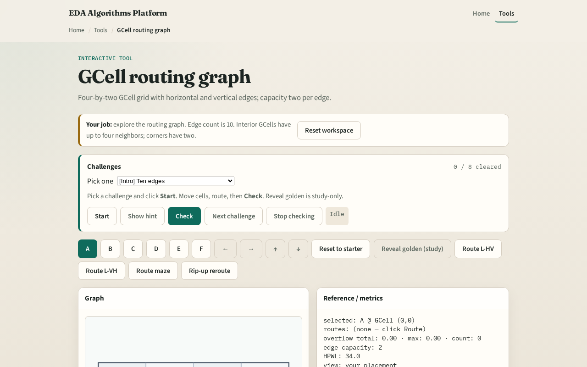

# GCell routing graph

**Module id:** module01-01-routing-graph
**Lab:** routing-graph
**Tracks:** A (implement) · B (browser lab)

## Slide 1 — Why a routing graph

Global routers do not hop pixel by pixel. They walk a coarse graph whose nodes are GCells and whose edges are the channels between neighbors. Before any pattern route, you must enumerate those edges on our four-by-two toy grid.

## Slide 2 — The idea

For each GCell at column i and row j, add an undirected edge to the right neighbor when i plus one is less than nx, and to the upper neighbor when j plus one is less than ny. On four by two you get eleven edges. Store each edge as a sorted pair of GCell indices so direction does not matter.

<!-- algorithm-walkthrough -->

## Slide 3 — GCell graph

Four-by-two GCells form a grid graph: nodes are tiles, edges are adjacency.

## Slide 4 — Horizontal edges

Three horizontal edges per row connect columns i and i+1.

## Slide 5 — Vertical edges

Four vertical edges connect rows j and j+1.

## Slide 6 — Neighbors

Interior GCell (1,0) has three neighbors; corners have two.

## Slide 7 — Capacity

Each edge tracks usage vs capacity—overflow drives rip-up.

<!-- /algorithm-walkthrough -->

## Slide 8 — Browser lab track

Open the **routing-graph** lab. Toggle grid lines and highlight one horizontal edge between columns zero and one. Read the edge list in the metrics panel. Match the count to eleven.

## Slide 9 — Implement track

Implement `edge_list(nx, ny)` in `common/grutil.py`. Print all edges for the tiny instance. Verify ((0,0),(1,0)) is present and diagonals are absent.

## Slide 10 — Pitfalls

Counting tile interiors instead of adjacency channels. Double-counting undirected edges as two directed arcs without collapsing. Forgetting top and right boundary checks.

## Slide 11 — Your turn

Finish the checklist. Sketch the eleven edges from memory. Next: map pin placements to terminal GCells.
