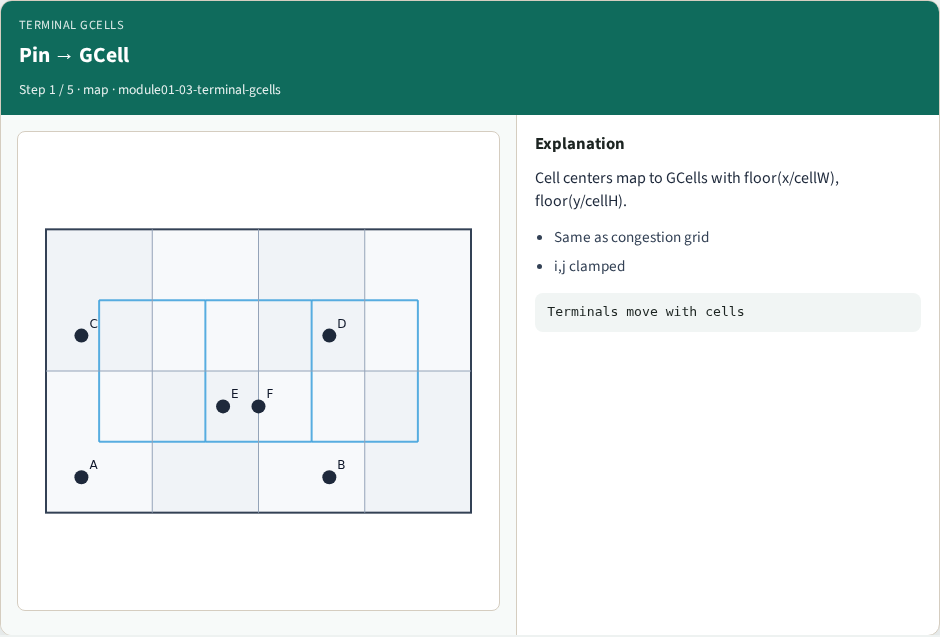
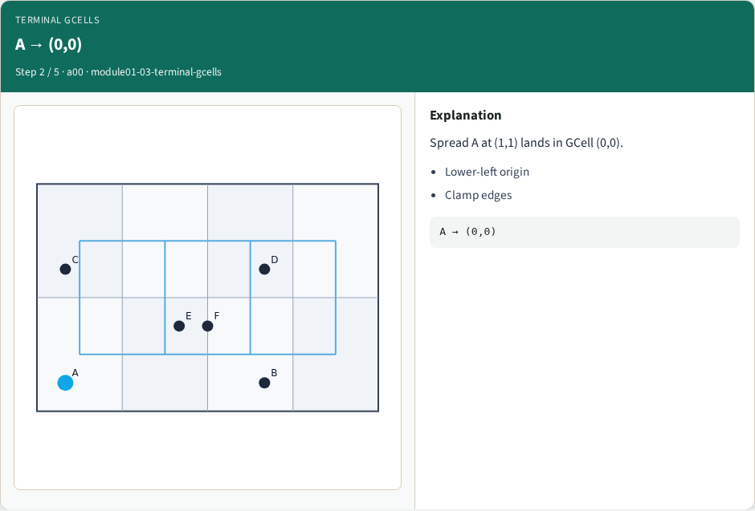
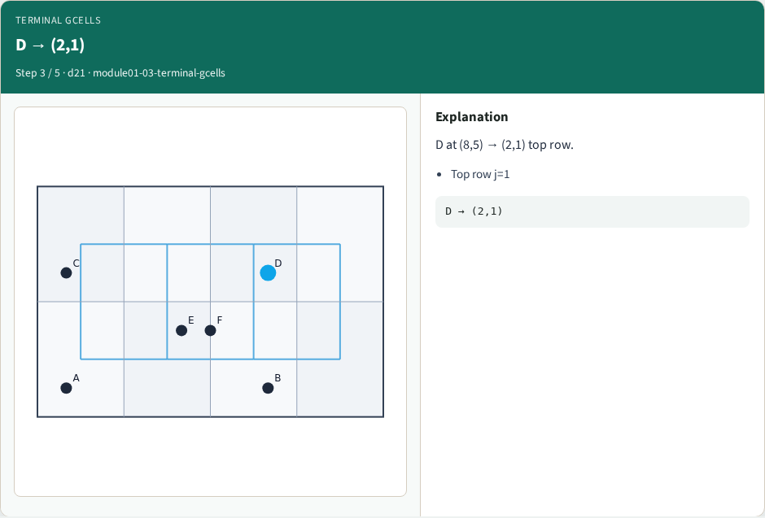
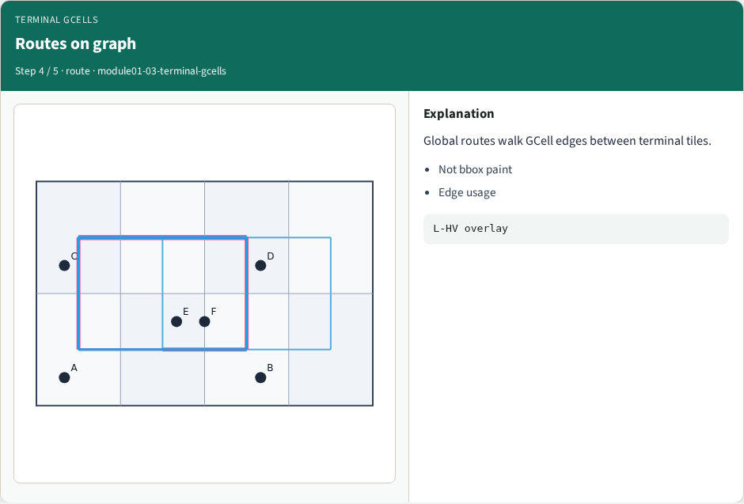
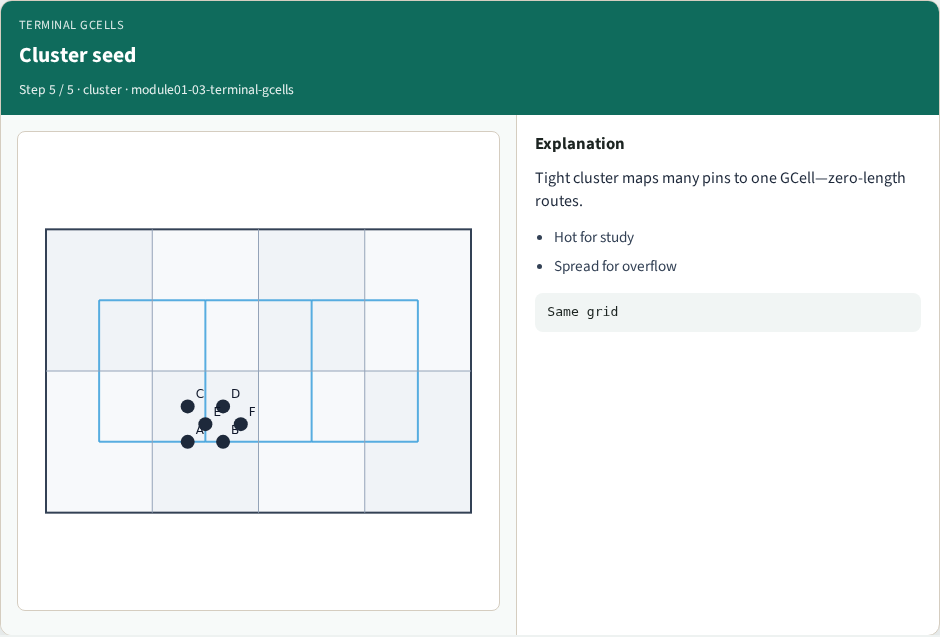
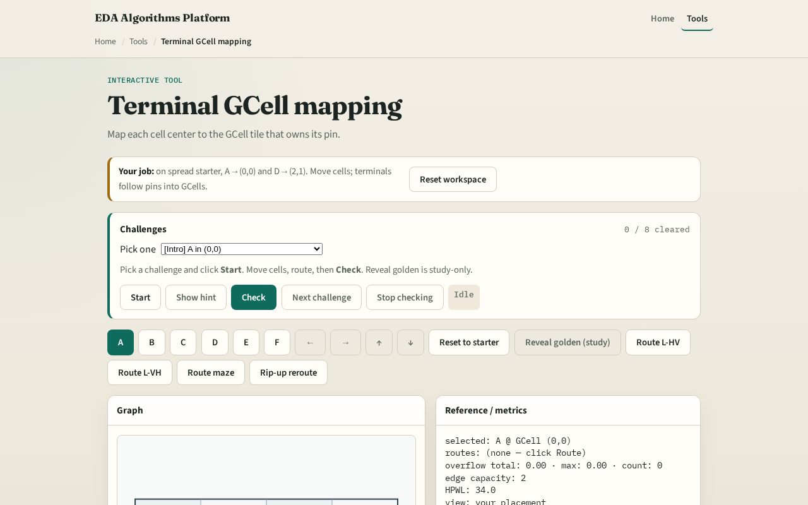

# Pins become terminals

A global route starts and ends at GCell terminals, one tile per pin

---

## The idea
- Cell_gcell of x y returns column i equals floor of x over cell width clamped
- Cell A at one comma one maps to zero comma zero
- Cell D at eight comma five maps to two comma one
- Build a dictionary from cell id to GCell for every pin in the netlist

---

## Pin → GCell

---

## A → (0,0)

---

## D → (2,1)

---

## Routes on graph

---

## Cluster seed

---

## Browser lab track

---

## Implement track
- Implement `terminals(positions, data)` returning the map
- Assert A through F on spread placement
- Print terminals before any routing lab

---

## Pitfalls
- Using cell origin instead of pin center
- Off-by-one at the right or top chip edge without clamp
- Mixing site columns from legalization with GCell columns

---

## Your turn
- Complete terminals for all six cells
- Next: L-shape pattern routes between two terminals

