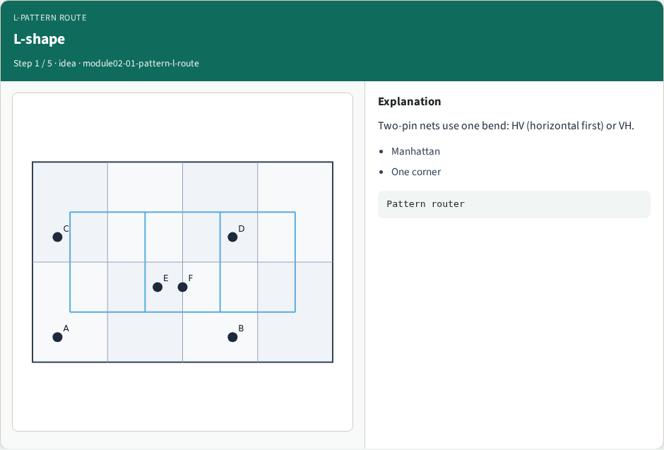
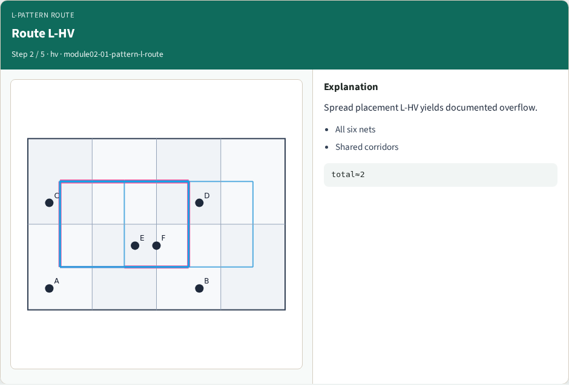
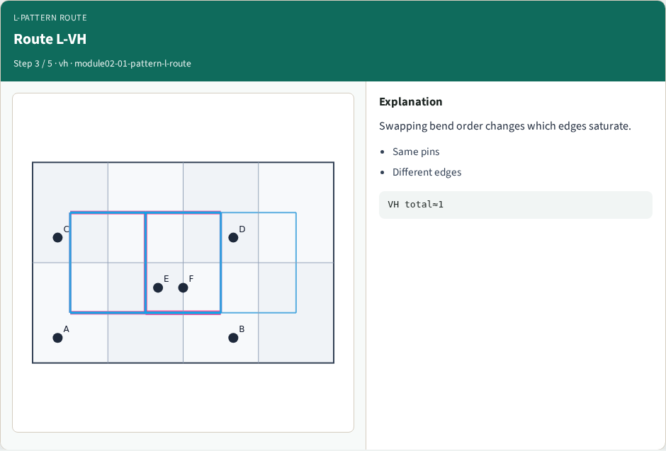
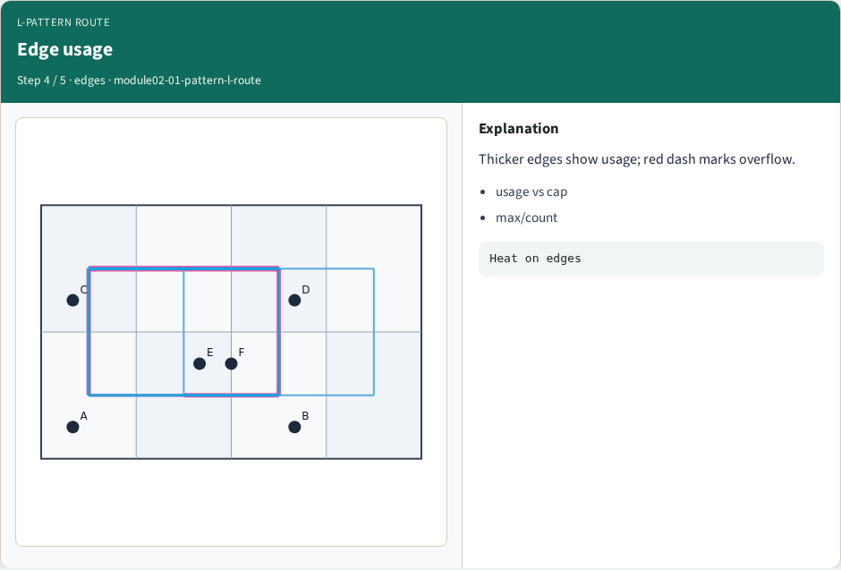
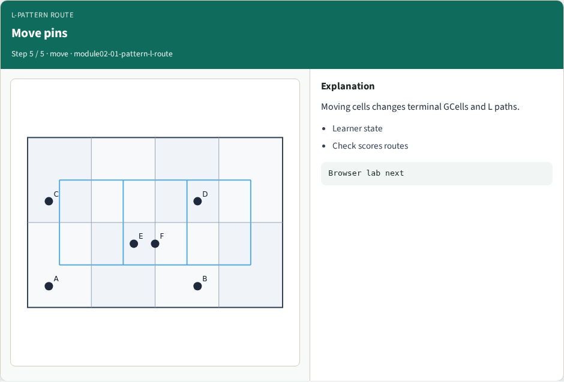
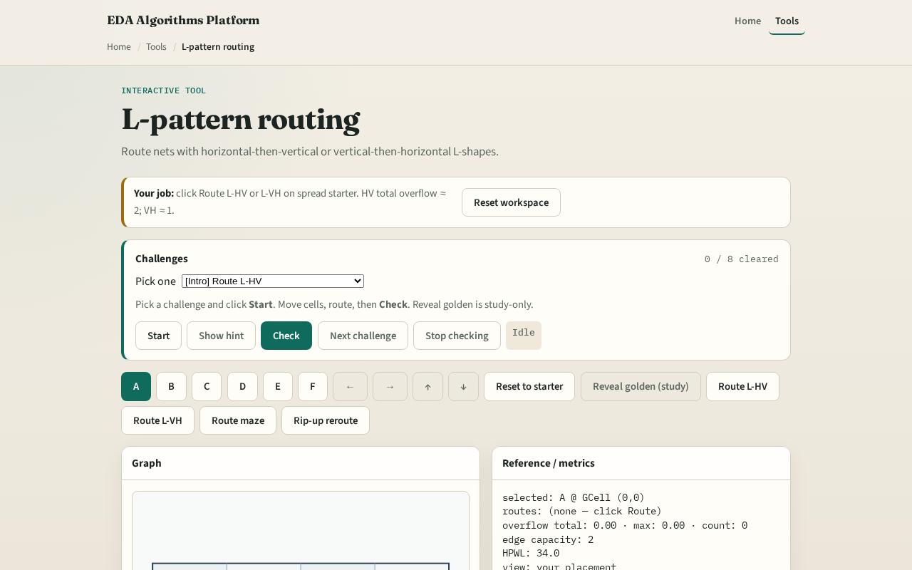

# The simplest global path

Two-pin global routing often starts with an L: travel along one axis, then the other

---

## The idea
- Prefer VH swaps the order
- Emit the list of GCells visited and convert consecutive pairs to edges with path_to_edges
- A path from zero comma zero to two comma one in HV uses three edges

---

## L-shape

---

## Route L-HV

---

## Route L-VH

---

## Edge usage

---

## Move pins

---

## Browser lab track

---

## Implement track
- Implement `l_route(a, b, prefer)` and `path_to_edges`
- Route net A–B on tiny_gr and print the edge list
- Match the browser overlay

---

## Pitfalls
- Skipping duplicate GCells at the bend
- Returning directed edges inconsistently, always normalize undirected keys
- Forgetting that L routes ignore existing congestion until sequential routing

---

## Your turn
- Ship Track A L-routes and clear browser challenges
- Next: Z-shape patterns when you want a third segment

