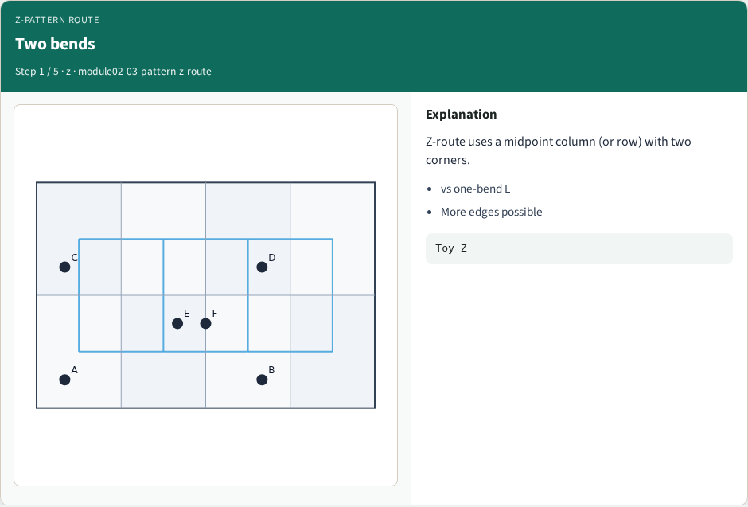
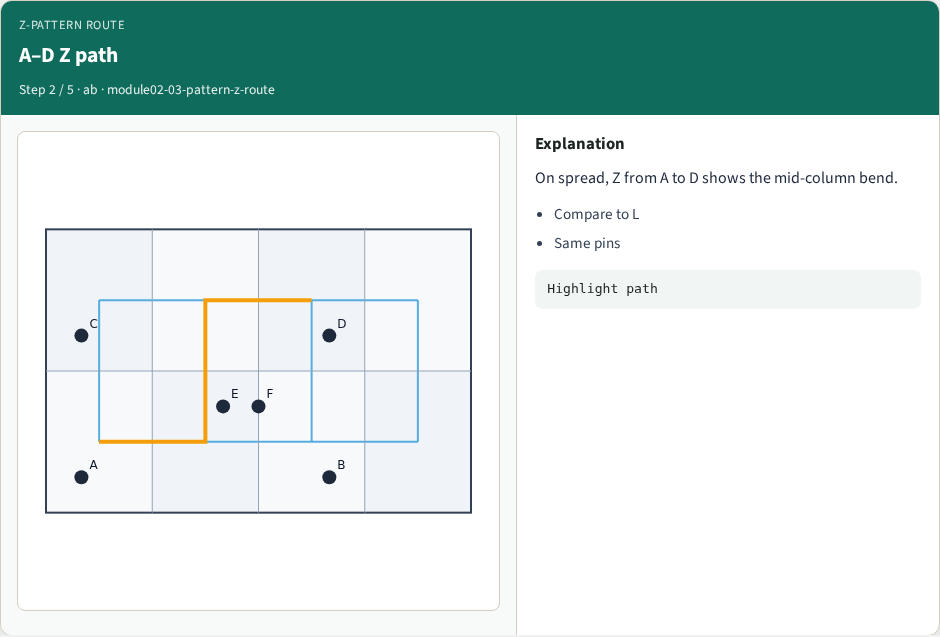
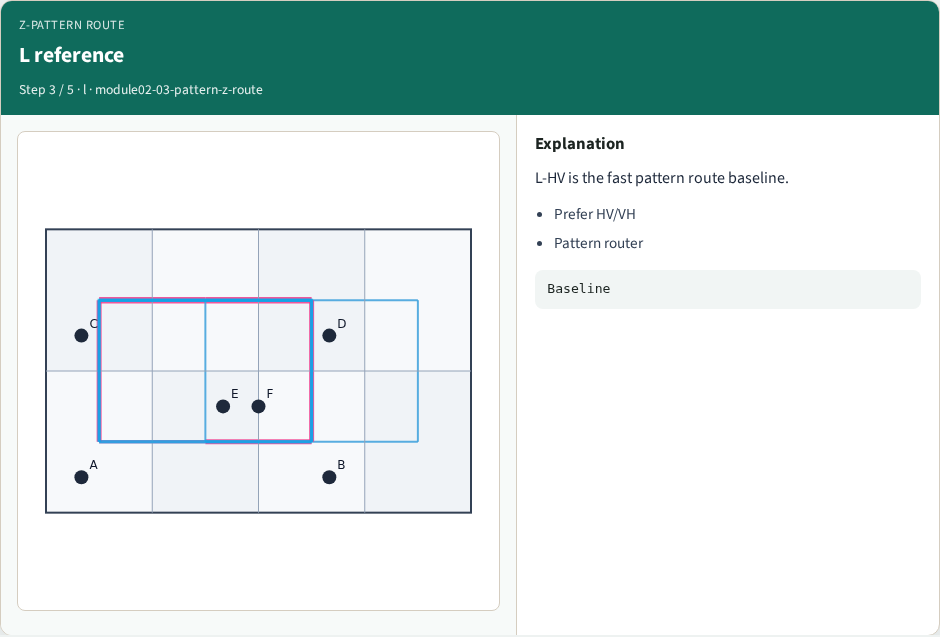
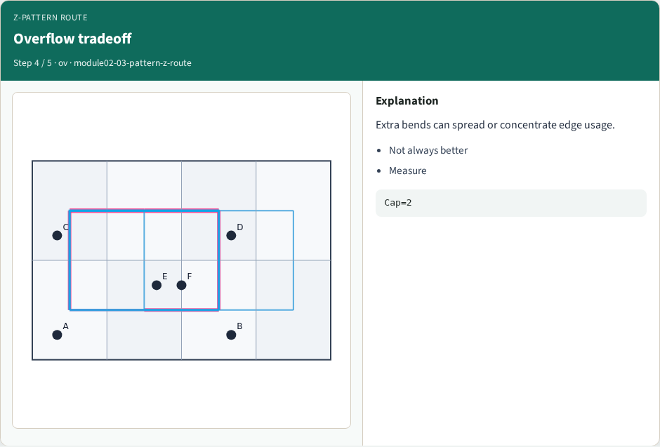
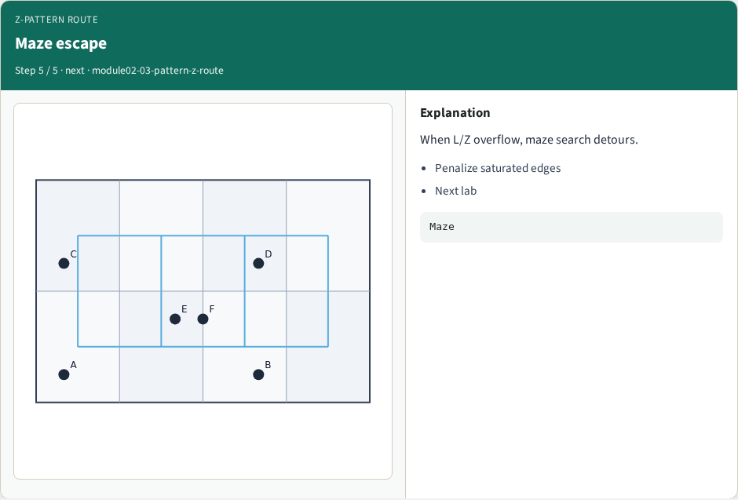

# Z-shape pattern routes — step-by-step (for slides / transcript)

**Module:** `module02-03-pattern-z-route`  
**Lab / algo:** `pattern-z-route`  
**Viewer:** `/tools/algorithm-walkthrough/?algo=pattern-z-route&step=1`

Use each **Caption** as spoken prose (or a shortened slide note).
Use **Bullets** on the PPT; pair with the PNG in `assets/steps/`.

## Step 1 — Two bends



**Caption (transcript):** Z-route uses a midpoint column (or row) with two corners.

**Slide bullets:**

- vs one-bend L
- More edges possible

**On-screen metrics:**

```
Toy Z
```

## Step 2 — A–D Z path



**Caption (transcript):** On spread, Z from A to D shows the mid-column bend.

**Slide bullets:**

- Compare to L
- Same pins

**On-screen metrics:**

```
Highlight path
```

## Step 3 — L reference



**Caption (transcript):** L-HV is the fast pattern route baseline.

**Slide bullets:**

- Prefer HV/VH
- Pattern router

**On-screen metrics:**

```
Baseline
```

## Step 4 — Overflow tradeoff



**Caption (transcript):** Extra bends can spread or concentrate edge usage.

**Slide bullets:**

- Not always better
- Measure

**On-screen metrics:**

```
Cap=2
```

## Step 5 — Maze escape



**Caption (transcript):** When L/Z overflow, maze search detours.

**Slide bullets:**

- Penalize saturated edges
- Next lab

**On-screen metrics:**

```
Maze
```

