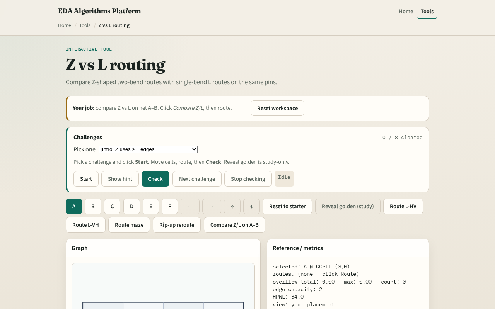

# Three segments

When pins are not on the same row or column, an L is not your only pattern

---

## The idea
- If a and b share a row or column, fall back to L-route
- Otherwise with prefer HZ pick mid column as the average of the two columns, walk H–V–H
- Path_to_edges should show at least three edges for off-axis pairs like zero comma zero to

---

## Two bends

---

## A–D Z path

---

## L reference

---

## Overflow tradeoff

---

## Maze escape

---

## Browser lab track

---

## Implement track
- Implement `z_route(a, b, prefer)`
- Print Z and L paths for the same terminal pair; explain one edge difference

---

## Pitfalls
- Using a midpoint that leaves zero-length segments
- Not falling back to L on aligned pins
- Confusing Z prefer HZ with L prefer HV naming

---

## Your turn
- Finish Z routing on two-pin nets
- Next: maze routing that respects congested edges

