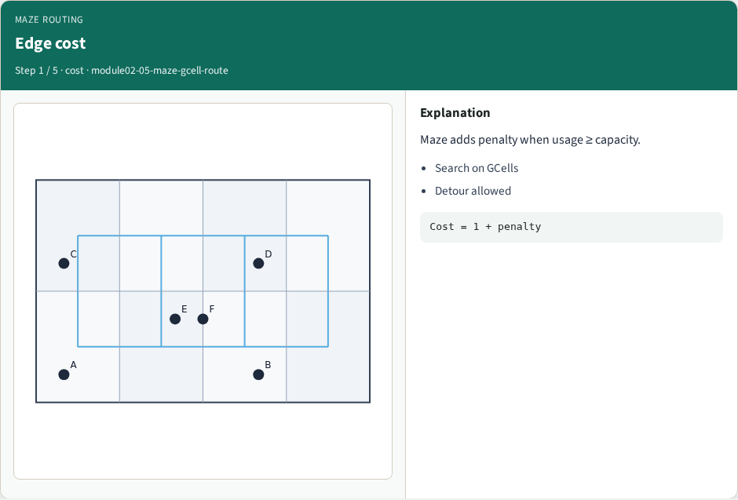
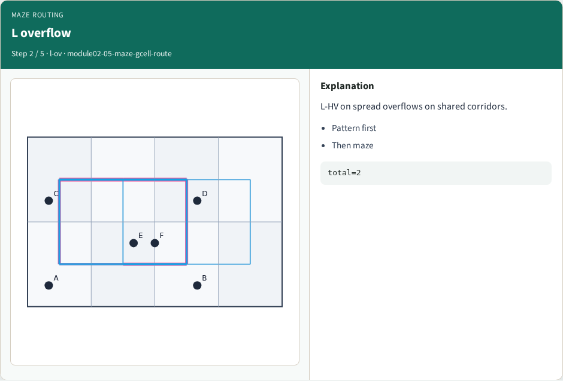
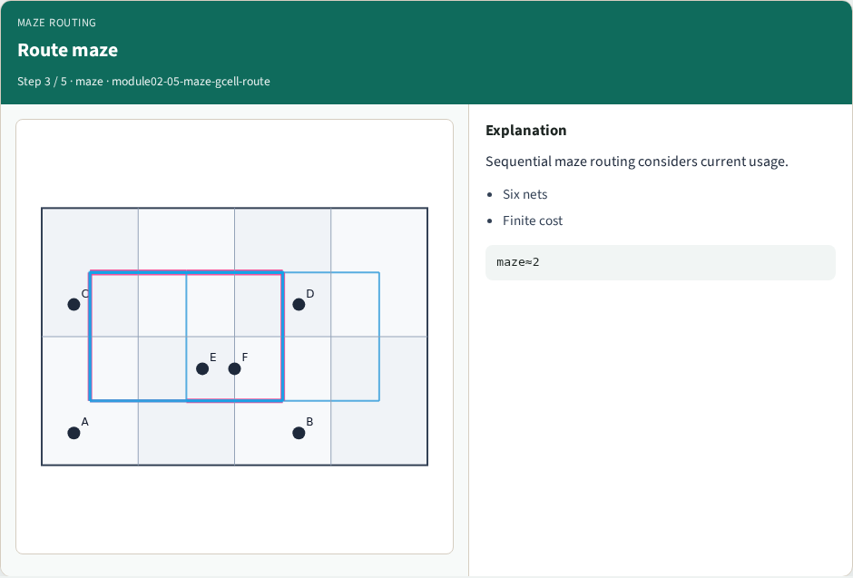
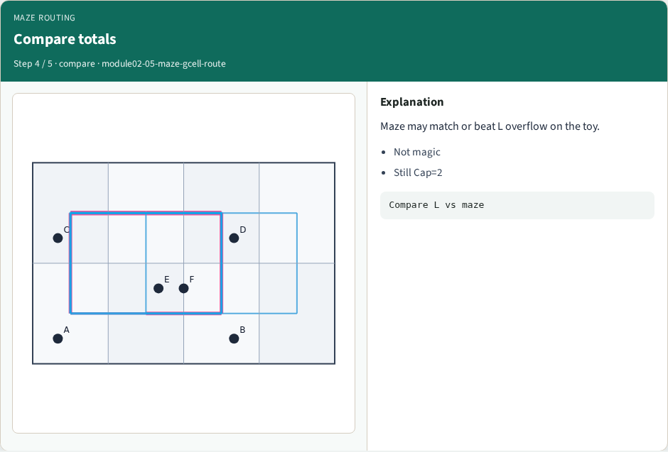
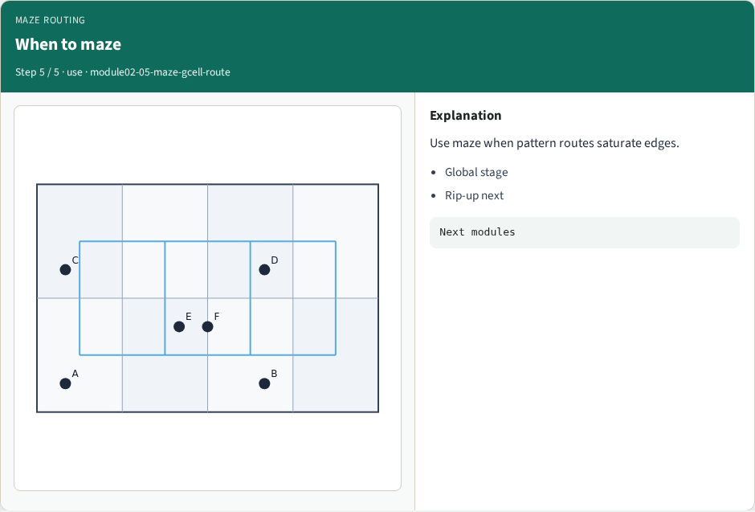
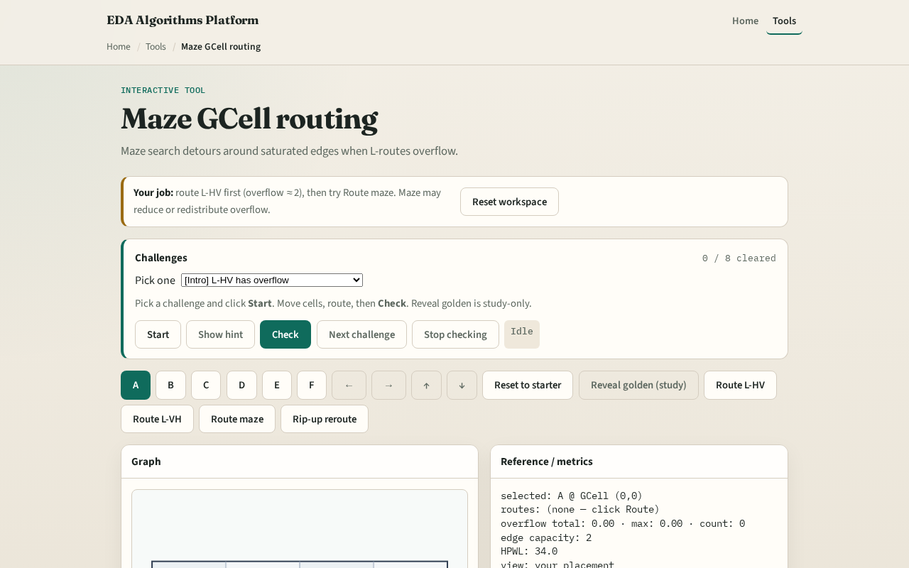

# Maze routing on GCells

**Module id:** module02-05-maze-gcell-route
**Lab:** maze-gcell-route
**Tracks:** A (implement) · B (browser lab)

## Slide 1 — Routes that detour

Pattern routers ignore blocked channels. Maze routing runs BFS on the GCell graph, skipping any edge whose usage is already at capacity. That is how global routers find alternate corridors.

## Slide 2 — The idea

Seed a queue with start and path list. Pop, expand neighbors, skip edges with usage greater than or equal to capacity. First time you dequeue the goal, return the path. If the queue empties, return None. Shortest feasible path wins.

<!-- algorithm-walkthrough -->

## Slide 3 — Edge cost

Maze adds penalty when usage ≥ capacity.

## Slide 4 — L overflow

L-HV on spread overflows on shared corridors.

## Slide 5 — Route maze

Sequential maze routing considers current usage.

## Slide 6 — Compare totals

Maze may match or beat L overflow on the toy.

## Slide 7 — When to maze

Use maze when pattern routes saturate edges.

<!-- /algorithm-walkthrough -->

## Slide 8 — Browser lab track

Open **maze-gcell-route**. Pre-fill an edge to capacity two and watch maze pick a longer detour. Clear the block and confirm the shortest path returns.

## Slide 9 — Implement track

Implement `maze_route(a, b, usage, capacity, nx, ny)`. Block edge ((0,0),(1,0)) at cap two and show maze cannot go direct; unblock a vertical detour path exists.

## Slide 10 — Pitfalls

Treating usage as per-tile instead of per-edge. Forgetting BFS needs visited set on GCells not edges. Returning a path through a full edge because you checked the wrong direction key.

## Slide 11 — Your turn

Pass maze goldens. Next: connect more than two pins with a star tree.
