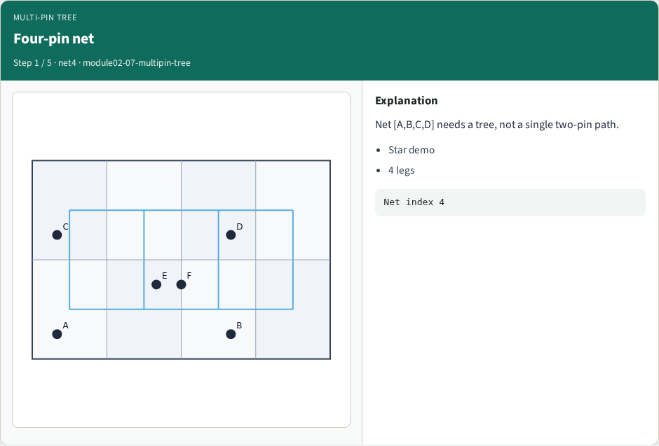
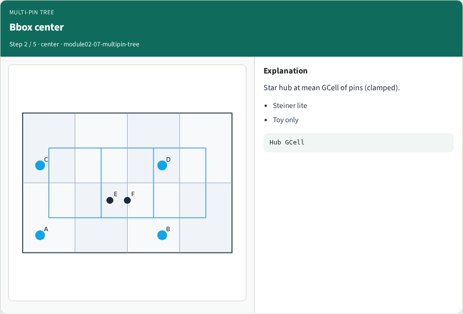
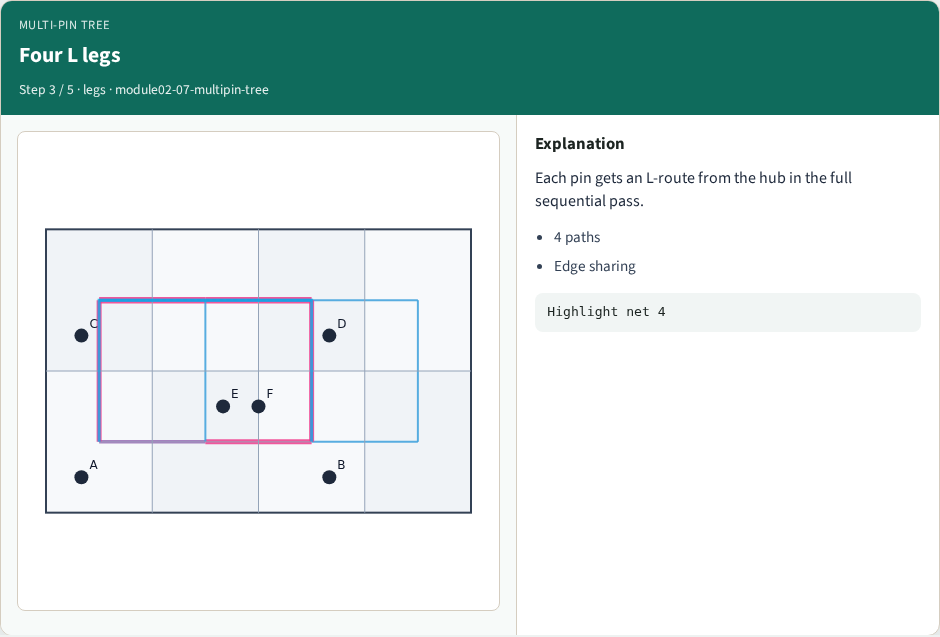
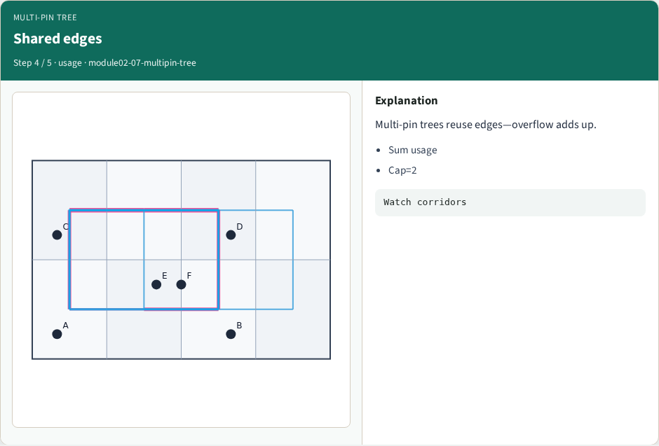
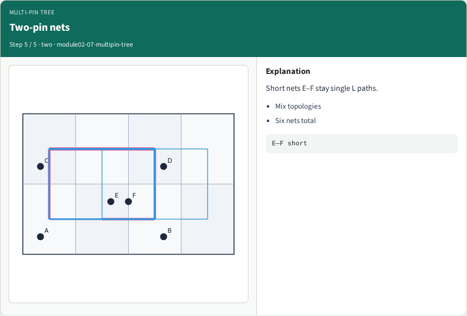
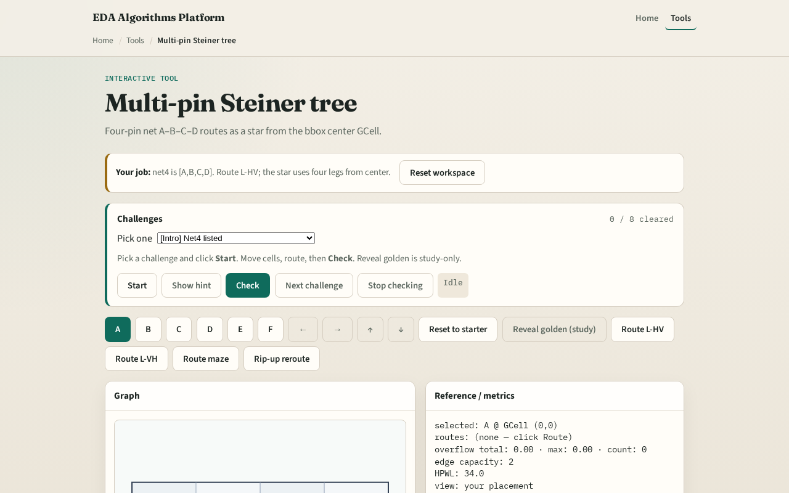

# More than two pins

Real nets have many pins

---

## The idea
- Collect terminal GCells for the net
- Center is the integer average of min and max column and row
- For each pin, add the edges along l_route center to pin with HV unless you choose VH
- Union all legs, edges shared by two legs count once in usage when you deposit

---

## Four-pin net

---

## Bbox center

---

## Four L legs

---

## Shared edges

---

## Two-pin nets

---

## Browser lab track

---

## Implement track
- Implement `multipin_star` and `multipin_star_edges`
- Route net index four on tiny_gr and print hub GCell plus edge count

---

## Pitfalls
- Routing pairwise between every pin pair, that explodes edges
- Picking chip center instead of bbox center GCell
- Double-depositing the same edge when summing legs

---

## Your turn
- Complete multipin routing
- Next: quantify overflow on those shared edges

