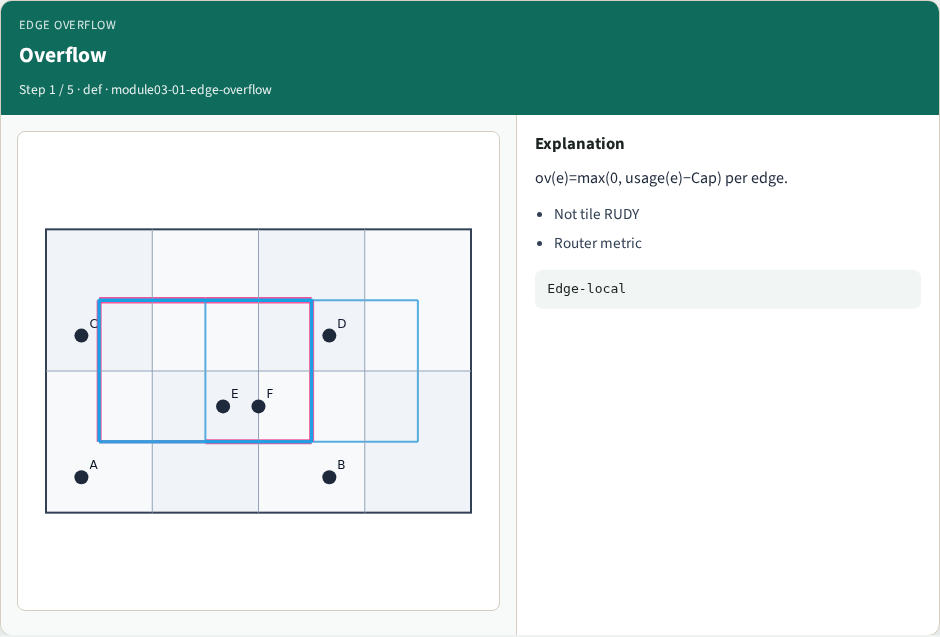
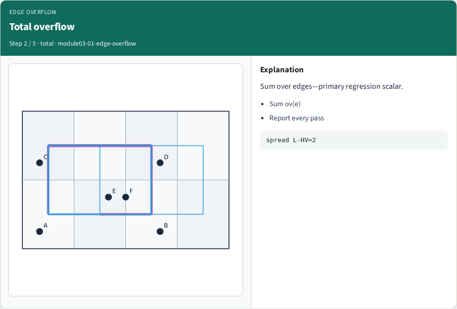
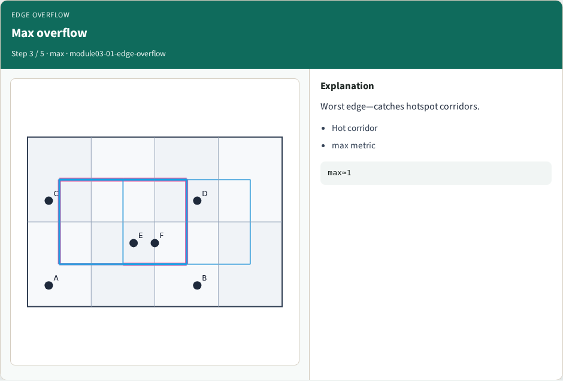
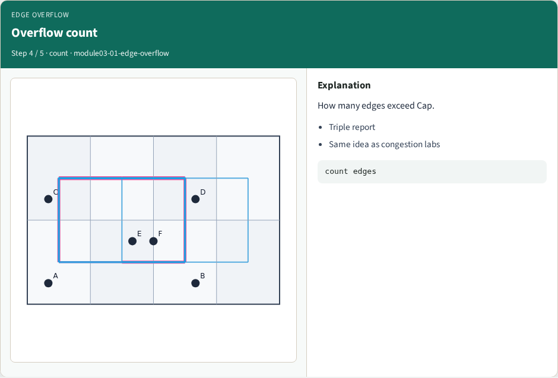
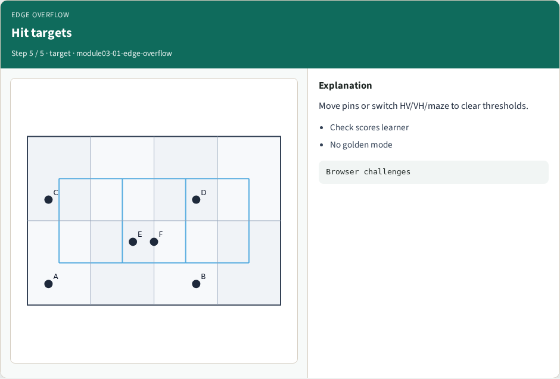
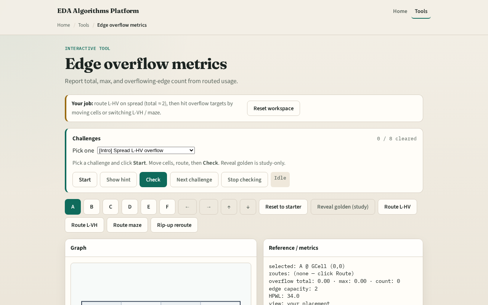

# Edge overflow metrics

**Module id:** module03-01-edge-overflow
**Lab:** edge-overflow
**Tracks:** A (implement) · B (browser lab)

## Slide 1 — When usage exceeds capacity

Each GCell edge has capacity two on tiny_gr. Every routed net deposits plus one on each edge it uses. Overflow is how far usage exceeds capacity—summed, maxed, and counted per edge.

## Slide 2 — The idea

For each edge e, overflow e equals max of zero and usage e minus capacity. Total is the sum across edges. Max is the worst edge. Count is how many edges have positive overflow. Sequential L-HV on all six nets should yield positive total overflow at cap two.

<!-- algorithm-walkthrough -->

## Slide 3 — Overflow

ov(e)=max(0, usage(e)−Cap) per edge.

## Slide 4 — Total overflow

Sum over edges—primary regression scalar.

## Slide 5 — Max overflow

Worst edge—catches hotspot corridors.

## Slide 6 — Overflow count

How many edges exceed Cap.

## Slide 7 — Hit targets

Move pins or switch HV/VH/maze to clear thresholds.

<!-- /algorithm-walkthrough -->

## Slide 8 — Browser lab track

Open **edge-overflow**. Run sequential L routes and read the triple total max count. Heat-map the worst edge.

## Slide 9 — Implement track

Implement `edge_overflow(usage, capacity)`. Call route_nets with mode l_hv on tiny_gr and assert total overflow is greater than zero.

## Slide 10 — Pitfalls

Computing overflow before summing all nets. Using tile demand from congestion instead of edge usage. Reporting negative overflow values.

## Slide 11 — Your turn

Hit overflow targets. Next: rip-up the hottest net and maze reroute.
