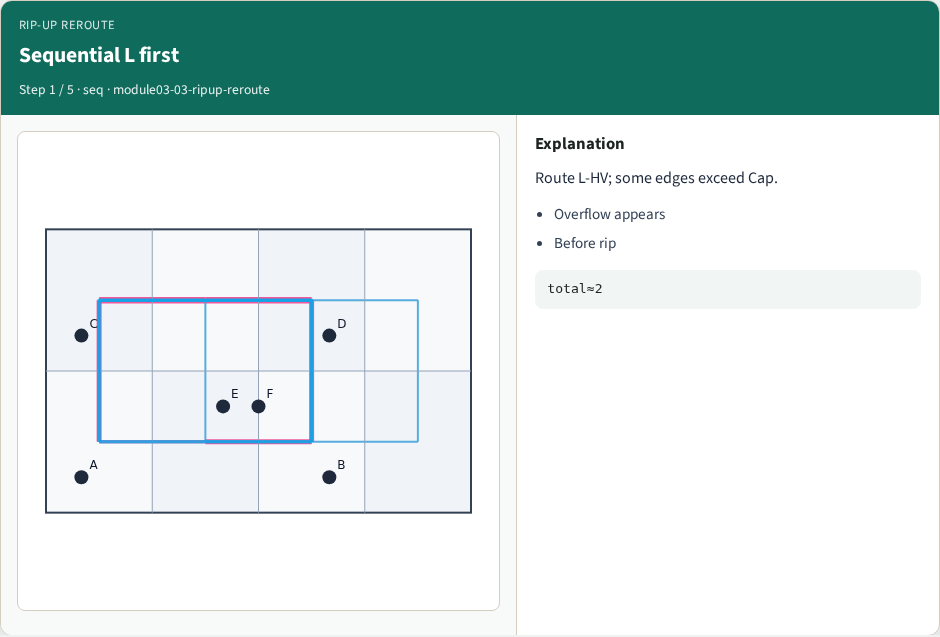
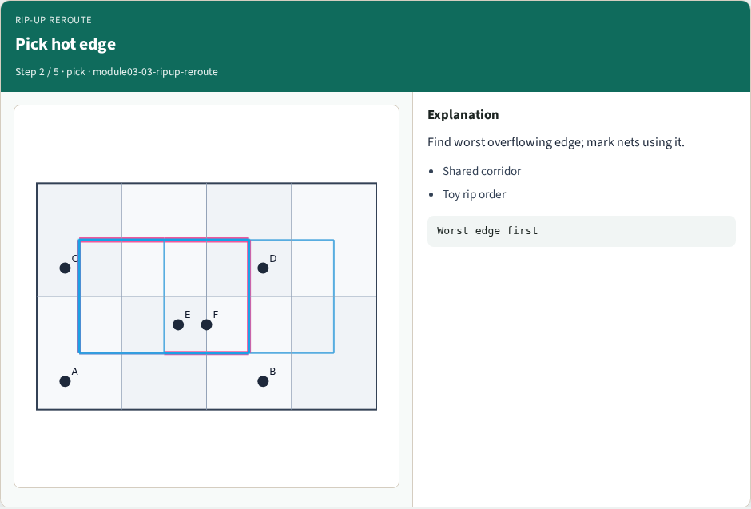
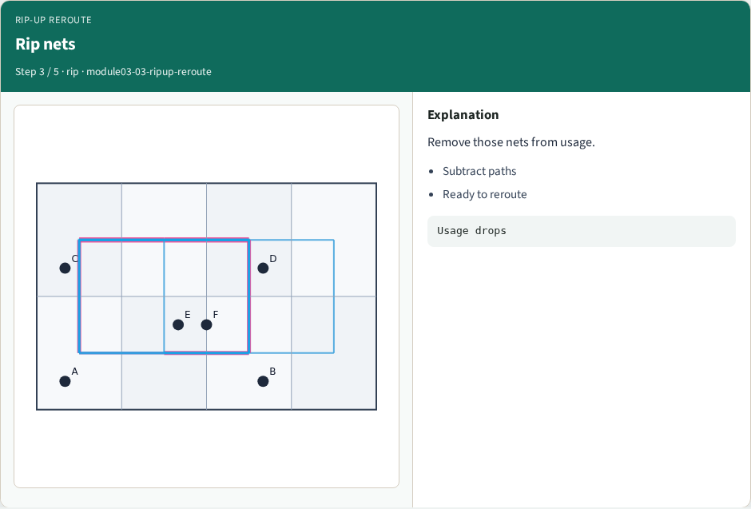
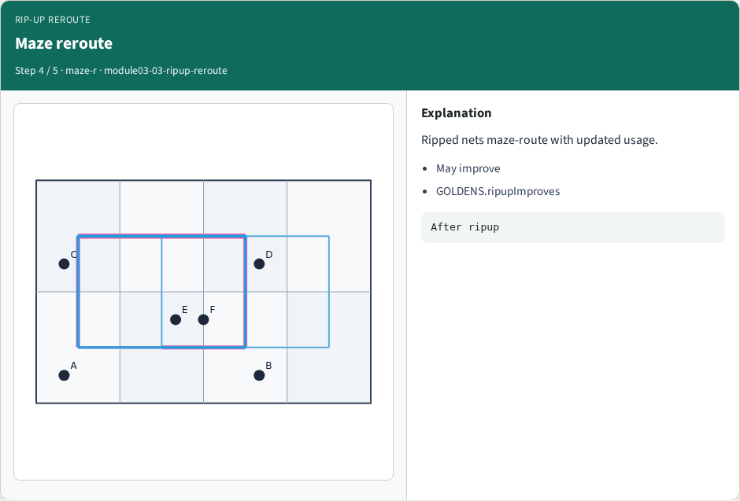
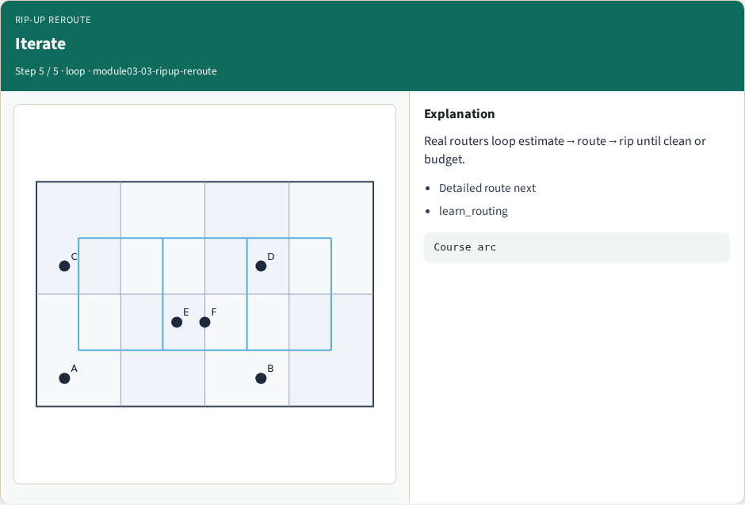
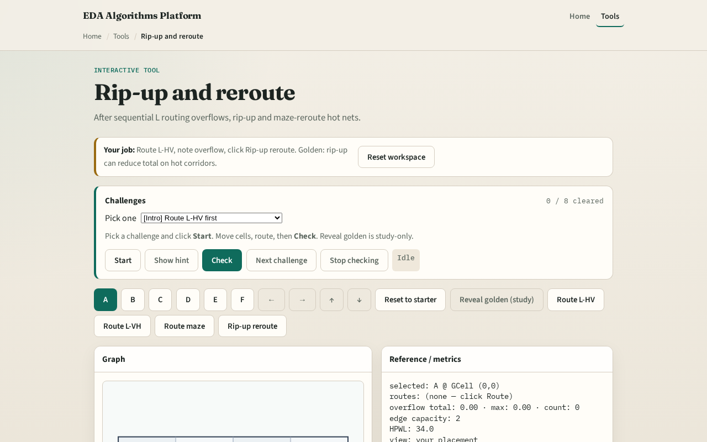

# Relieve hotspots

When overflow appears, global routers rip up contributing nets and reroute around congested edges

---

## The idea
- Score each net by overflow on its edges
- Subtract its route from usage
- Run maze_route between its pins with the remaining usage map
- Add the new edges back
- Total overflow should not rise; ideally it drops versus the pre-rip state

---

## Sequential L first

---

## Pick hot edge

---

## Rip nets

---

## Maze reroute

---

## Iterate

---

## Browser lab track

---

## Implement track
- Implement `ripup_reroute(routes, usage, capacity, nets, term, nx, ny)`
- Assert total overflow after is less than or equal to before on tiny_gr sequential L seed

---

## Pitfalls
- Ripping a net but leaving ghost usage on its old edges
- Rerouting with pattern L through the same hot edge
- Picking the wrong net to rip, use overflow contribution not HPWL

---

## Your turn
- Clear rip-up challenges
- Next: tie it together with full sequential global routing

