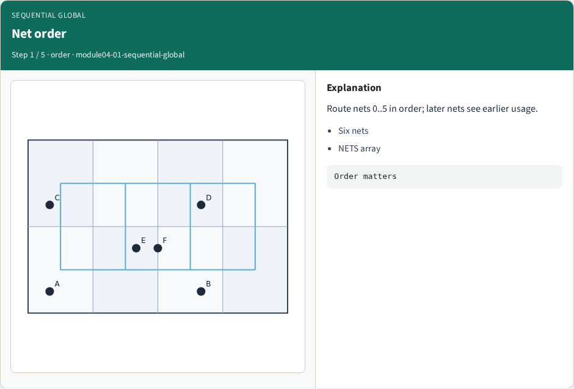
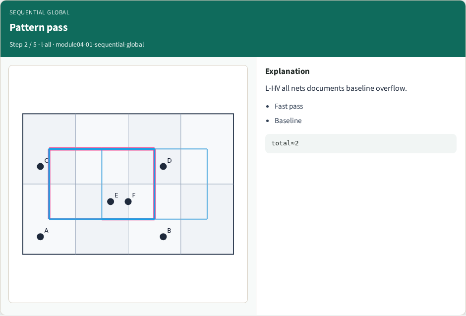
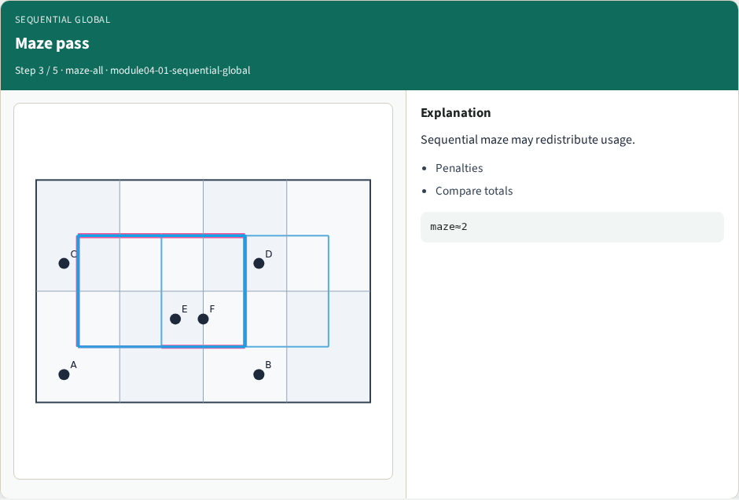
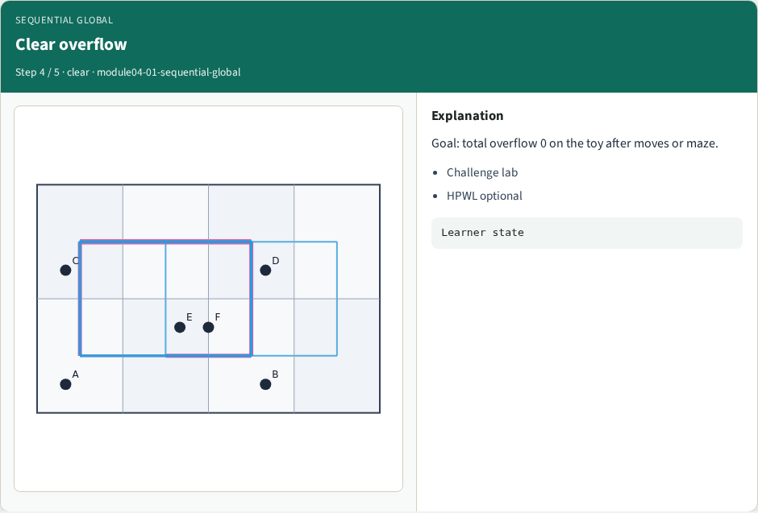
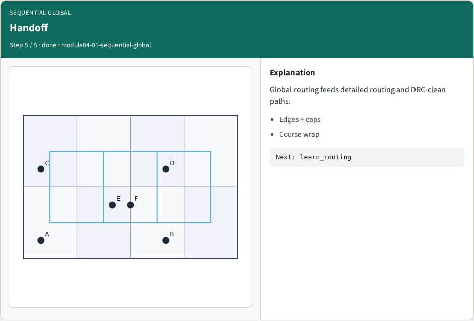

# Sequential global route — step-by-step (for slides / transcript)

**Module:** `module04-01-sequential-global`  
**Lab / algo:** `sequential-global`  
**Viewer:** `/tools/algorithm-walkthrough/?algo=sequential-global&step=1`

Use each **Caption** as spoken prose (or a shortened slide note).
Use **Bullets** on the PPT; pair with the PNG in `assets/steps/`.

## Step 1 — Net order



**Caption (transcript):** Route nets 0..5 in order; later nets see earlier usage.

**Slide bullets:**

- Six nets
- NETS array

**On-screen metrics:**

```
Order matters
```

## Step 2 — Pattern pass



**Caption (transcript):** L-HV all nets documents baseline overflow.

**Slide bullets:**

- Fast pass
- Baseline

**On-screen metrics:**

```
total≈2
```

## Step 3 — Maze pass



**Caption (transcript):** Sequential maze may redistribute usage.

**Slide bullets:**

- Penalties
- Compare totals

**On-screen metrics:**

```
maze≈2
```

## Step 4 — Clear overflow



**Caption (transcript):** Goal: total overflow 0 on the toy after moves or maze.

**Slide bullets:**

- Challenge lab
- HPWL optional

**On-screen metrics:**

```
Learner state
```

## Step 5 — Handoff



**Caption (transcript):** Global routing feeds detailed routing and DRC-clean paths.

**Slide bullets:**

- Edges + caps
- Course wrap

**On-screen metrics:**

```
Next: learn_routing
```

