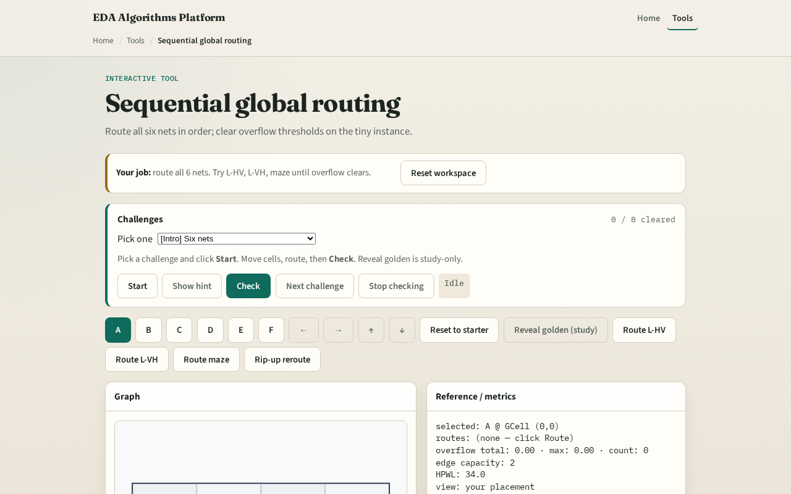

# Sequential global route

**Module id:** module04-01-sequential-global
**Lab:** sequential-global
**Tracks:** A (implement) · B (browser lab)

## Slide 1 — Order matters

Production global routers process nets in an order. Each net deposits usage on edges; later nets see a more congested graph. Sequential L-HV on tiny_gr is our baseline stress test.

## Slide 2 — The idea

Initialize empty usage. For each net in list order, compute terminals, route with the chosen mode—l_hv for two-pin L, star for multi-pin—and increment usage on every edge in the route. Report final usage and edge_overflow summary.

<!-- algorithm-walkthrough -->

## Slide 3 — Net order

Route nets 0..5 in order; later nets see earlier usage.

## Slide 4 — Pattern pass

L-HV all nets documents baseline overflow.

## Slide 5 — Maze pass

Sequential maze may redistribute usage.

## Slide 6 — Clear overflow

Goal: total overflow 0 on the toy after moves or maze.

## Slide 7 — Handoff

Global routing feeds detailed routing and DRC-clean paths.

<!-- /algorithm-walkthrough -->

## Slide 8 — Browser lab track

Open **sequential-global**. Route all nets in default order. Reorder mentally: would routing the four-pin net last change the hottest edge?

## Slide 9 — Implement track

Implement `route_nets` and `route_nets_with_routes`. Print usage and overflow after routing all six nets. Compare with maze mode on total overflow.

## Slide 10 — Pitfalls

Parallel deposit without order— hides rip-up motivation. Ignoring multi-pin net in order list. Resetting usage between nets accidentally.

## Slide 11 — Your turn

Complete sequential global routing. Offline compare and wrap come next.
