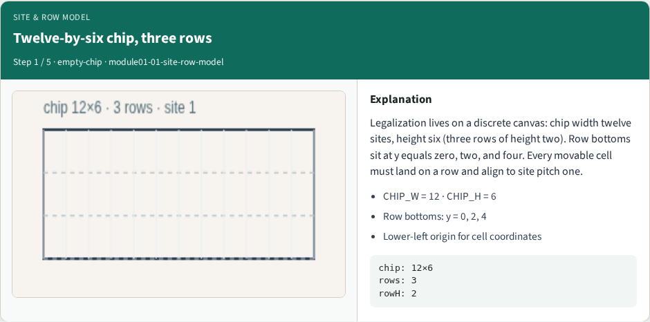
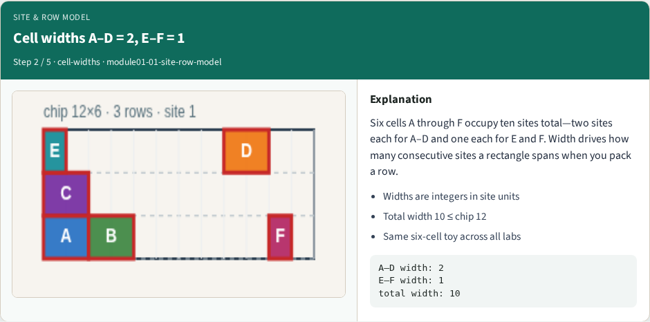
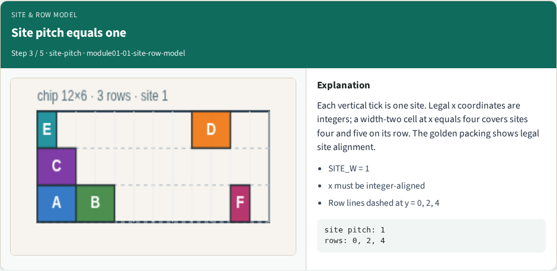
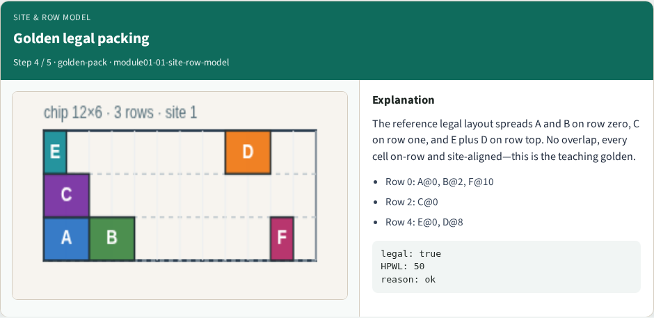
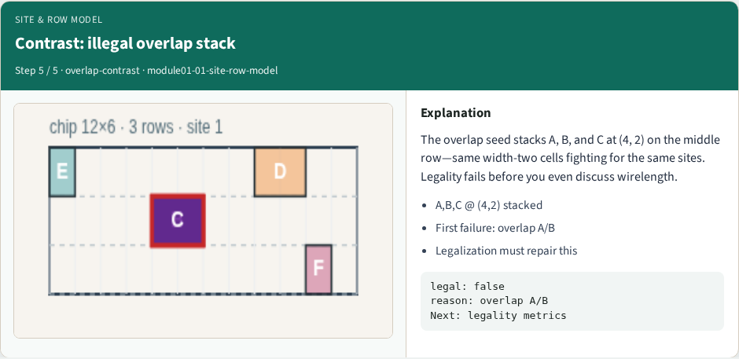

# Site and row model

**Module id:** module01-01-site-row-model
**Lab:** site-row-model
**Tracks:** A (implement) · B (browser lab)

## Slide 1 — Site and row model

Legalization snaps cells to a discrete grid. Our teaching chip is twelve sites wide and six high—three rows with bottoms at y zero, two, and four. Cell widths A through D are two sites; E and F are one. Total width ten fits inside twelve with room to pack.

## Slide 2 — The idea

Every cell sits on exactly one row with a lower-left coordinate aligned to site pitch one. Width tells you how many consecutive sites the rectangle covers. The golden packing is legal; the overlap seed stacks A, B, and C at (4, 2) to show what illegal looks like.


## Slide 3 — Pseudocode

Pseudocode is the written sketch of the algorithm before you code it. For this module the sketch is the site and row model itself: inputs are chip size, site pitch, row bottoms, and cell widths. Outputs are the rules every legal packing must obey.

Open this module's examples file and find the Pseudocode section. That written sketch is what you implement on the implement track and what the browser challenges measure.

## Slide 4 — Algorithm sketch

Read the sketch as a contract. Every cell lower-left sits on a site and a row bottom. Width tells how many consecutive sites the rectangle covers. Our teaching chip is twelve by six with three rows—that is the instance every later lab shares.

```text
INPUT: chip W×H, siteW, rowH, rows Y[], widths w[c]
OUTPUT: legal coordinate rules
for each cell c:
  x multiple of siteW; y in Y[]
  occupies [x, x+w[c]) × [y, y+rowH)
GOLDEN: W=12 H=6 siteW=1 rowH=2 Y={0,2,4}
widths A–D=2 E–F=1 (total 10 ≤ 12)
```


<!-- algorithm-walkthrough -->

## Slide 5 — Twelve-by-six chip, three rows



Legalization lives on a discrete canvas: chip width twelve sites, height six (three rows of height two). Row bottoms sit at y equals zero, two, and four. Every movable cell must land on a row and align to site pitch one.

## Slide 6 — Cell widths A–D = 2, E–F = 1



Six cells A through F occupy ten sites total—two sites each for A–D and one each for E and F. Width drives how many consecutive sites a rectangle spans when you pack a row.

## Slide 7 — Site pitch equals one



Each vertical tick is one site. Legal x coordinates are integers; a width-two cell at x equals four covers sites four and five on its row. The golden packing shows legal site alignment.

## Slide 8 — Golden legal packing



The reference legal layout spreads A and B on row zero, C on row one, and E plus D on row top. No overlap, every cell on-row and site-aligned—this is the teaching golden.

## Slide 9 — Contrast: illegal overlap stack



The overlap seed stacks A, B, and C at (4, 2) on the middle row—same width-two cells fighting for the same sites. Legality fails before you even discuss wirelength.

<!-- /algorithm-walkthrough -->


## Slide 10 — Browser lab track

In the browser lab track, open the **site-row-model** lab from the tools shelf. Open the interactive lab, place or snap cells on the site and row grid—or use an Apply helper—then Check. Reveal golden is study-only. Work the challenges that lock the goldens, then come back to implement the same loop yourself.

## Slide 11 — Implement track

In the implement track, open this module's EXAMPLES.md Pseudocode section and the course common solvers. Parse `tiny_legal.json`, run the algorithm with deterministic coordinates, and print legality, displacement, and HPWL. Match the browser goldens before you claim the checklist.

## Slide 12 — Pitfalls

Common traps: assuming snap alone legalizes; forgetting site width when checking overlap; ignoring fixed macro D at (8, 4); reporting HPWL without legality; and comparing Abacus and Tetris without naming displacement versus wirelength tradeoffs.

## Slide 13 — Your turn

Complete the checklist for at least one track—preferably both. Implement until your metrics match the starter goldens. When you're ready, take the short quiz, then continue to the next module.
