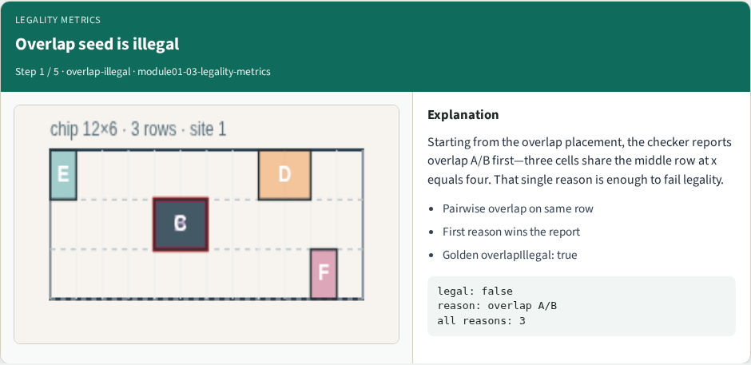
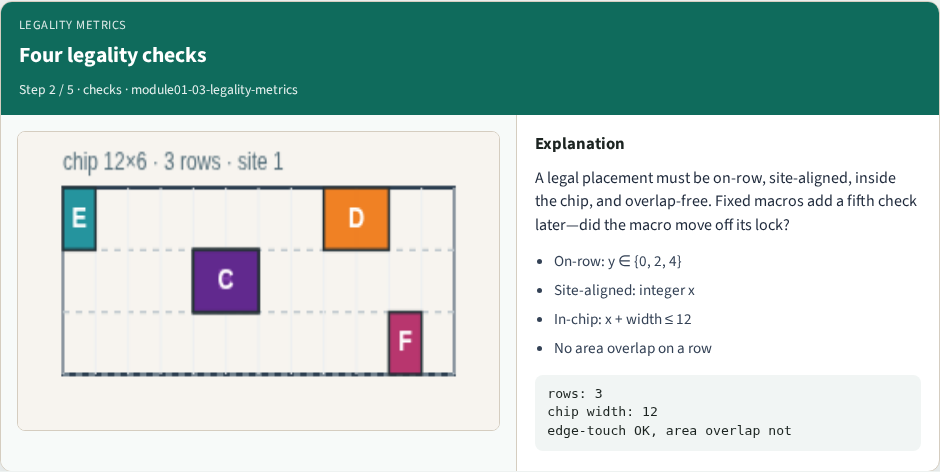
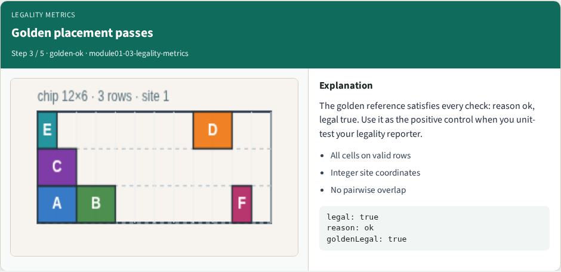
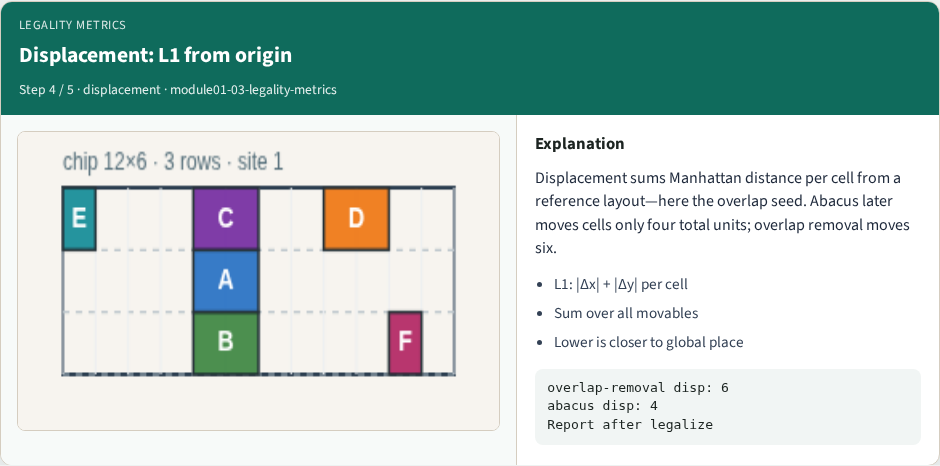
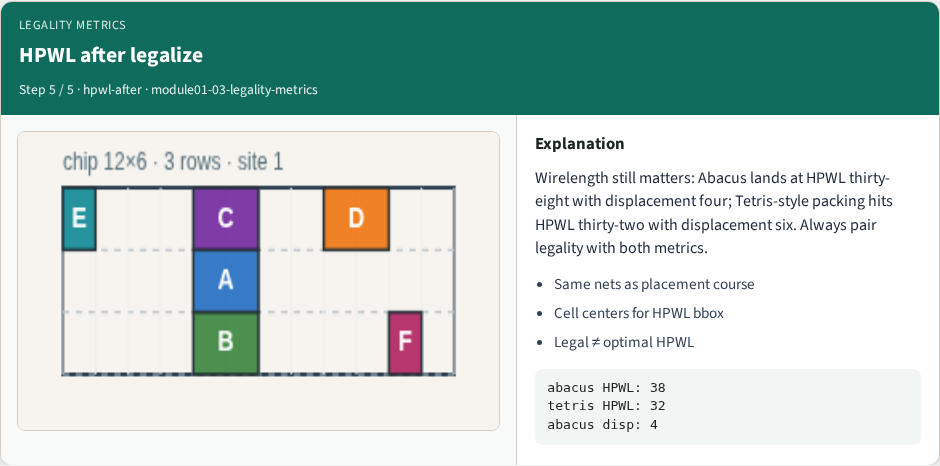

# Legality metrics

Before you celebrate wirelength, ask whether the placement is legal

---

## The idea
- Check on-row placement, site alignment, in-chip bounds, and pairwise overlap
- Report displacement as L1 Manhattan distance from the origin layout
- Pair legality with HPWL after legalize

---

## Pseudocode
- Before you trust wirelength, write a legality checker in pseudocode
- Inputs are coordinates and widths
- The loop walks cells and pairs
- The stop condition is the first failure reason, or ok when every check passes
- Open this module's examples file and find the Pseudocode section
- That written sketch is what you implement on the implement track and what the browser

---

## Algorithm sketch
- The sketch also defines the metrics you report after a legalize pass
- On the overlap seed the checker fails with overlap A/B; the golden packing returns ok

---

## Algorithm sketch — try these

```
INPUT: positions, widths, chip, optional fixed
OUTPUT: legal?, reason, disp, HPWL
for each cell c:
  fail if off-site, off-row, outside, or macro moved
for each same-row pair (a,b):
  fail if [x,x+w) intervals overlap
disp = Σ|Δx|+|Δy|; HPWL = Σ net bbox (centers)
GOLDEN: overlap → "overlap A/B"; golden → "ok"
```

---

## Overlap seed is illegal


---

## Four legality checks


---

## Golden placement passes


---

## Displacement: L1 from origin


---

## HPWL after legalize


---

## Browser lab track
- In the browser lab track, open the **legality-metrics** lab from the tools shelf
- Open the interactive lab
- Reveal golden is study-only
- Work the challenges that lock the goldens

---

## Implement track
- In the implement track
- Parse `tiny_legal.json`, run the algorithm with deterministic coordinates
- Match the browser goldens before you claim the checklist

---

## Pitfalls
- Common traps

---

## Your turn
- Complete the checklist for at least one track, preferably both
- Implement until your metrics match the starter goldens
- When you're ready, take the short quiz, then continue to the next module

