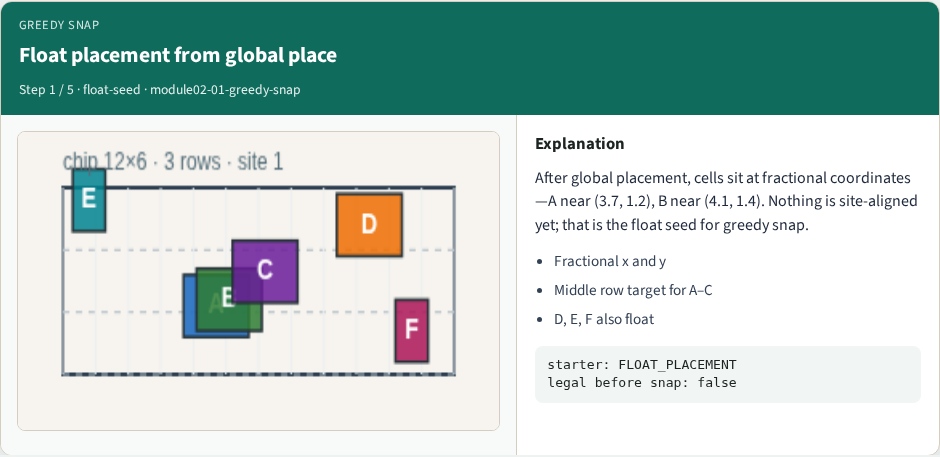
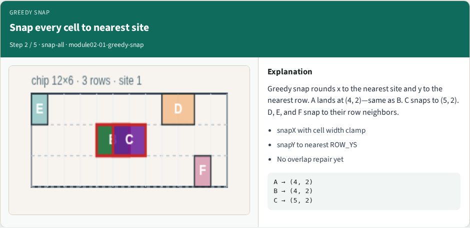
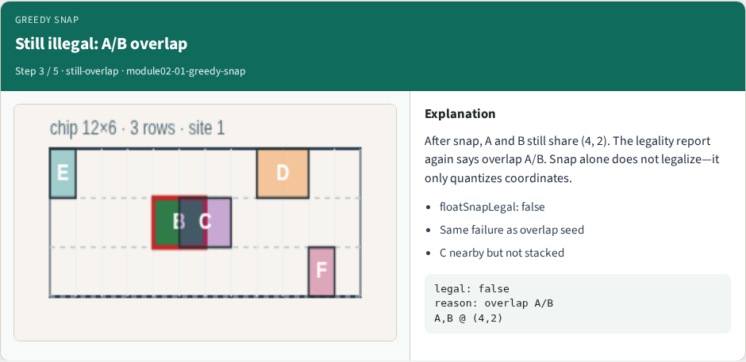
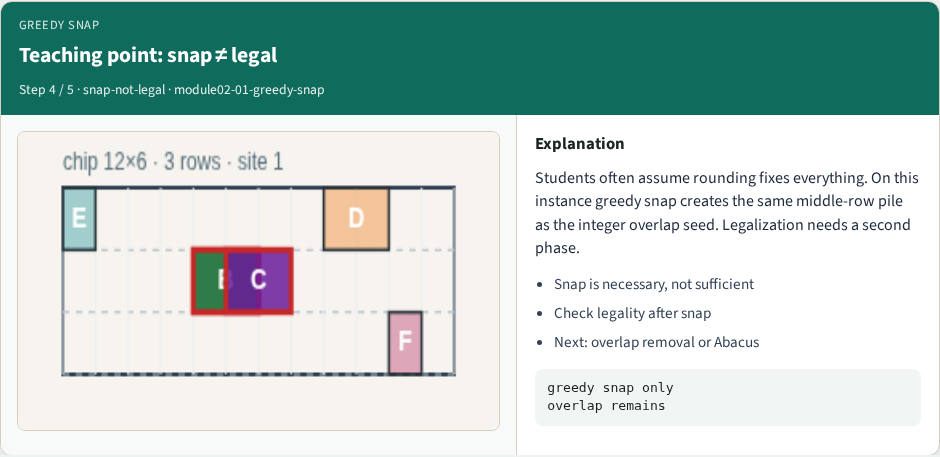
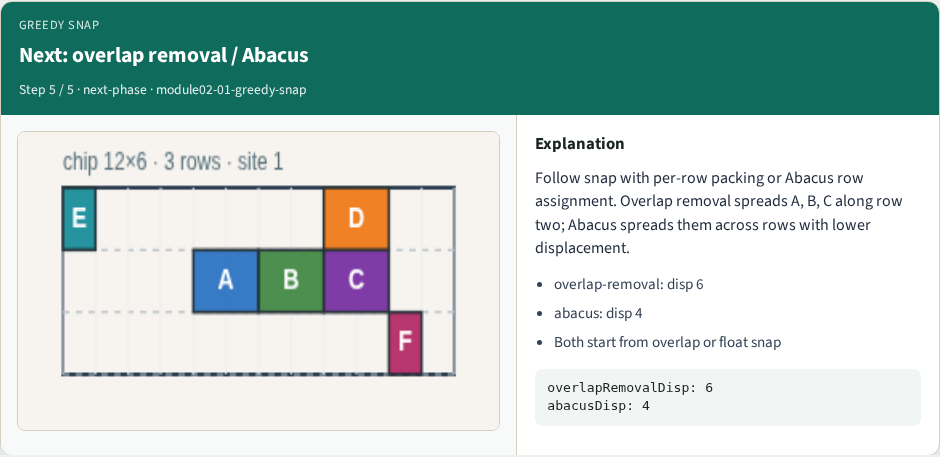

# Greedy snap

**Module id:** module02-01-greedy-snap
**Lab:** greedy-snap
**Tracks:** A (implement) · B (browser lab)

## Slide 1 — Greedy snap

Global placement leaves fractional coordinates—the float seed puts A near (3.7, 1.2) and B near (4.1, 1.4). Greedy snap rounds x to the nearest site and y to the nearest row. A lands at (4, 2)—the same site as B.

## Slide 2 — The idea

Snap quantizes coordinates but does not remove overlap. After snap, A and B still fail with overlap A/B. Teaching point: snap is necessary, not sufficient—you need overlap removal or Abacus packing next.


## Slide 3 — Pseudocode

Greedy snap is the first written loop after global place. Pseudocode here has one pass: for each movable cell, round x to a site and y to the nearest row. Fixed macros stay put.

Open this module's examples file and find the Pseudocode section. That written sketch is what you implement on the implement track and what the browser challenges measure.

## Slide 4 — Algorithm sketch

The important line in the sketch is the note after the loop: snap does not remove overlap. On the float starter, A and B both land at four comma two—so legality still fails until a packer runs.

```text
INPUT: float positions, widths, rows Y[], chip W
OUTPUT: snapped positions (may still overlap)
for each movable cell c:
  x ← round(x) clamped to [0, W−w[c]]
  y ← nearest row in Y[]
fixed macros: keep locked (x,y)
NOTE: snap ≠ legal — A,B may share a site
GOLDEN float: A→(4,2), B→(4,2) still overlap
```


<!-- algorithm-walkthrough -->

## Slide 5 — Float placement from global place



After global placement, cells sit at fractional coordinates—A near (3.7, 1.2), B near (4.1, 1.4). Nothing is site-aligned yet; that is the float seed for greedy snap.

## Slide 6 — Snap every cell to nearest site



Greedy snap rounds x to the nearest site and y to the nearest row. A lands at (4, 2)—same as B. C snaps to (5, 2). D, E, and F snap to their row neighbors.

## Slide 7 — Still illegal: A/B overlap



After snap, A and B still share (4, 2). The legality report again says overlap A/B. Snap alone does not legalize—it only quantizes coordinates.

## Slide 8 — Teaching point: snap ≠ legal



Students often assume rounding fixes everything. On this instance greedy snap creates the same middle-row pile as the integer overlap seed. Legalization needs a second phase.

## Slide 9 — Next: overlap removal / Abacus



Follow snap with per-row packing or Abacus row assignment. Overlap removal spreads A, B, C along row two; Abacus spreads them across rows with lower displacement.

<!-- /algorithm-walkthrough -->


## Slide 10 — Browser lab track

In the browser lab track, open the **greedy-snap** lab from the tools shelf. Open the interactive lab, place or snap cells on the site and row grid—or use an Apply helper—then Check. Reveal golden is study-only. Work the challenges that lock the goldens, then come back to implement the same loop yourself.

## Slide 11 — Implement track

In the implement track, open this module's EXAMPLES.md Pseudocode section and the course common solvers. Parse `tiny_legal.json`, run the algorithm with deterministic coordinates, and print legality, displacement, and HPWL. Match the browser goldens before you claim the checklist.

## Slide 12 — Pitfalls

Common traps: assuming snap alone legalizes; forgetting site width when checking overlap; ignoring fixed macro D at (8, 4); reporting HPWL without legality; and comparing Abacus and Tetris without naming displacement versus wirelength tradeoffs.

## Slide 13 — Your turn

Complete the checklist for at least one track—preferably both. Implement until your metrics match the starter goldens. When you're ready, take the short quiz, then continue to the next module.
